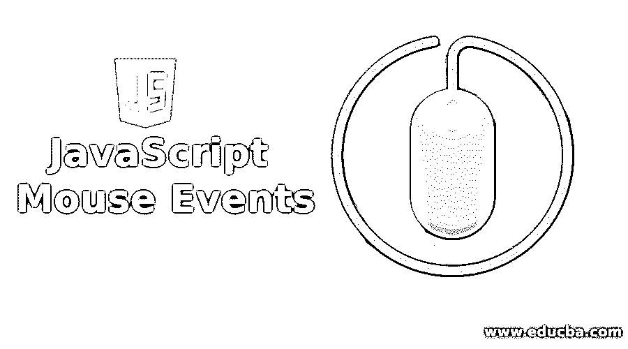

# JavaScript 鼠标事件

> 原文：<https://www.educba.com/javascript-mouse-events/>




## JavaScript 鼠标事件简介

以下文章概述了 JavaScript 鼠标事件。鼠标事件是当鼠标与注册到 Mouse event 对象 html 元素交互时生成的事件。有不同的事件与鼠标事件有关，如鼠标点击、鼠标悬停、鼠标离开等。每当鼠标事件生成时，浏览器就会执行一些活动或动作。为处理鼠标事件而执行的操作称为鼠标事件处理程序，处理鼠标事件的过程称为鼠标事件处理程序。

### JavaScript 中鼠标事件的类型

下面给出了六种类型的鼠标事件:

<small>网页开发、编程语言、软件测试&其他</small>

*   **click:** 鼠标点击注册元素时发生 click 事件。事件处理程序的名称是 onclick。
*   **mouseup:** 当鼠标按钮在一个元素上释放时，发生 mouseup 事件。事件处理程序的名称是 onmousedup。
*   **mousedown:** 当鼠标按钮按在一个元素上时，发生 mousedown 事件。事件处理程序的名称是 onmousedown。
*   **mousemove:** 当鼠标按钮移动到一个元素上时，发生 mousemove 事件。事件处理程序的名称是 onmousemove。
*   **mouseover:** 当鼠标光标移动到元素上时，发生 mouseover 事件。事件处理程序的名称是 onmouseover。
*   **mouseout:** 当鼠标光标离开一个元素时发生 mouseout 事件。事件处理程序的名称是 onmouseout。

### JavaScript 鼠标事件的例子

下面是提到的例子:

#### 示例#1

鼠标事件的点击事件

**代码:**

```
<!DOCTYPE html>
<html lang= "en" >
<head>
<title> This is an example for mouse events </title>
</head>
<body>
<!-- code to show working of onclick handler -->
<button onclick= "funHandler()" style="color:#FF0000"> Click here to generate mouse click event. </button>
<script>
function funHandler() {
document.getElementById("divid").innerHTML="The Mouse click event is generated and it handled.";
}
</script>
<div id="divid" style="color: #0900C4"></div>
</body>
</html>
```

**上述代码的输出为:**


**按钮点击一次，输出为:**


在上面的代码中，当我们单击按钮时，鼠标单击事件就会生成一次。该按钮注册或指定 onclick 处理函数，也就是 funHandler()函数，所以当单击该按钮时，click 事件生成，funHandler()函数执行，打印一些文本，如上面的输出所示。

#### 实施例 2

mouseup 事件

**代码:**

```
<!DOCTYPE html>
<html lang= "en" >
<head>
<title> This is an example for mouse events </title>
</head>
<body>
<!-- code to show working of onmouseup handler -->
<button onmouseup= "funHandler()" style="color:#FF0000"> Click here to generate mouse up event. </button>
<script>
function funHandler() {
document.getElementById("divid").innerHTML="The Mouse up event is generated and it handled.";
}
</script>
<div id="divid" style="color: #0900C4"></div>
</body>
</html>
```

**上述代码的输出为:**


**按下按钮后，输出为:**


在上面的代码中，当我们按下按钮时，鼠标抬起事件被处理一次。该按钮注册或指定 onmouseup 处理函数，也就是 funHandler()函数，所以当按下该按钮时，onmouseup 事件生成，funHandler()函数执行，打印一些文本，如上面的输出所示。

#### 实施例 3

鼠标按下事件

**代码:**

```
<!DOCTYPE html>
<head>
<title> This is an example for mouse events </title>
</head>
<body>
<!-- code to show working of onmousedown handler -->
<button onmousedown= "funHandler()" style="color:#FF0000"> Click here to generate mouse down event. </button>
<script>
function funHandler() {
document.getElementById("divid").innerHTML="The Mouse down event is generated and it handled.";
}
</script>
<div id="divid" style="color: #0900C4"></div>
</body>
</html>
```

**上述代码的输出为:**


**一旦松开按钮(点击)，输出为:**


在上面的代码中，当我们释放(按下)按钮时，鼠标按下事件被处理一次。按钮指定 onmousedown 处理函数，它是 funHandler()函数，所以当按钮被释放时，onmousedown 事件被生成，funHandler()函数被执行，它打印一些文本，如上面的输出所示。

#### 实施例 4

mousemove 事件

**代码:**

```
<!DOCTYPE html>
<head>
<title> This is an example for mouse events </title>
</head>
<body>
<!-- code to show working of onmousemove handler -->
<button onmousemove = "style.color='#FF0000'"> Move here to generate mouse move event. </button>
</body>
</html>
```

**上述代码的输出为:**


**一旦你移动到按钮上，输出是:**


在上面的代码中，当我们将鼠标移到按钮上时，鼠标移动事件被处理。该按钮指定 onmousedown 处理程序将文本颜色更改为红色，因此当鼠标移动到按钮上时，onmousemove 事件将生成并将文本颜色更改为红色，如上面的输出所示。

#### 实施例 5

mouseover 和 mouseout 事件

**代码:**

```
<!DOCTYPE html>
<head>
<title> This is an example for mouse events </title>
<script>
function funOver(e) {
px = e.clientX;
py = e.clientY;
pxy = " x and y Coordinates = (" + px + "," + py + ")";
document.getElementById("hid").innerHTML = pxy
}
function funOut() {
document.getElementById("hid").innerHTML = "";
}
</script>
</head>
<body>
<!-- code to show working of onmousemove handler -->
<p>Mouse over the button, and get mouse pointer coordinates. </p>
<button id="bid" onmouseover = "funOver(event)" onmouseout= "funOut(event)"> Move here to generate mouse move event. </button>
<h3 id="hid"></h3>
</body>
</html>
```

**上述代码的输出为:**


**一旦你移动到按钮上，输出是:**


**当鼠标移出按钮时，输出为:**


在上面的代码中，一旦我们将鼠标移过并移出按钮，鼠标移过和鼠标移出事件就会被处理。按钮指定 onmouseover 处理函数 funOver()函数和 onmouseout 处理函数 funOut()函数，所以当鼠标移动到按钮上时，显示 x 和 y 坐标，当移出时什么也不显示。

### 结论

当鼠标与 html 元素交互时，鼠标事件被生成。有不同类型的鼠标事件，包括点击、鼠标移动、鼠标悬停、鼠标按下、鼠标抬起和鼠标离开。

### 推荐文章

这是 JavaScript 鼠标事件指南。这里我们讨论 JavaScript 鼠标事件的介绍以及类型和例子。您也可以看看以下文章，了解更多信息–

1.  [JavaScript 事件](https://www.educba.com/javascript-events/)
2.  [Javascript 抛出异常](https://www.educba.com/javascript-throw-exception/)
3.  [JavaScript 文件阅读器](https://www.educba.com/javascript-filereader/)
4.  [JavaScript 历史对象](https://www.educba.com/javascript-history-object/)


