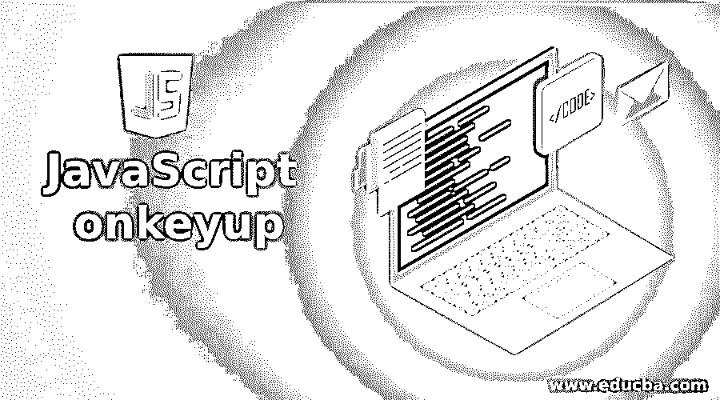

# JavaScript onkeyup

> 原文：<https://www.educba.com/javascript-onkeyup/>




## JavaScript onkeyup 简介

JavaScript onkeyup 事件是当处理应用程序的用户释放键盘上的一个键时发生的一种事件。使用这种方法可以处理派生类中的事件。方法有助于应用程序在不附加委托的情况下处理发生的事件。一旦某个键在被按下后从关键字中释放出来，就会调用此方法。如果没有释放按键，将不会调用事件。与按下字母或数字键时发生的 onkeyup 事件不同，此方法与按下的键无关。

### JavaScript onkeyup 的语法

在 JavaScript 中，如果在应用程序中需要一个事件，有两种方法，一种是调用对象的 onkeyup 方法，然后调用包含需要执行的操作的方法。第二种方法是使用 addEventListener 方法调用函数来执行操作。因此，调用 onkeyup 事件方法有两种语法。

<small>网页开发、编程语言、软件测试&其他</small>

1.使用 onkeyup 关键字调用对象上的函数。

```
Object.onkeyup = function(){myFunction()};
```

**举例:**

```
document.getElementById("text_box").onkeyup = function() {myFunction()};
```

2.在对象上使用 addEventListener()方法中的函数。

```
element.addEventListener(event, function, useCapture);
```

**举例:**

```
document.getElementById("text_box").addEventListener("keyup", myFunction);
```

### onkeyup 事件在 JavaScript 中如何工作？

当应用程序在 JavaScript 中引发 keyup 事件时，会向编译器提供一个代码来指示某个键被按下。例如，小写的“x”将被 keyup 报告为 65。所有事件都将大写字母“A”报告为 65。一旦编译器得到代码，它就把控制权发送给所定义的函数，并在按下的每个键上运行函数中的所有语句。因此，这种类型的方法用于执行操作，例如调查按下的键是字母还是数字，或者一旦在字段中键入字母，是否将其转换为大写。

要引发这样的事件，请在元素上使用 onkeyup 方法，并使用它来调用需要调用的方法。

```
Object.onkeyup =function(){function_name}
```

还有第二种方法来调用事件上的方法。它正在使用事件侦听器。在 JavaScript 中，可以使用 addEvenetListener()方法在事件发生时调用方法。此方法有助于将事件侦听器附加到对象，而不会覆盖现有的事件侦听器。许多事件处理程序可以添加到单个对象中。因此使用 addEventListener()方法可以更容易地处理应用程序中发生的各种事件。这也增强了代码的可读性。

**语法:**

```
element.addEventListener(event, function, useCapture);
```

通过这种方式，该方法将函数附加到事件击键或按键等。

keypress 和 keyup 是有区别的，因为 onkeypress 处理的是在键盘上按下某个键的情况，而 onkeyup 看到的是在键盘上释放某个键的情况。onkeypress 也可以看到带有字母或数字的键，而 onkeyup 可以处理键盘上的所有键。

**Note:** onkeyup event is not able to detect all the changes when a key is pressed such as pasting text into the text field. Instead use input event if one needs to see call the operation whenever there is a change in the input’s value.

### JavaScript onkeyup 示例

下面是提到的例子:

#### 示例#1

在我们的第一个例子中，我们将看到 JavaScript 代码向输入字段中被按下的每个字母追加 1。这里我们使用 onkeyup 方法通过调用 myMethod 来调用事件处理程序，并执行方法中的语句。

**代码:**

```
<!DOCTYPE html&gt
<html>
<body>
<p>This method will append 1 at the end of each key pressed in the text field </p>
Enter your Text: <input type="text" id="Number">
<script>
document.getElementById("Number").onkeyup = function() {myMethod()};
function myMethod() {
var number = document.getElementById("Number");
number.value = number.value+1;
}
</script>
</body>
</html>
```

**输出:**


#### 实施例 2

在我们的第二个例子中，我们将看到 JavaScript 代码向输入字段中被按下的每个字母追加 1。这里我们使用 addEventListener()方法，通过调用 myMethod 将事件处理程序附加到 keyup 事件上，并执行方法中的语句。使用此方法增强了代码的可读性。

**代码:**

```
<!DOCTYPE html>
<html>
<body>
<p>This example demonstrated use of addEventListener() method to attach a "keyup" event to an input field.</p>
<p>This method will append 1 at the end of each key pressed in the text field.</p>
Enter your Number: <input type="text" id="Number">
<script>
document.getElementById("Number").addEventListener("keyup", myMethod);
function myMethod() {
var number = document.getElementById("Number");
number.value = number.value+1;
</script>
</body>
</html>
```

**输出:**

**


T6】**

### 结论

一旦键盘上的一个键在一个派生类中被释放，JavaScript onkeyup 事件方法就会被调用，而无需使用委托。我们可以使用对象上的 onkeyup 方法调用或使用 addEventListener()方法来调用事件。这有助于在从键盘上松开某个键时调用该函数并执行一些操作。

### 推荐文章

这是一个 JavaScript onkeyup 的指南。这里我们讨论 onkeyup 事件在 JavaScript 中是如何工作的？和示例。您也可以看看以下文章，了解更多信息–

1.  JavaScript 中的[对象](https://www.educba.com/object-in-javascript/)
2.  [JavaScript getElementsByTagName()](https://www.educba.com/javascript-getelementsbytagname/)
3.  [JavaScript 混淆器](https://www.educba.com/javascript-obfuscator/)
4.  [JavaScript 警告](https://www.educba.com/javascript-alert/)


