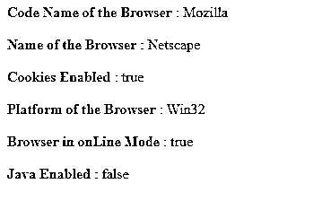

# JavaScript 导航器

> 原文：<https://www.educba.com/navigator-in-javascript/>


## **JavaScript 导航器简介**

[JavaScript 中的 Navigator 是一个对象](https://www.educba.com/javascript-objects/)，它提供了关于用户用来访问网络应用的浏览器的详细信息。正如我们有文档对象模型(DOM)来控制数据操作一样，我们也有浏览器对象模型(BOM)来控制如何在浏览器上查看应用程序。BOM 的一些实体是:


<small>网页开发、编程语言、软件测试&其他</small>

*   历史
*   位置
*   屏幕
*   文档
*   航海家

JavaScript navigator 对象有助于根据用户的浏览器以及浏览器设置中启用或禁用的实体来定制我们的应用程序，因为我们知道所有的浏览器都互不相同，并且处理 JavaScript 的方式也不同。

本文解释了 JavaScript 使用的 BOM 导航器。

### JavaScript 中导航器的属性

JavaScript Navigator 提供了几个方法和属性，可以用来获取关于用户浏览器的有趣信息。这可以帮助程序员检测和发现浏览器是否支持哪些功能。

现在，我们知道 navigator 对象有助于检测用户使用了哪种浏览器。在本文的这一部分，我们将讨论 navigator 对象的常用属性和方法，并获得一些关于我们的浏览器的信息。

navigator 对象是一个窗口属性，可以通过

```
window.navigator or navigator
```

因为窗口是一个全局对象，并且位于作用域链的顶端，所以可以在不添加窗口前缀的情况下访问它。

#### 表 1:导航器对象的属性

下面提到了一些导航器对象属性

| **属性** | **描述** |
| **appCodeName** | 返回浏览器的代码名 |
| **appName** | 返回浏览器的名称 |
| **appVersion** | 返回浏览器的版本信息 |
| **cookieEnabled** | 确定浏览器中是否启用了 cookies |
| **地理定位** | 返回可用于定位用户位置的地理定位对象 |
| **语言** | 返回浏览器的语言 |
| **上线** | 确定浏览器是否在线 |
| **平台** | 返回为哪个平台编译的浏览器 |
| **产品** | 返回浏览器的引擎名称 |
| **用户代理** | 返回浏览器发送给服务器的用户代理头 |

#### 表 2:导航器对象的方法

| **方法** | **描述** |
| **javaEnabled()** | 指定浏览器是否启用了 Java |
| **tain enabled()** | 在 JavaScript 版本 1.2 中移除。指定浏览器是否启用了数据污染 |

数据污点允许一个窗口看到另一个窗口中的属性，因为它被证明是一个高安全性风险，所以被移除。

##### 示例#1

导航器属性和方法

**代码:**

```
<!doctype html>
<script>
document.write("<strong>Code Name of the Browser</strong> : ",navigator.appCodeName + "<br><br>");
document.write("<strong>Name of the Browser</strong> : ",navigator.appName + "<br><br>");
document.write("<strong>Cookies Enabled</strong> : ",navigator.cookieEnabled + "<br><br>");
document.write("<strong>Platform of the Browser</strong> : ",navigator.platform + "<br><br>");
document.write("<strong>Browser in onLine Mode</strong> : ",navigator.onLine + "<br><br>");
document.write("<strong>Java Enabled</strong> : ",navigator.javaEnabled());
</script>
</html>
```

**输出:**




需要记住的重要一点是，由于兼容性的原因，navigator.appCodeName 总是导致“Mozilla”。此外，我们使用 Chrome、Firefox、IE11 或 Safari。navigator 对象的 appName 属性将始终导致“Netscape”。我们还需要记住，从 navigator 对象返回的信息通常可能是错误的或误导的，因为用户可以更改 navigator 对象返回的数据，浏览器不会报告在浏览器之后发布的新操作系统，不同的浏览器可以使用相同的名称。导航器对象的属性是只读属性。除了属性和方法，JavaScript Navigator 还有一个称为集合的特性。

#### 表 3:导航器对象集合

下表列出了 JavaScript navigator 对象中存在的集合，然后我们将看到一个例子。

| **收藏** | **描述** |
| **插件[]** | 返回对文档中所有嵌入对象的引用 |
| 拟态 | 返回客户端浏览器支持的 MIME 类型的集合 |

mime 属性有三个预定义的字段:

*   名称–MIME 类型的名称(视频/mpeg)
*   描述–类型的描述
*   后缀–MIME 类型的所有可能文件后缀(文件扩展名)的列表。

##### 实施例 2

JavaScript 导航器集合

**代码:**

```
<!doctype html>
<script>
var plugin = navigator.plugins["Flash Player"];
if (plugin)
document.write("Plugin Present")
else
document.write("You don't have Flash Player installed!")
</script>
</html>
```

**输出:**


##### 实施例 3

JavaScript 导航器属性-地理定位

**代码:**

```
<!DOCTYPE html>
<html>
<body>
<script>
navigator.geolocation.getCurrentPosition(showPosition);
function showPosition(position) {
console.log("Latitude: " + position.coords.latitude + "\n" +"Longitude: " + position.coords.longitude);
}
</script>
</body>
</html>
```

**输出:**


它有助于提供用户位置，但需要用户的许可才能共享他/她的位置。[对于有 GPS 的设备来说，地理定位更加精确](https://www.educba.com/html-geolocation/)。此属性也是只读属性。

### 结论

我们学习了如何使用 JavaScript 获取浏览器信息，以及它的 navigator 对象如何帮助我们获取名称、版本、平台等信息。，以及用户浏览器中是否启用了 cookies。记住一些浏览器给出错误的信息只是为了绕过网站测试。

### 推荐文章

这是 JavaScript 中的导航指南。在这里，我们还将讨论 JavaScript 中导航器的基本概念和属性，以及一些示例。您也可以看看以下文章，了解更多信息–

1.  【JavaScript 如何工作
2.  [JavaScript vs JQuery](https://www.educba.com/javascript-vs-jquery/)
3.  [TypeScript vs JavaScript](https://www.educba.com/typescript-vs-javascript/)
4.  [HTML5 vs JavaScript](https://www.educba.com/html5-vs-javascript/)


