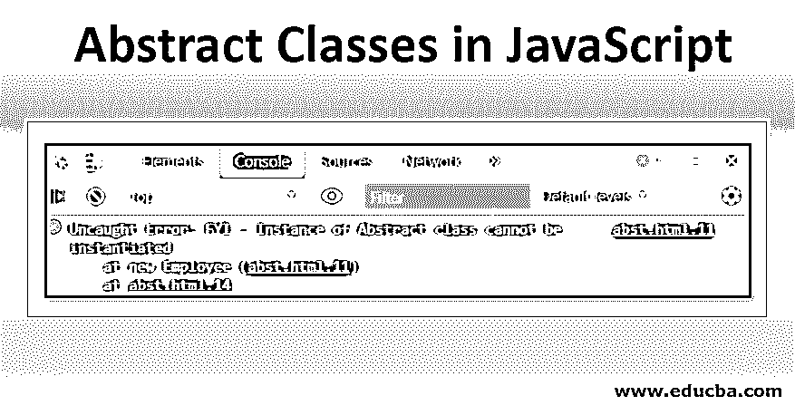

# JavaScript 中的抽象类

> 原文：<https://www.educba.com/abstract-classes-in-javascript/>




## JavaScript 中抽象类的介绍

javascript 是一种面向对象的语言，因为 JavaScript 中的大多数元素都是对象，除了原始数据类型。

在面向对象编程(OOP)中，抽象的概念是隐藏实现细节，向用户展示对象的基本特性。OOP 的这种抽象特性增强了我们编写的代码的可理解性和可维护性，并减少了代码的重复。由于抽象大部分时间[用在 Java 等编程语言](https://www.educba.com/best-programming-languages/)中，我们将在 JavaScript 中应用这个特性。

<small>网页开发、编程语言、软件测试&其他</small>

在 JavaScript 博客文章的抽象类中，我们将讨论 JavaScript 中的抽象类。在我们深入到 [JavaScript 中抽象类的实现之前，让我们了解一下](https://www.educba.com/what-is-javascript/)什么是抽象类。

### 什么是抽象类？

*   抽象类可以被定义为不能被实例化的类，即其对象引用不能被创建并且在其中包含一个或多个抽象方法。
*   抽象方法是一种只能声明但没有实现的方法。抽象类需要被继承，并且需要子类为抽象类中声明的方法提供实现。
*   在 Java 中，我们有 abstract 关键字来使一个类成为抽象类，而在 JavaScript 中没有这样的保留关键字来将一个类声明为抽象类。
*   在下面的例子中，我们将使用 JavaScript 编写几行代码来检查我们是否能够[创建一个抽象类](https://www.educba.com/abstract-class-in-c-sharp/)，并且看看我们是否能够满足它的属性。

### JavaScript 中抽象类的例子

让我们在程序代码的帮助下看一些例子

#### 示例 1:抽象类创建

**代码:**

```
<!DOCTYPE html>
<html>
<body>
<script>
//Created an abstract class (constructor function)
function Employee()
{
this.empName= "empName";
if(this.constructor === Employee){
throw new Error("FYI: Instance of Abstract class cannot be instantiated");
}
} ;
// Method (function) of our abstract class
Employee.prototype.display=function()
{  return this.empName;  }
var employee = new Employee();
</script>
</body>
</html>
```

**输出:**


**说明:**

在上面的代码场景中，我们创建了一个构造函数 Employee，它充当一个抽象类。我们还创建了一个显示函数来检查雇员的姓名。在 JavaScript 的最后一行，我们创建了一个对象引用或抽象类 employee 的一个实例(Employee ),以检查是否正在创建对象或通过 display 函数显示错误。

现在，进一步扩展上面的例子，我们将创建另一个函数来扩展抽象类 Employee 的属性和方法。就 Java 而言，我们将创建一个子类，我们的雇员将是超类。

#### 示例 2:扩展抽象类

**代码:**

```
<!DOCTYPE html>
<html>
<body>
<script>
//Created an abstract class (constructor function)
function Employee()
{
this.empName="empName";
if(this.constructor === Employee){
throw new Error("You cannot create an instance of     Abstract Class");
}
};
// Method (function) of our abstract class
Employee.prototype.display=function()
{
return "Employee name is: "+this.empName;
}
//Created a subclass (constructor function)
function Manager(fullName)
{
this.empName=fullName;
}
//Created an object of subclass (extending abstract class)
Manager.prototype=Object.create(Employee.prototype);
var mang=new Manager("Aniket Davda");
console.log(mang.display());
</script>
</body>
</html>
```

**输出:**


**说明:**

在上面的代码示例中，我们通过创建一个函数/类管理器来实现抽象，该管理器通过原型链(JavaScript 中的一个重要概念，通过它来实现继承)来扩展我们的抽象类 Employee。实现细节对用户是隐藏的，并且只访问满足他/她的需求的特征。

在上面的例子 1 和 2 中，我们已经实现了抽象，尽管我们还没有满足抽象类的所有属性。根据抽象类的定义，它的对象不能被创建，应该有一个或多个抽象方法。

随着 ES6 的发布，JavaScript 变得简单多了，并引入了 Java 类的新特性及其附加特性。让我们看看下面的例子，我们用 JavaScript 实现了一个类和抽象属性。

#### 例 3:抽象类——完整的代码

**代码:**

```
<!DOCTYPE html>
<html>
<body>
<script>
class Employee
{
constructor() {
if(this.constructor == Employee){
throw new Error(" Object of Abstract Class cannot be created");
}
}
display(){
throw new Error("Abstract Method has no implementation");
}
}
class Manager extends Employee
{
display(){
//super.display();
console.log("I am a Manager");
}
}
//var emp = new Employee;
var mang=new Manager();
mang.display();
</script>
</body>
</html>
```

**输出 1:** 正确输出


**输出 2:** 注释掉 super.display()


**输出 3:** 注释掉 var emp = new Employee()


**说明:**

上面的代码片段看起来几乎像一个定义了类、构造函数、方法和对象的 java 代码，这是 ES6 版本的魔力。现在回到代码，我们可以看到 Employee 类是一个抽象类，当它的对象被创建时显示错误(输出 3)，并且包含一个抽象方法 display()，它的实现是在 Manager 类的 display()方法中定义的，它扩展了 Employee 类的属性和方法。

### 结论

我们在处理抽象时需要记住的是，不能创建抽象类的实例。总之，我们学习了如何在 JavaScript 中实现 OOP 概念的抽象，以及如何实现一个满足所有属性的抽象类。

### 推荐文章

这是 JavaScript 中抽象类的指南。这里我们讨论 JavaScript 中抽象类的介绍，什么是抽象类以及适当的例子。您也可以浏览我们推荐的其他文章，了解更多信息——

1.  [JavaScript 确认](https://www.educba.com/javascript-confirm/)
2.  [JavaScript getElementsByTagName()](https://www.educba.com/javascript-getelementsbytagname/)
3.  [JavaScript 中的定时器](https://www.educba.com/timer-in-javascript/)
4.  JavaScript 中的[对象](https://www.educba.com/object-in-javascript/)


