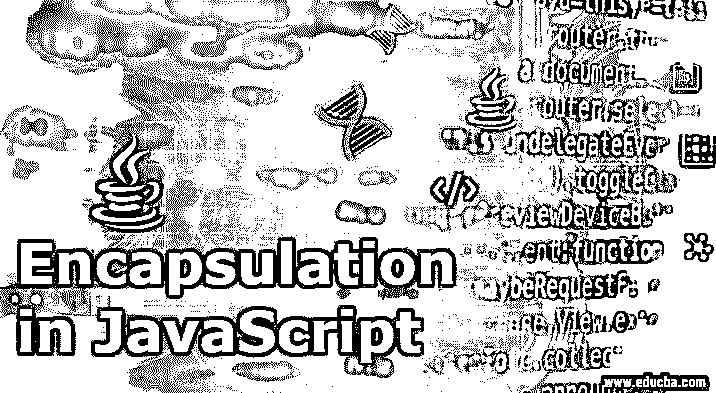

# JavaScript 封装

> 原文：<https://www.educba.com/encapsulation-in-javascript/>




## JavaScript 封装简介

JavaScript 是一种健壮的面向对象的脚本语言，能够在客户端和服务器端构建复杂的应用程序。然而，实现的复杂度越高，就需要更好的可维护性和更灵活的代码来处理这种情况。封装，[面向对象编程的原则之一](https://www.educba.com/object-oriented-programming-in-java/)是实现这些目标的关键。

根据定义，JavaScript 中的封装是将数据与作用于数据的函数绑定的过程。封装允许我们控制和验证数据。在 JavaScript 中，变量类似于数据。

<small>网页开发、编程语言、软件测试&其他</small>

封装意味着信息隐藏，即一个对象的内部实体不应该直接暴露为公共实体。这将有助于限制变量的未授权使用。相反，如果调用者想要获得一个定义的结果，它应该使用对象内部的公共方法或公共实体来访问对象的私有变量。

### JavaScript 封装的工作原理

让我们看一个简单的问题，其中一个“雇员”对象包含两个属性“姓名”属性。

```
var employee = {
name : "Aditya Chaturvedi",
};
alert(employee.name); // Aditya Chaturvedi
employee.name = "Rahul Khanna";
alert(employee.name); // Rahul Khanna
```

在上面的例子中，一切看起来都很好。我们创建了对象，打印了它的属性值并修改了它。但是当一些用户试图为 name 属性设置一个整数值时，问题就出现了。

```
employee.name = "Amit Trivedi";
alert(employee.name); // Amit Trivedi
```

就 JavaScript 而言，这是完全合法的，因为在 JavaScript 中，变量可以接受赋予它的任何类型。为了纠正这一点，我们需要设置可以设置为对象属性名的有效字符的范围。如果调用者可以访问和修改这些数据的值，这些验证就不能工作。对此的简单解决方案是

```
var employee = {
name : "Aditya Chaturvedi",
setName : function (value) {
var exp = new RegExp(/\d+/);
if( exp.test(value) ) {
alert("Invalid Name");
}
else {
this.name = value;
}
},
"getName" : function() {
return this.name;
}
};
alert( employee.getName() );   // Aditya Chaturvedi
employee.setName( "Rahul Khanna" );
alert( employee.getName() );   // Rahul Khanna
employee.setName( 42 );        // Invalid Name
alert( employee.getName() );   // Rahul Khanna
```

上面的例子应用了验证，但是仍然有一些错误，好像调用者直接访问名字，他仍然可以改变它。

```
employee.setName( 42 ); // Invalid Name; Here name won’t be changed.
employee.name = 42;     // No validation happens and the name is changed
alert( employee.getName() );   // 42 is printed.
```

这里的最终目标是变量名不应该对对象“employee”全局可用。封装有助于解决这个问题。这可以通过函数范围和闭包这两个概念来解决。

#### 1.功能范围

任何写在函数代码块内部的变量对外部都是隐藏的。

```
function fnScope()
{
var fnVar = "Hi!";
alert( fnVar ) // "Hi!";
}
alert( fnVar ) // error; fnVar is not accessible outside the function.
```

因此，如果我们将变量“name”移到函数“setName”中，那么调用者将不能直接访问它。但这并不容易直接将变量“Name”放入函数“setName”中，因为函数块中的变量不能在它的作用域之外使用，因此 name 对“getName”方法不可用。因为这种封闭会有所帮助。

#### 2.关闭

当两个函数捆绑在一起并引用它们周围的状态或词法环境时，就称为闭包。简而言之，闭包允许父函数中的另一个函数使用函数的局部变量。这里，我们有一个隐藏在函数 setName 内部的变量名。但是内部对象(myObj)可以访问它:

```
var employee = function () {
var name = "Aditya Chaturvedi";
var exp = new RegExp(/\d+/);
var myObj = {
setName : function (value) {
if( exp.test(value) ) {
alert("invalid name");
}
else {
name = value; // The object has access to "name"
}
},
getName : function () {
return name; // The object has access to "name"
}
}; // End of the Object
};
employee.getName(); // doesn't work!
```

现在我们已经使用了闭包的概念，两个函数都可以访问内部对象 myObj。但是，访问内部对象仍然存在错误。上面我们已经看到 employee.getName 不能使用，employee.myObj.getName 也不能使用，因为 myObj 也是函数的私有变量，不能像这样在外部访问私有变量。因此，每当调用匿名函数时，我们需要返回内部对象，并将它赋给外部变量。

```
var employee = function () {
var name = "Aditya Chaturvedi";
var exp = new RegExp(/\d+/);
return {
setName : function (value) {
if( exp.test(value) ) {
alert("Invalid Name");
}
else {
name = value;
}
},
getName : function () {
return name;
}
}; // end of the return
}(); // Note this '()' means we're calling the function
// and assigning the returned value to the variable employee
alert(employee.getName());   // Aditya Chaturvedi
employee.setName( "Rahul Khanna" );
alert(employee.getName());  // Rahul Khanna
employee.setName( 42 ); // Invalid Name; the name does'nt changes.
employee.name = 42;     // Doesn't affect the private fullName variable.
alert(employee.getName());  // Rahul Khanna is printed again.
```

### JavaScript 封装的优势

在 JavaScript 中使用封装的主要优点是为数据提供安全性。封装的其他好处包括:

*   封装保护对象免受非法访问。
*   封装有助于在不暴露其复杂细节的情况下达到一个水平。
*   这将减少人为错误。
*   使应用程序更加灵活和易于管理。
*   简化应用程序。

### 结论

封装是 JavaScript 中的一个工具，它可以使复杂的操作变得简单和易于管理，同时使整个应用程序变得安全和易于工作。

### 推荐文章

这是一个 JavaScript 封装指南。这里我们讨论 javascript 中封装的工作原理以及概念和优点。你也可以看看下面的文章来了解更多-

1.  [JavaScript 中的数组](https://www.educba.com/arrays-in-javascript/)
2.  [JavaScript 工具](https://www.educba.com/javascript-tools/)
3.  [JavaScript 中的 For 循环](https://www.educba.com/for-loop-in-javascript/)
4.  [JavaScript 中的变量](https://www.educba.com/variables-in-javascript/)


