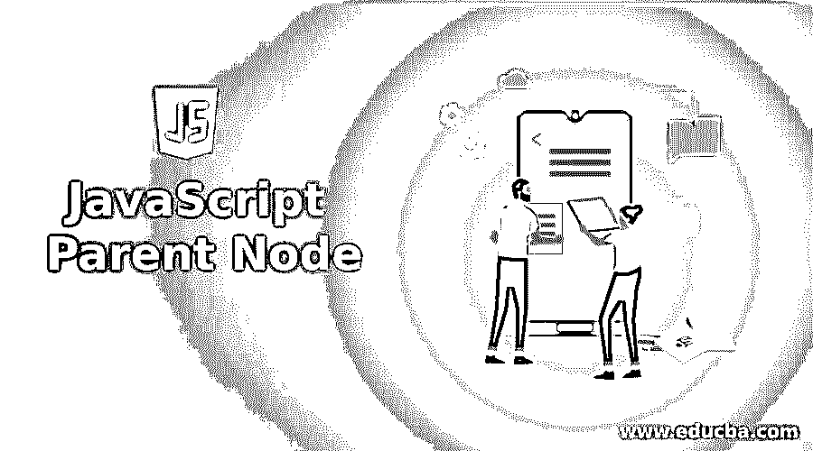
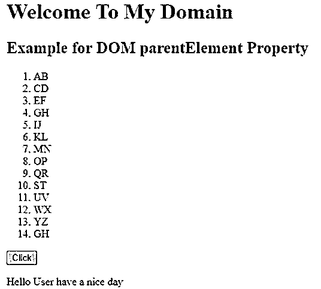
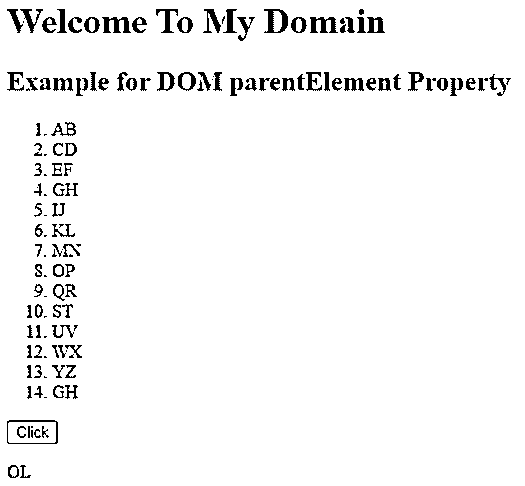
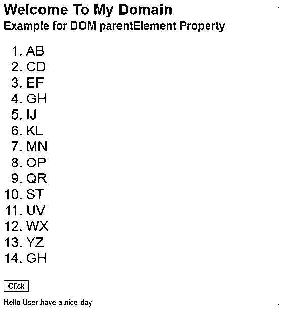

# JavaScript 父节点

> 原文：<https://www.educba.com/javascript-parent-node/>




## JavaScript 父节点简介

父节点是 javascript 属性之一，它用于返回在对象节点中定义的特定节点的父节点，每当我们使用 html 网页作为 UI 前端时，html 文档本身就可以识别 html 元素的父节点。头和体是每个 html 元素的一些子节点。元素的属性也是只读的，所以我们不能编辑节点。我们认为在 parent node 属性的类型中不接受自定义功能。

### 语法和参数

在一般的父节点和子节点中，这种关系将被称为继承概念。因此，每个节点都包含方法和它们自己的属性，这些方法和属性必须为父节点和子节点中的所有节点对象所共有。

<small>网页开发、编程语言、软件测试&其他</small>

```
<html>
<body>
<div>
<p id="first">
Some sentence
</p>
</div>
<p id="second">
</p>
<button onclick="function()"></button>
<script>
function  function()
{
var v=document.getElementById("first").parentNode.nodeName;
document.getElementById("second").innerHTML=v;
---some javascript logics---
}
</script></body></html>
```

以上代码是 html 和 javascript 函数的父节点和子节点关系的基本语法。每当我们使用 html 代码时，父节点和子节点都是借助于

标签来指定的，这是父节点和子节点的最好例子。

### Javascript 中父节点是怎么做的？

javascript 通常包含许多用于特定网页的属性和方法，更加安全，性能更快。同样，父节点和子节点是必须返回到指定节点的父节点的属性。从指定的节点开始，如果假设它已经被赋值为 null，或者如果当前节点没有父元素，也没有只读属性。它有不同的属性，比如一些常用的主要属性 ParentNode.childElementCount，ParentNode.children，ParentNode.firstElementChild，ParentNode.lastElementChild 这些都是 html 和脚本中 dom 元素的只读属性。父节点是当前节点元素的父节点。元素的父节点是一个元素节点，不仅因为它是一个文档节点或文档片段节点，即使我们在应用程序中需要的所有子节点中都使用了这些节点。

文档和文档片段节点没有父节点，因此 parentNode 将始终为空值。如果假设我们已经创建了新的节点，但是它没有附加到 DOM 树，那么该节点的 parentNode 也将为 null。DOM parent element 属性主要用于返回特定子元素的父元素，这一点很重要，因为 parentNode 和 parentElement 属性类似于一个元素，有时不同之处在于，如果父节点不是一个元素，parentElement 属性将始终返回空值，这种情况在应用程序中是不可能的。

DOM 用于允许任何类型的元素和它们自己的内容，但是我们必须决定相应的 DOM 对象和操作允许在 Dom 上从文档对象开始。因此，从这个角度来看，它是 DOM 的主要入口点之一，任何类型的节点都可以访问它。在子节点或子节点的情况下，元素被引导指向子节点，因为嵌套的概念在给定的父节点元素实例中被严格遵循，如、 标签。在 Descendants 中，嵌套了实际给定元素的所有 html 元素，包括子节点、子节点等等。在 descendants 中，标签的所有元素不仅仅指向直接子标签

、

1.  Label element.

### JavaScript 父节点的示例

下面是一些例子:

#### 示例#1

**代码:**

```
<!DOCTYPE html>
<html>
<head>
<title>
First Example
</title>
</head>
<body>
<h1 style="color:green;">
Welcome To My Domain
</h1>
<h2>Example for DOM parentElement Property</h2>
<ol type="sample">
<li id="example">AB</li>
<li>CD</li>
<li>EF</li>
<li>GH</li>
<li>IJ</li>
<li>KL</li>
<li>MN</li>
<li>OP</li>
<li>QR</li>
<li>ST</li>
<li>UV</li>
<li>WX</li>
<li>YZ</li>
<li>GH</li>
</ol>
<button onclick="demo()">
Click
</button>
<p id="second">
Hello User have a nice day
</p>
<script>
function demo() {
var v =
document.getElementById("example").parentElement.nodeName;
document.getElementById("second").innerHTML =v;
}
</script>
</body>
</html>
```

**输出:**







#### 实施例 2

**代码:**

```
<!DOCTYPEhtml>
<html>
<head>
<title>
Second Example
</title>
<style>
.first>div {
src: url('WWW.facebook.com');
font-family:'MutatorSans';
font-style: normal;
font-smooth: 6em;
}
div.second {
font-smooth: auto;
font-smooth: never;
font-smooth: always;
}
div.third {
font-weight: inherit;
text-transform: uppercase;
font: 1.5rem 'MutatorSans', sans-serif;
font-smooth: 2em;
}
div.four {
font: 80% sans-serif;
font-smooth: 3em;
}
div.five {
background-color:pink;
font: 13px/11px sans-serif;
font-smooth: 5em;
}
</style>
</head>
<body>
<div class="five">
<h1 style="color:green;">
Welcome To My Domain
</h1>
<h2>Example for DOM parentElement Property</h2>
<div class="third">
<ol type="sample">
<li id="example">AB</li>
<li>CD</li>
<li>EF</li>
<li>GH</li>
<li>IJ</li>
<li>KL</li>
<li>MN</li>
<li>OP</li>
<li>QR</li>
<li>ST</li>
<li>UV</li>
<li>WX</li>
<li>YZ</li>
<li>GH</li>
</ol>
</div>
<button onclick="demo()">
Click
</button>
<p id="second">
Hello User have a nice day
</p>
<script>
function demo() {
var v =
document.getElementById("example").parentElement.nodeName;
document.getElementById("second").innerHTML =v;
}
</script>
</div>
</body>
</html>
```

**输出:**




#### 实施例 3

**代码:**

```
<!DOCTYPEhtml>
<html>
<head>
<title>
Welcome To My DOmain
</title>
<style>
div {
padding: 17px;
width: 73%;
background-color: red;
color: pink;
border-radius:32px;
}
.second {
float: left;
font-size: 32px;
font-weight: bold;
cursor: pointer;
}
</style>
</head>
<body>
<center>
<h2>Hello User have a nice day</h2>
<div>

x

<p style="font-size:33px;">Once Again Welcome User Please give your feedback in the columns</p>
</div>
</center>
</body>
</html>
```

**输出:**


点击 x 后:


在上面的三个例子中，我们在应用程序中使用了与 parentNode 和 parentElement 相同的概念。无论我们在代码中尝试了什么逻辑，但是当我们以 parentElement.nodeName 的形式调用它时，它将调用标记元素的父元素。

### 结论

继承概念适用于所有类型的编程语言，在独立应用程序和 web 应用程序中主要用于父子关系。同样，基于 web 的应用程序(可能是 javascript 语言 parentNodes)主要包含在性能和应用程序流中，以便理解 web 用户。

### 推荐文章

这是一个 JavaScript 父节点的指南。这里我们也讨论一下 javascript 中的介绍和父节点是怎么做的？以及一个不同的示例及其代码实现。您也可以看看以下文章，了解更多信息–

1.  [JavaScript 浮动](https://www.educba.com/javascript-floating/)
2.  [JavaScript 计数器](https://www.educba.com/javascript-counter/)
3.  [JavaScript 动画](https://www.educba.com/javascript-animation/)
4.  [JavaScript elseIf](https://www.educba.com/javascript-elseif/)


