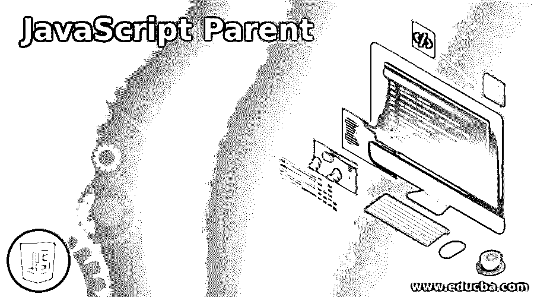
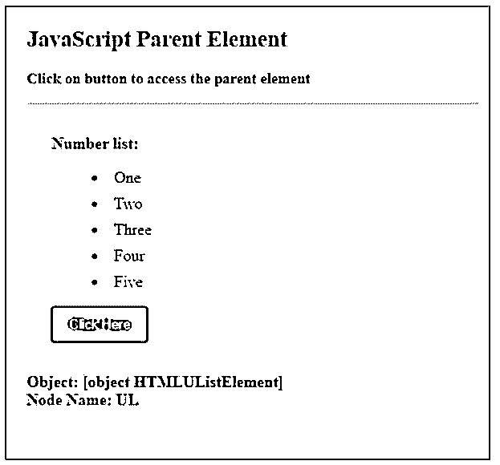
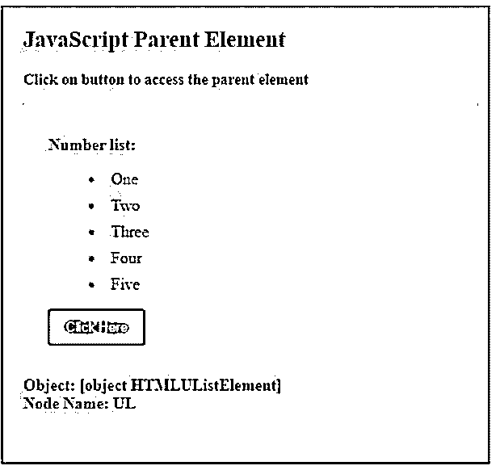
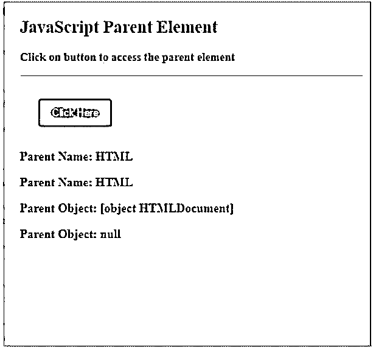

# JavaScript 父级

> 原文：<https://www.educba.com/javascript-parent/>




## JavaScript 父级简介

HTML 由 DOM 组成，其中所有元素都被定义为对象。这些元素形成了层次结构，如从父到子。任何包含子元素的元素都可以被视为父元素。通常需要访问这样的父元素，并使用函数对它们进行操作。它提供了两种访问父元素的方法，一种是使用 parentNode，另一种是使用 parentElement。这两个属性都返回调用此属性的元素的父元素。parentNode 和 parentElement 都是只读属性。

### JavaScript Parent 是如何工作的？

因为 JavaScript 提供了 parentNode 和 parentElement 属性来访问父元素。这两个属性相似，但是如果指定元素的父节点不是元素，parentElement 属性将返回 null。

<small>网页开发、编程语言、软件测试&其他</small>

*   **node.parentElement:** 返回一个字符串，该字符串代表任何指定子节点的父节点，如果父节点不是元素，则返回 null。该节点表示文档树中的任何元素。
*   **node.parentNode:** 返回代表指定子节点的父节点的对象。该节点表示文档树中的任何元素。

### 例子

下面是提到的例子:

#### 示例 1:使用 parentElement

**代码:**

```
<!DOCTYPE html>
<html>
<head>
<meta charset = "UTF-8">
<title>
Accessing Parent Element using JavaScript
</title>
<style>
.body-data {
border : #81D4FA 2px solid;
background-color : #03a9f400;
text-align : left;
padding-left : 20px;
height : 450px;
width : 95%;
}
.list {
margin:5px auto;
max-width: 700px;
padding: 25px 15px 15px 25px;
}
.list li {
margin: 8px 0 0 0;
list-style: inside;
}
.list p, .resultText {
margin: 0 0 3px 0;
padding: 0px;
display: block;
font-weight: bold;
}
.heading {
font-weight: bold;
border-bottom: 2px solid #ddd;
font-size: 15px;
width: 98%;
}
.list button[ type = submit] {
background: #2196F3;
padding: 10px 17px 10px 17px;
margin-right: 10px;
color: #fff;
border: none;
}
.list button[ type = submit]:hover {
background: #2173f3;
}
</style>
</head>
<body>
<div class = "body-data" >
<div class = "heading" >
<h2> JavaScript Parent Element </h2>
<p> Click on button to access the parent element </p>
</div>
<div class = "list" >
<p> Number list: </p>
<ul>
<li id = "one" > One </li>
<li id = "two" > Two </li>
<li id = "three" > Three </li>
<li id = "four" > Four </li>
<li id = "five" > Five </li>
</ul>
<button type = "submit" value = "submit" onclick = "accessParent()"> Click Here </button>
</div>
<div class = "resultText">
<p id = "result"> </p>
</div>
</div>
<script type = "text/javascript">
function accessParent() {
var parentEl = document.getElementById("one").parentElement;
document.getElementById("result").innerHTML = "Object: " + parentEl + "</br> Node Name:" + " " + parentEl.nodeName;
}
</script>
</body>
</html>
```

**输出:**




#### 示例 2:使用 parentNode

**代码:**

```
<!DOCTYPE html>
<html>
<head>
<meta charset = "UTF-8">
<title>
Accessing Parent Element using JavaScript
</title>
<style>
.body-data {
border : #81D4FA 2px solid;
background-color : #03a9f400;
text-align : left;
padding-left : 20px;
height : 450px;
width : 95%;
}
.list {
margin:5px auto;
max-width: 700px;
padding: 25px 15px 15px 25px;
}
.list li {
margin: 8px 0 0 0;
list-style: inside;
}
.list p, .resultText {
margin: 0 0 3px 0;
padding: 0px;
display: block;
font-weight: bold;
}
.heading {
font-weight: bold;
border-bottom: 2px solid #ddd;
font-size: 15px;
width: 98%;
}
.list button[ type = submit] {
background: #2196F3;
padding: 10px 17px 10px 17px;
margin-right: 10px;
color: #fff;
border: none;
}
.list button[ type = submit]:hover {
background: #2173f3;
}
</style>
</head>
<body>
<div class = "body-data" >
<div class = "heading" >
<h2> JavaScript Parent Element </h2>
<p> Click on button to access the parent element </p>
</div>
<div class = "list" >
<p> Number list: </p>
<ul>
<li id = "one" > One </li>
<li id = "two" > Two </li>
<li id = "three" > Three </li>
<li id = "four" > Four </li>
<li id = "five" > Five </li>
</ul>
<button type = "submit" value = "submit" onclick = "accessParent()"> Click Here </button>
</div>
<div class = "resultText">
<p id = "result"> </p>
</div>
</div>
<script type = "text/javascript">
function accessParent() {
var parentEl = document.getElementById("one").parentNode;
document.getElementById("result").innerHTML = "Object: " + parentEl + "</br> Node Name:" + " " + parentEl.nodeName;
}
</script>
</body>
</html>
```

**输出:**




#### 例 3:两者的区别

**代码:**

```
<!DOCTYPE html>
<html>
<head>
<meta charset = "UTF-8">
<title>
Accessing Parent Element using JavaScript
</title>
<style>
.body-data {
border : #81D4FA 2px solid;
background-color : #03a9f400;
text-align : left;
padding-left : 20px;
height : 450px;
width : 95%;
}
.list {
margin:5px auto;
max-width: 700px;
padding: 25px 15px 15px 25px;
}
.list li {
margin: 8px 0 0 0;
list-style: inside;
}
.list p, .resultText {
margin: 0 0 3px 0;
padding: 0px;
display: block;
font-weight: bold;
}
.heading {
font-weight: bold;
border-bottom: 2px solid #ddd;
font-size: 15px;
width: 98%;
}
.list button[ type = submit] {
background: #2196F3;
padding: 10px 17px 10px 17px;
margin-right: 10px;
color: #fff;
border: none;
}
.list button[ type = submit]:hover {
background: #2173f3;
}
</style>
</head>
<body>
<div class = "body-data" >
<div class = "heading" >
<h2> JavaScript Parent Element </h2>
<p> Click on button to access the parent element </p>
</div>
<div class = "list" >
<button type = "submit" value = "submit" onclick = "accessParent()"> Click Here </button>
</div>
<div class = "resultText">
<p id = "result1"> </p>
<p id = "result2"> </p>
<p id = "result3"> </p>
<p id = "result4"> </p>
</div>
</div>
<script type = "text/javascript">
function accessParent() {
var parentEl1 = document.body.parentNode;
document.getElementById("result1").innerHTML = "Parent Name:" + " " + parentEl1.nodeName;
var parentEl2 = document.body.parentElement;
document.getElementById("result2").innerHTML = "Parent Name:" + " " + parentEl2.nodeName;
var parentEl3 = document.documentElement.parentNode;
document.getElementById("result3").innerHTML = "Parent Object:" + " " + parentEl3;
var parentEl4 = document.documentElement.parentElement;
document.getElementById("result4").innerHTML = "Parent Object:" + " " + parentEl4;
}
</script>
</body>
</html>
```

**输出:**




请注意，在调用 parentElement 的情况下，与 parentNode 相比，它返回 null parent。

### 结论

JavaScript 提供了两种类型的属性来访问 DOM 结构中的父元素。一个是 parentElement，另一个是 parentNode。这两种属性几乎相同。

### 推荐文章

这是一个 JavaScript 家长指南。这里我们讨论一下入门，JavaScript parent 是如何工作的？和示例。您也可以看看以下文章，了解更多信息–

1.  [JavaScript onkeyup](https://www.educba.com/javascript-onkeyup/)
2.  [JavaScript onfocus](https://www.educba.com/javascript-onfocus/)
3.  [JavaScript exec()](https://www.educba.com/javascript-exec/)
4.  [JavaScript 鼠标按下](https://www.educba.com/javascript-mousedown/)


