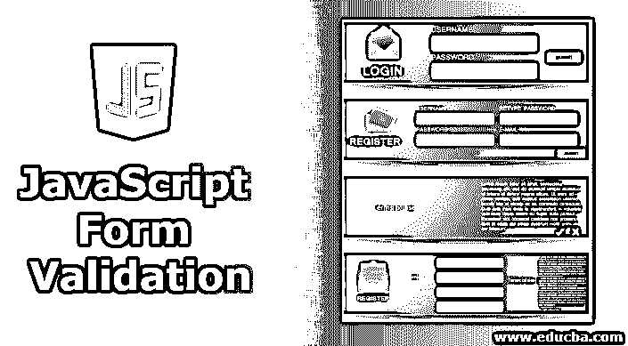
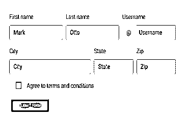
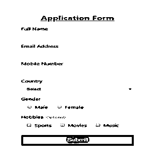

# JavaScript 表单验证

> 原文：<https://www.educba.com/javascript-form-validation/>




## JavaScript 表单验证简介

下面的文章提供了 JavaScript 表单验证的概要。表单验证对创建的表单执行准确性检查，并检查用户提交的信息是否正确。一旦客户端输入了所需的信息，表单的验证通常发生在服务器端。表单验证后，如果有任何不正确的信息或任何字段留空。然后，服务器会向客户端发送消息，指出输入的信息不正确或缺失。表单的验证让客户相信输入的所有信息都是正确的，否则将会抛出错误以便纠正。

**举例:**

<small>网页开发、编程语言、软件测试&其他</small>

**代码:**

```
var y = document.forms["Form"]["f.name"].value;
if (y == "")
{
alert("Name filed is empty");
return false;
}
}
```

**表单验证时需要检查的事项:**

*   检查用户是否将必须填写的字段留空。如果为空，则返回“警告消息”。
*   检查用户是否在应该输入数值的地方输入了数字。比如联系方式。
*   检查用户是否在名称字段中输入了字母字符。
*   检查数字和字母字符。如果表单域是字母数字的。例如，消息字段。
*   检查用户是否在两个字段中正确输入了密码。(密码字段、确认密码字段)
*   还要确保所有的下拉框和复选框都标记正确。

### 表单验证的类型

*   客户端表单验证
*   服务器端表单验证

#### 1.客户端表单验证

为了避免给服务器带来压力和不必要的带宽，使用 Jscript 进行客户端验证是有帮助的。在从客户端进行验证之后，您应该从服务器端进行另一次验证。多做一次服务器端验证的原因是因为用户可能在他们的 web 浏览器上禁用了 JavaScript 。

客户端验证消耗较少的验证时间，因为验证发生在用户的浏览器上，这有助于用户获得更好的体验。而服务器端验证发生在服务器上，它需要用户的输入。然后，需要在验证之前将其发送到服务器，最后，用户必须等待服务器的响应，以了解错误发生在哪个字段。

**举例:**

**代码:**

```
<div class="form-row">
<div class="col-md-4 mb-3">
<label for="validationDefault">First name</label>
<input type="text" class="form" id="validationDefault" placeholder="First name" value="Mark"
required>
</div>
<div class="col-md-4 mb-3">
<label for="validationDefault">Last name</label>
<input type="text" class="form" id="validationDefault" placeholder="Last name" value="Otto"
required>
</div>
<div class="col-md-4 mb-3">
<label for="validationDefaultUsername">Username</label>
<div class="input-group">
<div class="input-group-prepend">
@
</div>
<input type="text" class="form-control" id="validationDefaultUsername" placeholder="Username"
aria-describedby="inputGroupPrepend21" required>
</div>
</div>
</div>
<div class="form-row">
<div class="col-md-6 mb-3">
<label for="validationDefault">City</label>
<input type="text" class="form-control" id="validationDefault" placeholder="City" required>
</div>
<div class="col-md-3 mb-3">
<label for="validationDefault">State</label>
<input type="text" class="form-control" id="validationDefault" placeholder="State" required>
</div>
<div class="col-md-3 mb-3">
<label for="validationDefault">Zip</label>
<input type="text" class="form-control" id="validationDefault" placeholder="Zip" required>
</div>
</div>
<div class="form-group">
<div class="custom-control custom-checkbox">
<input type="checkbox" class="custom-control-input" id="invalidCheck12" required>
<label class="custom-control-label" for="invalidCheck">Agree to terms and conditions</label>
</div>
</div>
<button class="btn btn-primary btn-sm" type="submit">Submit form</button>
</form>
```

**输出**:




#### 2.服务器端表单验证

执行服务器端验证是为了确保用户已经输入了所有数据，并且没有留下任何空白或输入错误。服务器端验证确保用户输入的表单中没有错误。

**举例:**

**代码:**

```
<html lang="en">
<head>
<meta charset="UTF-8">
<title>Form validation</title>
<link rel="stylesheet" href="https://cdn.educba.com/css/form-style.css">
<script>
function printError(elemId, hintMsg) {
document.getElementById(elemId).innerHTML = hintMsg;
}
function validateForm() {
var name = document.contactForm.name.value;
var email = document.contactForm.email.value;
var mobile = document.contactForm.mobile.value;
var country = document.contactForm.country.value;
var gender = document.contactForm.gender.value;
var hobbies = [];
var checkboxes = document.getElementsByName("hobbies[]");
for(var i=0; i < checkboxes.length; i++) {
if(checkboxes[i].checked) {
hobbies.push(checkboxes[i].value);
}
}
var nameErr = emailErr = mobileErr = countryErr = genderErr = true;
if(name == "") {
printError("nameErr", "Please enter name");
} else {
var regex = /^[a-zA-Z\s]+$/;
if(regex.test(name) === false) {
printError("nameErr", "Enter valid name");
} else {
printError("nameErr", "");
nameErr = false;
}
}
if(email == "") {
printError("emailErr", "enter your email");
} else {
var regex = /^\S+@\S+\.\S+$/;
if(regex.test(email) === false) {
printError("emailErr", "Please enter a valid email");
} else{
printError("emailErr", "");
emailErr = false;
}
}
if(mobile == "") {
printError("mobileErr", "Please enter mobile number");
} else {
var regex = /^[1-9]\d{9}$/;
if(regex.test(mobile) === false) {
printError("mobileErr", "Please enter a valid mobile number");
} else{
printError("mobileErr", "");
mobileErr = false;
}
}
if(country == "Select") {
printError("countryErr", "Please select country");
} else {
printError("countryErr", "");
countryErr = false;
}
if(gender == "") {
printError("genderErr", "Please select gender");
} else {
printError("genderErr", "");
genderErr = false;
}
if((nameErr || emailErr || mobileErr || countryErr || genderErr) == true) {
return false;
} else {
var dataPreview = "You've entered the following details: \n" +
"Full Name: " + name + "\n" +
"Email Address: " + email + "\n" +
"Mobile Number: " + mobile + "\n" +
"Country: " + country + "\n" +
"Gender: " + gender + "\n";
if(hobbies.length) {
dataPreview += "Hobbies: " + hobbies.join(", ");
}
alert(dataPreview);
}
};
</script>
</head>
<body>
<form name="contactForm" onsubmit="return validateForm()" action="/examples/actions/confirmation.php" method="post">
<h2>Application Form</h2>
<div class="row">
<label>Full Name</label>
<input type="text" name="name">
<div class="error" id="nameErr"></div>
</div>
<div class="row">
<label>Email Address</label>
<input type="text" name="email">
<div class="error" id="emailErr"></div>
</div>
<div class="row">
<label>Mobile Number</label>
<input type="text" name="mobile" maxlength="10">
<div class="error" id="mobileErr"></div>
</div>
<div class="row">
<label>Country</label>
<select name="country">
<option>Select</option>
<option>Australia</option>
<option>India</option>
<option>United States</option>
<option>United Kingdom</option>
</select>
<div class="error" id="countryErr"></div>
</div>
<div class="row">
<label>Gender</label>
<div class="form-inline">
<label><input type="radio" name="gender" value="male"> Male</label>
<label><input type="radio" name="gender" value="female"> Female</label>
</div>
<div class="error" id="genderErr"></div>
</div>
<div class="row">
<label>Hobbies <i>(Optional)</i></label>
<div class="form-inline">
<label><input type="checkbox" name="hobbies[]" value="sports"> Sports</label>
<label><input type="checkbox" name="hobbies[]" value="movies"> Movies</label>
<label><input type="checkbox" name="hobbies[]" value="music"> Music</label>
</div>
</div>
<div class="row">
<input type="submit" value="Submit">
</div>
</form>
</body>
</html>
```

**输出:**




### 结论

JavaScript 中的表单验证不需要复杂的编码，但是我们应该从用户的角度考虑他们在填写表单时会如何出错，以及如何使用各种方法来验证表单。我们必须确保，如果用户输入的信息不正确，那么，错误发生在哪个字段的错误消息，并提供输入格式的说明。

### 推荐文章

这是 JavaScript 表单验证的指南。在这里，我们还将讨论在进行表单验证时需要检查的内容及其类型。您也可以看看以下文章，了解更多信息–

1.  [JavaScript 封装](https://www.educba.com/encapsulation-in-javascript/)
2.  [JavaScript 的特性](https://www.educba.com/features-of-javascript/)
3.  [JavaScript 中的正则表达式](https://www.educba.com/regular-expressions-in-javascript/)
4.  [JavaScript 对象方法](https://www.educba.com/javascript-object-methods/)


