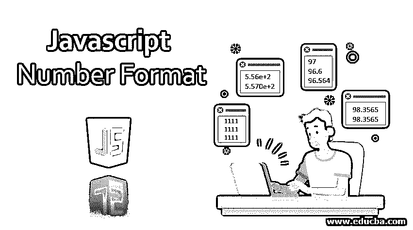
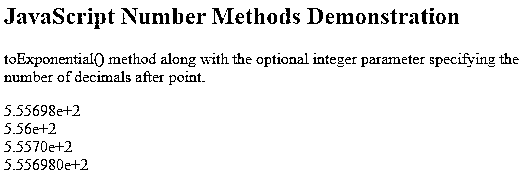
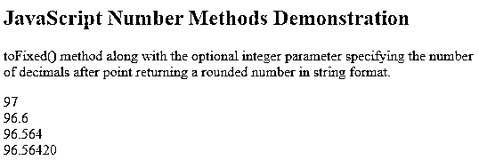
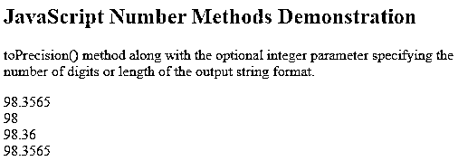
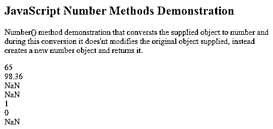
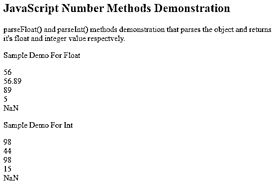

# JavaScript 数字格式

> 原文：<https://www.educba.com/javascript-number-format/>




## JavaScript 数字格式介绍

数字，不管是整数还是浮点还是小数值，都是 javascript 中的[原语数据类型。在 javascript 中，数字操作方法是可用的，但它们都是在对象上操作的。虽然这些方法不能在原始数据类型上使用](https://www.educba.com/primitive-data-types-in-javascript/)[，](https://www.educba.com/primitive-data-types-in-java/)我们可以在数字的原始数据类型上执行 javascript 的数字操作方法，因为 javascript 将每个基本数据类型都视为一个对象。在这个主题中，我们将学习 JavaScript 数字格式。

无论何时调用任何方法，JavaScript 数字操作方法都会返回一个新的数字对象，而无需借助于调用方法来修改对象。

<small>网页开发、编程语言、软件测试&其他</small>

### JavaScript 数字格式的方法

这些方法可以操作任何数字格式，如变量、文字甚至表达式。

我们今天要讨论的方法在下面的表格中列出并简要描述


#### 1.toString()方法

该方法返回字符串，可以传递的参数可以是变量、文字或表达式。让我们来看一个演示相同内容的例子。

**代码:**

```
<!DOCTYPE html>
<html>
<body>
<h2>JavaScript Number Methods Demonstration</h2>
<p>toString() demonstration for variables, literals and expressions</p>
<p id="sampleDemo"></p>
<script>
var x = 11111;
document.getElementById("sampleDemo").innerHTML = x.toString() + "<br>" +
(11111).toString() + "<br>" + (10000 + 1111).toString();
</script>
</body>
</html>
```

**输出:**


#### 2.toExponential()方法

此方法返回一个值，该值是字符串中的舍入数字和指数符号。除了返回字符串值之外，还可以为该方法提供一个 integer 参数，该参数指定输出字符串中小数点后的小数位数。

让我们看一个同样的例子。

**代码:**

```
<!DOCTYPE html>
<html>
<body>
<h2>JavaScript Number Methods Demonstration</h2>
<p>toExponential() method along with the optional integer parameter specifying the number of decimals after point.</p>
<p id="sampleDemo"></p>
<script>
var sample = 555.698;
document.getElementById("sampleDemo").innerHTML = sample.toExponential() + "<br>" + sample.toExponential(2) + "<br>" + sample.toExponential(4) + "<br>" + sample.toExponential(6);
</script>
</body>
</html>
```

**输出:**




#### 3.toFixed()方法

此方法返回具有指定小数位数的整数。此方法返回包含数字的字符串，该数字的小数位数可以在参数中指定。

让我们看一个同样的例子。

**代码:**

```
<!DOCTYPE html>
<html>
<body>
<h2>JavaScript Number Methods Demonstration</h2>
<p>toFixed() method along with the optional integer parameter specifying the number of decimals after point returning a rounded number in string format.</p>
<p id="sampleDemo"></p>
<script>
var sample = 96.5642; document.getElementById("sampleDemo").innerHTML =
sample.toFixed(0) + "<br>" + sample.toFixed(1) + "<br>" + sample.toFixed(3) + "<br>" + sample.toFixed(5);
</script>
</body>
</html>
```

**输出:**




#### 4.toPrecision()方法

此方法返回一个字符串，该字符串包含参数中指定的数字长度。像 toFixed()方法一样，该字符串不考虑传递的参数，如要考虑的小数位数，而是考虑数字中的总位数，这意味着它的实际长度。

让我们也看一个这种方法的例子。

**代码:**

```
<!DOCTYPE html>
<html>
<body>
<h2>JavaScript Number Methods Demonstration</h2>
<p>toPrecision() method along with the optional integer parameter specifying the number of digits or length of the output string format.</p>
<p id="sampleDemo"></p>
<script>
var sample = 98.3565;
document.getElementById("sampleDemo").innerHTML =
sample.toPrecision() + "<br>" +
sample.toPrecision(2) + "<br>" +
sample.toPrecision(4) + "<br>" +
sample.toPrecision(6);
</script>
</body>
</html>
```

**输出:**




#### 5.valueOf()方法

此方法返回存储在调用它的变量、文字或表达式中的实际内容数值。在 javascript 中，数字可以是 number 或 object 类型。在内部，javascript 使用 valueOf()方法检索原始数值。

让我们看一个同样的例子。

**代码:**

```
<!DOCTYPE html>
<html>
<body>
<h2>JavaScript Number Methods Demonstration</h2>
<p>valueOf() method demonstration for variables, literals and expressions.</p>
<p id="sampleDemo"></p>
<script>
var sample = 98.3565;
document.getElementById("sampleDemo").innerHTML =
sample.valueOf() + "<br>" +
(98.3565).valueOf() + "<br>" +
(90 + 8.3565).valueOf();
</script>
</body>
</html>
```

**输出:**


除了上述方法，还有其他方法可以帮助将 javascript 对象转换为数字，如下所列

#### 6.Number()方法

此方法返回传递的参数的转换后的数字。

**代码:**

```
<!DOCTYPE html>
<html>
<body>
<h2>JavaScript Number Methods Demonstration</h2>
<p>Number() method demonstration that converts the supplied object to the number and during this conversion it doesn't modifies the original object supplied, instead creates a new number object and returns it.</p>
<p id="sampleDemo"></p>
<script> document.getElementById("sampleDemo").innerHTML =
Number("65") + "<br>" +
Number("98.36") + "<br>" +
Number("46 69") + "<br>" +
Number("11,12") + "<br>" +
Number(true) + "<br>" +
Number(false) + "<br>" +
Number("Sample");
</script>
</body>
</html>
```

**输出:**




#### 7.parseFloat()和 parseInt()方法

此方法分析提供的对象，并分别返回浮点值或整数值。

让我们看一个例子。

**代码:**

```
<!DOCTYPE html>
<html>
<body>
<h2>JavaScript Number Methods Demonstration</h2>
<p>parseFloat() and parseInt() methods demonstration that parses the object and returns it's float and integer value respectvely.</p>
<p>Sample Demo For Float</p>
<p id="sampleDemoForFloat"></p>
<p>Sample Demo For Int</p>
<p id="sampleDemoForInt"></p>
<script>
document.getElementById("sampleDemoForFloat").innerHTML =
parseFloat("56") + "<br>" +
parseFloat("56.89") + "<br>" +
parseFloat("89 45 52") + "<br>" +
parseFloat("5 days") + "<br>" +
parseFloat("day 27");
document.getElementById("sampleDemoForInt").innerHTML =
parseInt("98") + "<br>" +
parseInt("44.65") + "<br>" +
parseInt("98 56 14") + "<br>" +
parseInt("15 days") + "<br>" +
parseInt("day 20");
</script>
</body>
</html>
```

**输出:**




### 结论

这样，我们可以使用数字格式操作方法来转换对象，以获得所需的格式作为输出或结果。我们应该记住，无论何时使用上述任何方法，它都不会修改传递的原始对象，而是创建一个具有预期格式的新对象作为回报。

### 推荐文章

这是一个 JavaScript 数字格式的指南。在这里，我们讨论 JavaScript 数字格式的基本概念和不同的方法，如变量、文字甚至表达式以及相应的例子。您也可以看看以下文章，了解更多信息–

1.  [JavaScript innerHTML](https://www.educba.com/javascript-innerhtml/)
2.  [JavaScript 中的队列](https://www.educba.com/queue-in-javascript/)
3.  [JavaScript 调试器](https://www.educba.com/javascript-debugger/)
4.  [JavaScript 获取数组长度](https://www.educba.com/javascript-get-array-length/)


