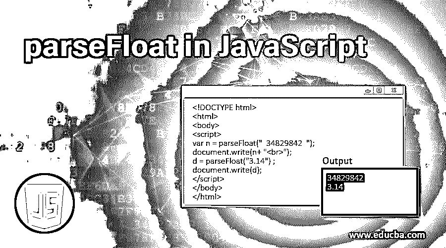
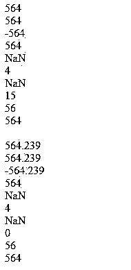
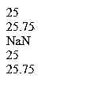
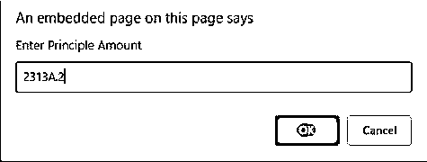

# JavaScript 中的 parseFloat

> 原文：<https://www.educba.com/parsefloat-in-javascript/>




## JavaScript 中的 parseFloat 简介

parseFloat()是一个全局内置函数，它接受一个字符串作为输入并转换为浮点数，这意味着浮点数被解析到遇到一个字符(非数字)的位置。Float 是十进制数的一种数据类型，通常用于计算模拟值和连续值，因为计算起来很困难。浮点数的最大值可以是 3.40282347E+38，最小值可以是-3.40282347E+38。这些浮点数总是 64 位的。浮点表示带有小数点或分数的十进制整数。解析意味着分析一组指令并将其转换成一种格式，以便运行时环境可以运行程序。

****语法:****

<small>网页开发、编程语言、软件测试&其他</small>

```
Number.parseFloat(value);
```

或者

```
parseFloat(value);
```

接受一个字符串形式的参数，并将其转换为浮点数。如果字符串的第一个字符不能转换为数字，则函数返回 NaN，即不是数字。通常返回浮点数，直到出现非数字字符的位置。

### JavaScript 中的 parseFloat 示例

让我们考虑一个说明上述理论的例子，

#### 示例#1

**代码:**

```
<!DOCTYPE html>
<html>
<body>
<script>
var n = parseFloat("  34829842  ");
document.write(n+ "<br>");
d = parseFloat("3.14") ;
document.write(d);
</script>
</body>
</html>
```

****输出:****


这里，parseFloat()忽略输入字符串前后的空格，只返回浮点数，即 34829842。

#### 实施例 2

使用 isNaN 检查输入字符串是否是浮点数字或字符。

**代码:**

```
<!DOCTYPE html>
<html>
<body>
<script>
var x = parseFloat("3.45");
if (isNaN(x))
document.write("x is not a number" + "<br>");
else
document.write("x is a number" + "<br>");
var y = parseFloat("howareyou");
if (isNaN(y))
document.write("y is not a number" + "<br>");
else
document.write("y is a number" + "<br>");
</script>
</body>
</html>
```

****输出:****


在数学中，0/0 未定义为实数，因此表示为 NaN。由于 NaN 没有值，将其与自身进行比较将返回 TRUE。isNaN 检查一个值是否为 NaN(非数字),如果该值为数字，则返回 TRUE，否则返回 FALSE。

#### 实施例 3

让我们看看 parseInt()和 parseFloat()之间的区别，使用 parseInt()，每个浮点十进制数都将被舍入到它的最近值，即 2.34 是否将被舍入到 2。

**代码:**

```
<!DOCTYPE html>
<html>
<body>
<script>
var x = parseInt("3.67");
var y = parseFloat("3.67");
document.write('Using parseInt("3.67") = ' + x + "<br>");
document.write('Using parseFloat("3.67") = ' + y + "<br>");
</script>
</body>
</html>
```

****输出:****


#### 实施例 4

超大数字或极小数字可以用指数符号来表示。

**代码:**

```
<!DOCTYPE html>
<html>
<body>
<script>
var x = parseFloat("432e-4");
var y = parseFloat("432e9");
document.write('Using parseFloat("432e-4") = ' + x + "<br>");
document.write('Using parseFloat("432e9") = ' + y + "<br>");
</script>
</body>
</html>
```

****输出:****


parseFloat()不是任何对象的方法。如果 parseFloat()遇到除加号(+)、减号(-)、数字(0-9)、小数或指数(E 或 E)之外的字符，parseFloat()将返回该字符的值，而忽略其他无效字符。解析时会忽略值的前导空格和尾随空格。参数的第一个字符不能转换为数字并返回 NaN，可以返回 Infinity，可以将 BigInt 语法转换为数字，因为结尾的 n 字符被丢弃。

#### 实施例 5

**代码:**

```
<!DOCTYPE html>
<html>
<head>
<title>Exploring parseInt() and parseFloat()</title>
<script>
document.write(parseInt( "564.239" ) + "</br>" );
document.write(parseInt( "+564.239" ) + "</br>" );
document.write(parseInt( "-564.239" ) + "</br>" );
document.write(parseInt( "564FGl" ) + "</br>" );
document.write(parseInt( "FGl" ) + "</br>" );
document.write(parseInt( "4px 9px" ) + "</br>" );
document.write(parseInt( "(786)" ) + "</br>" );
document.write(parseInt( "0xF" ) + "</br>" );
document.write(parseInt( "056" ) + "</br>" );
document.write(parseInt( " 564 " ) + "</br>" );
document.write("</br>");
document.write(parseFloat( "564.239" ) + "</br>" );
document.write(parseFloat( "+564.239" ) + "</br>");
document.write(parseFloat( "-564.239" ) + "</br>");
document.write(parseFloat( "564FGl" ) + "</br>");
document.write(parseFloat( "FGl" ) + "</br>");
document.write(parseFloat( "4px 9px" ) + "</br>");
document.write(parseFloat( "(786)" ) + "</br>");
document.write(parseFloat( "0xF" ) + "</br>");
document.write(parseFloat( "056" ) + "</br>");
document.write(parseFloat( " 564 " ) + "</br>");
</script>
</head>
<body>
</body>
</html>
```

****输出:****




“0x”和“056”，因为我们没有分别将它们视为基数 16 和基数 8，唯一的区别是 parseFloat()对于像 564.239 这样的值返回十进制数，而 parseInt()返回 564。

#### 实施例 6

如果有两位小数，第二位小数无效，parseFloat()方法将字符串转换到该位置。字符串 22.45.32 将被解析为 22.45。

**代码:**

```
<!DOCTYPE html>
<html>
<head>
<script>
document.write(parseFloat( "22.45.32" ) + "</br>" );
</script>
</head>
<body>
</body>
</html>
```

****输出:****


#### 实施例 7

使用 Number.parseFloat(strng_value)。

**代码:**

```
<!DOCTYPE html>
<html>
<body>
<script>
var a="25";
var b="25.75"
var c="How are you";
var d="25How are you";
var e="25.75How are you"
document.writeln(Number.parseFloat(a)+"<br>");
document.writeln(Number.parseFloat(b)+"<br>");
document.writeln(Number.parseFloat(c)+"<br>");
document.writeln(Number.parseFloat(d)+"<br>");
document.writeln(Number.parseFloat(e));
</script>
</body>
</html>
```

****输出:****




#### 实施例 8

解析值之前和之后。

**代码:**

```
<!DOCTYPE html>
<html lang="en">
<head>
<meta charset="utf-8">
<title>area of a circle</title>
</head>
<script>
var a="10.67";
var b="23.51";
var c=a+b;
document.writeln("Before invoking parseFloat(): "+c+"<br>");
var c=Number.parseFloat(a)+Number.parseFloat(b);
document.writeln("After invoking parseFloat(): "+c);
</script>
</body>
</html>
```

**输出:**


#### 实施例 9

让我们看看如何使用 parseFloat 计算单利。

**代码:**

```
<!DOCTYPE html>
<html lang="en">
<head>
<meta charset="utf-8">
<title>Simple Interest</title>
</head>
<script type="text/javascript">
function simpleInterest()
{
var pa,rate,time;
pa=parseFloat(prompt("Enter Principle Amount"));
rate=parseFloat(prompt("Enter Rate Amount"));
time=parseFloat(prompt("Enter Time(year)"));
document.write(pa + "</br>");
document.write(rate + "</br>");
document.write(time + "</br>");
var si=(pa*rate*time)/100;
document.write("Simple Interest anually is: "+si);
}
</script>
<body>
<center>
<input type="button" value="Calculate Simple Interest" onclick="simpleInterest()" />
</center>
</body>
</html>
```

****输出:****


点击按钮时:




我们需要输入本金金额，同样也要输入利率和时间。

本金金额:2313.2
利率:2。一个
时间:1.2A


#### 实施例#10

圆半径的计算。

**代码:**

```
<!DOCTYPE html>
<html lang="en">
<head>
<meta charset="utf-8">
<title>area of a circle</title>
</head>
<script type="text/javascript">
function area()
{
var radius;
radius=parseFloat(prompt("Enter radius"));
document.write(radius + "</br>");
var area = 3.14 * radius * radius;
document.write("Area of circle is is: "+area);
}
</script>
<body>
<center>
<input type="button" value="Calculate Area" onclick="area()" />
</center>
</body>
</html>
```

****输出:****


半径:3DF.4A


### 结论

最后，我们可以总结说，解析这些浮点数字对复杂的计算很有帮助，因为即使用户输入任何字符，parseFloat 也只限制数字，并且只接受数字作为输入，这就是解析并返回浮点值。这个 [javascript 函数](https://www.educba.com/javascript-function-declaration/)不如 parseInt()函数强大，因为它将传入的字符串值解析为浮点数而不是十进制数，但只能处理十进制数，而不是八进制或十六进制数。

### 推荐文章

这是 JavaScript 中的 parseFloat 指南。在这里，我们将讨论基本概念以及带有代码实现和输出的 10 个简单示例。您也可以阅读以下文章，了解更多信息——

1.  [JavaScript 获取数组长度](https://www.educba.com/javascript-get-array-length/)
2.  [JavaScript 合并数组](https://www.educba.com/javascript-merge-arrays/)
3.  [JavaScript parseInt](https://www.educba.com/javascript-parseint/)
4.  [JavaScript 自定义事件](https://www.educba.com/javascript-custom-events/)


