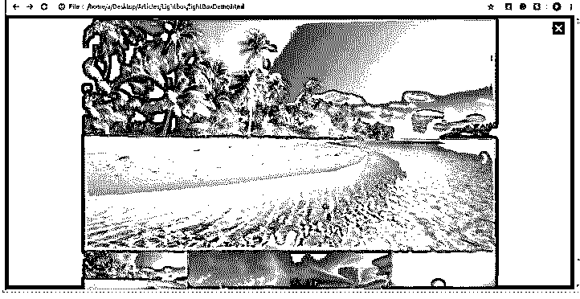
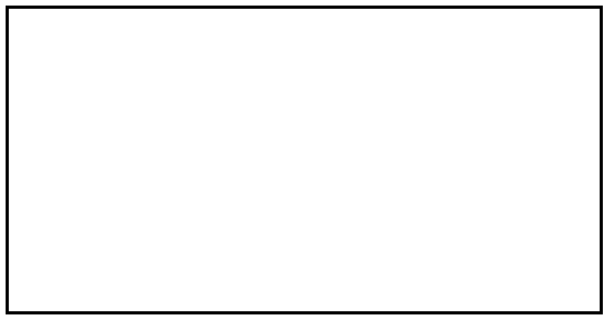
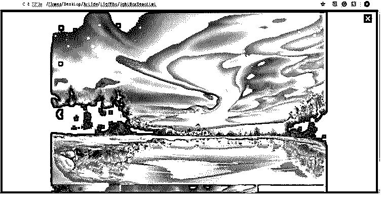
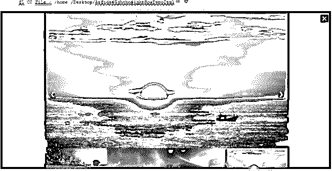

# JavaScript 中的 Lightbox

> 原文：<https://www.educba.com/lightbox-in-javascript/>


## JavaScript 中的 Lightbox 简介

下面的文章用 JavaScript 提供了 Lightbox 的概要。我们经常会遇到这样的情况，当我们必须以小尺寸向用户显示多个图像(也可以称为缩略图或预览)时，当用户单击任何一个图片时，我们必须打开一个大窗口或模式，以更大的尺寸显示所选图像，并提供上一页和下一页按钮进行导航。这种点击图片就能打开的东西被称为灯箱或幻灯片，它能以全尺寸显示图片，并能在其中导航。

最受欢迎和日常的例子可以是谷歌搜索图片或我们的手机，笔记本电脑等图库。我们可以简单地通过使用 HTML、CSS 和 JavaScript 编码来创建它。HTML 将用于定义我们显示的布局或结构，CSS 将用于为我们提供不同的样式，可以帮助我们隐藏、显示、显示透明窗口等，这些可以通过使用 JavaScript 来进一步操作。我们可以在 HTML 的事件上改变窗口的样式，比如 onClick()，hover 等等。

<small>网页开发、编程语言、软件测试&其他</small>

### 用 JavaScript 实现 Lightbox 的步骤及示例

下面给出了步骤:

#### 第一步

首先，我们将编写 HTML 代码来定义显示图像缩略图的第一个屏幕的布局和结构。我们将在每个图像上使用 onClick()事件，以更大的尺寸打开 lightbox 和幻灯片。为此将调用 OpenLightboxModal()。请注意，有必要将图像放在与代码文件相同的文件夹中，否则您必须在 img 元素的 src 属性中提到这些图像的完整路径。

**代码:**

```
<!DOCTYPE html>
<body>
<style>
//Code mentioned in points 3 to 6 should be placed for defining style using css
</style>
<div class="rowStyle">
<div class="colStyle">

</div>
<div class="colStyle">

</div>
<div class="colStyle">

<div class="colStyle">

</div>
</div>
```

#### 第二步

现在，我们将为 lightbox 定义模式，并在单击右上角提供的关闭符号时调用 closeLightboxModal()以返回缩略图。箭头定义在两边，通过调用 switchSlide()方法将幻灯片切换到上一张和下一张。灯箱的底部将以透明视图显示所有图像，当鼠标悬停在它上面时，CSS 属性将变为完全可见，单击底部带 jumpToSlide()方法将分别打开这些小缩略图。

**代码:**

```
<div id="Lightbox" class="modal">
&times;
<div class="modal-content">
<div class="slide">

</div>
<div class="slide">

</div>
<div class="slide">

</div>
<div class="slide">

</div>
<a class="preceding" onclick="switchSlide(-1)">❮</a>
<a class="succeeding" onclick="switchSlide(1)">❯</a>
<div class="dots">
<div class="colStyle">

</div>
<div class="colStyle">

</div>
<div class="colStyle">

</div>
<div class="colStyle">

</div>
</div>
</div>
</div>
</div>
```

#### 第三步

现在是时候使用 CSS 定义上述结构的样式了。这里，flex 用于显示图像，这意味着它们将根据设备的大小进行调整。首先，为第一页上的缩略图声明样式。

**代码:**

```
html {
box-sizing: border-box;
}
*, *:before, *:after
{ box-sizing:
inherit;
}
body { margin:
0;
}
.thumbnails {
width: 100%;
}
.rowStyle
display:
flex;
flex-direction: rowStyle;
justify-content: space-between;
}
.rowStyle >>
.colStyle {
padding: 0 8px;
}
.colStyle {
float: left;
width: 25%;
}
```

#### 第四步

现在，我们将为 lightbox cum 幻灯片定义 CSS，它将驻留在模态中。

**代码:**

```
.modal {
display:
none;
position:
fixed; z-
index: 1;
padding: 10px 62px 0px
62px; left: 0;
top: 0;
width: 100%;
height:
100%;
overflow:
auto;
background-color: black;
}
.modal-content {
position:
relative;
display: flex;
flex-direction:
column; justify-content:
center; margin: auto;
padding: 0 0 0 0;
width: 80%;
max-width: 1200px;
}
```

#### 第五步

模态内部幻灯片的 CSS 将首先被设置为 none，并相应地进一步修改。

**代码:**

```
.slide {
display:
none;
}
.image-slide {
width:
100%;
}
.modal-thumbnails { width: 100%;
}
.dots {
display:
flex;
flex-direction: rowStyle;
justify-content: space-between;
}
```

#### 第六步

当不活动时，较低的带和首页缩略图将透明可见，当鼠标悬停时，它将完全可见。

同样的 CSS 如下:

**代码:**

```
img.thumbnails, img.modal-thumbnails { opacity: 0.6;
}
img.active,
.thumbnails:hover,
.modal-thumbnails:hover { opacity: 1;
}
img.hover-shadow {
transition: 0.3s;
}
.hover-shadow:hover {
box-shadow: 0 4px 8px 0 rgba(0, 0, 0, 0.2), 0 6px 20px 0 rgba(0, 0, 0, 0.19);
}
.close {
color:
white;
position:
absolute; top:
10px;
right: 25px;
font-size:
35px;
font-weight: bold;
}
.close:hover,
.close:focus { color: #999;
text-decoration:
none; cursor: pointer;
}
.preceding,
.succeeding {
cursor:
pointer;
position:
absolute; top:
50%;
width: auto;
padding: 16px;
margin-top:
-50px;
color: white;
font-weight:
bold; font-size:
20px; transition:
0.6s ease;
border-radius: 0 3px
3px 0; user-select:
none;
-webkit-user-select: none;
}
.succeeding { right:
0;
border-radius: 3px 0 0 3px;
}
.preceding:hover,
.succeeding:hover {
background-color: rgba(0, 0, 0, 0.8);
}
```

#### 第七步

开始了。我们已经准备好了视图，但是现在是时候为我们的 lightbox 编写主要代码了。JavaScript 用于操纵视图和幻灯片。它是由上述 HTML 事件触发的。首先编写可点击事件的所有方法或函数，然后调用 showSlide()主函数，它包含根据下面函数传递给它的参数显示所需图像的主要逻辑。
**代号:**

```
<script>
let indexOfSlide = 1;
showSlide(indexOfSlide);
function openLightboxModal() {
document.getElementById('Lightbox').style.display = 'block';
}
function closeLightboxModal() {
document.getElementById('Lightbox').style.display = 'none';
};
function switchSlide(n) {
showSlide(indexOfSlide += n);
};
function jumpToSlide(n) {
showSlide(indexOfSlide = n);
};
```

#### 第八步

所有 showSlide()函数的关键是保存幻灯片显示的逻辑，如下所示。

**代码:**

```
function showSlide(n) {
const slides = document.getElementsByClassName('slide');
let modalThumbnails = document.getElementsByClassName('modal-thumbnails');
if (n >
slides.length) {
indexOfSlide = 1;
};
if (n < 1) {
indexOfSlide = slides.length;
};
for (let i = 0; i < slides.length; i++) { slides[i].style.display = "none";
};
for (let i = 0; i < modalThumbnails.length; i++) {
modalThumbnails[i].className = modalThumbnails[i].className.replace(' active', '');
};
slides[indexOfSlide - 1].style.display = 'block'; modalThumbnails[indexOfSlide - 1].className += ' active';
};
</script>
</body>
</html>
```

**上述代码的输出如下:**














**点击右上角的十字符号，输出为:**


通过这种方式，使用 JavaScript 我们可以操纵视图，并在用户的动作上呈现我们想要的内容，如点击上一个、下一个标签、点击缩略图等。

### 推荐文章

这是一个用 JavaScript 编写的 Lightbox 指南。这里我们用一个例子来讨论 JavaScript 中 lightbox 的介绍和步骤。您也可以看看以下文章，了解更多信息–

1.  [JavaScript 中的继承](https://www.educba.com/inheritance-in-javascript/)
2.  [JavaScript 光标](https://www.educba.com/javascript-cursor/)
3.  [JavaScript 中的关联数组](https://www.educba.com/associative-array-in-javascript/)
4.  [设置属性 JavaScript](https://www.educba.com/setattribute-javascript/)


