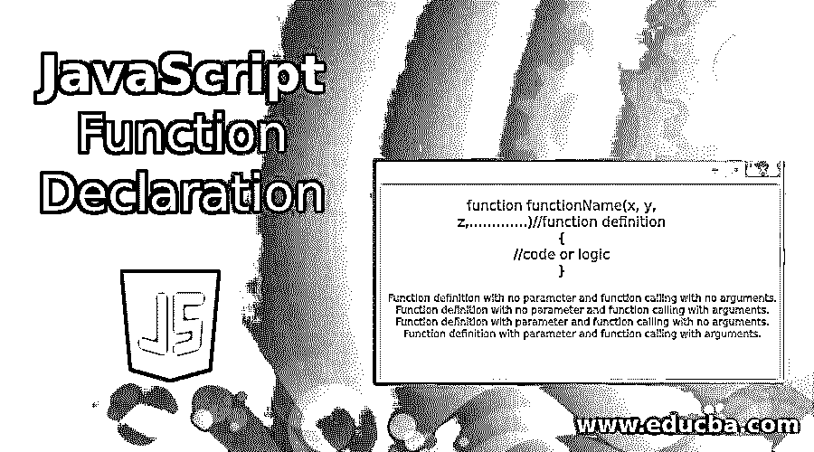

# JavaScript 函数声明

> 原文：<https://www.educba.com/javascript-function-declaration/>




## JavaScript 函数声明简介

一个函数就是一组语句组成一个逻辑单元(代码)。一个函数可以从任何地方调用，而不需要 HTML 页面。一个函数可以在标签的开头定义。

**Important Note:** Functions can be used or defined with both <head> and <body> section of a document.

**实时示例:**我正在编写一个代码，将现有的产品显示给一个电子商务网站。假设我要展示洗发水的规格；在任何地方，都很难写出所有的规范代码行。如果我们在一个特定的块中编写代码，并在需要的地方使用该块，我们就可以轻松地完成工作，而不用一次又一次地编写相同的代码。在那里我们会遇到函数。

<small>网页开发、编程语言、软件测试&其他</small>

### JavaScript 函数是如何工作的？

*   JavaScript 函数通过使用 function 关键字来使用。您可以采用函数声明或函数表达式。
*   JavaScript 函数不检查返回类型和参数类型；它负责 JavaScript 引擎。
*   JavaScript 函数不检查许多参数；即使函数中没有参数，函数中的参数也不会给你一个错误，因为它由 JavaScript 引擎处理。
*   JavaScript 函数语法非常重要。

**语法:**

```
function functionName(x, y, z,………….)//function definition
{
//code or logic
}
functionName(1,2,3,…….);//function calling
```

**说明:**

*   该函数是使用 function 关键字声明的。
*   函数名是 functionName(x，y，z)和被调用的函数定义。
*   x，y，z……是函数参数。
*   functionName (1，2，3)是函数参数，被调用函数调用。

document.write():用于像 html 页面一样在浏览器中显示输出。

### JavaScript 函数声明的类型和示例

*   没有参数的函数定义和没有参数的函数调用。
*   不带参数的函数定义和带参数的函数调用。
*   带参数的函数定义和不带参数的函数调用。
*   带参数的函数定义和带参数的函数调用。

以下是 JavaScript 声明的示例:

#### 示例#1

没有参数的函数定义和没有参数的函数调用。函数定义和函数调用都没有参数和自变量。

**语法:**

```
function getName()//function with no parameters
{
//code
}
getName()//function with no arguments
```

**代码:回文. js**

```
<!DOCTYPE html>
<html>
<body>
<font color="blue"><h1 align="center">Function definition with no parameter and function calling with no arguments</h1></font>
<script>
function palindromeOrNot()
{
var remainder,total=0,actualNumber;
var input=998919899;
actualNumber=input;
while(input>0)
{
remainder=input%10;
total=(total*10)+remainder;
input=parseInt(input/10);
}
if(actualNumber===total){
document.write(actualNumber+": is palindrome number ");
}
else  {
document.write(actualNumber+": is not palindrome");
}
}
palindromeOrNot();
</script>
</body>
</html>
```

**输出:**


**逻辑解释:**

*   想想 594 号。
*   第一次迭代余数=594%10 得出余数 4。
*   合计=合计*10+余数= >初始合计值=0，因此合计=0*10+4 为 4。
*   Input=parseInt(input/10)，解析是必需的，因为 JavaScript 默认将它视为字符串。输入=594/10 是 59。
*   执行时的第二次迭代，直到输入> 0，所以余数再次=输入%10。从代码的第一次迭代开始，这次输入=59。余数=59%10 是 9
*   现在，总数=4*10+9 是 49。由于第一次迭代，这里的总数是 4。
*   输入=59/10 是 5。
*   第三次迭代余数=5%10 等于 5。由于第二次迭代，输入为 5。
*   总数=49*10+5 是 495。第二次迭代的总数是 49。
*   输入=5/10 是 0，所以 while 退出。
*   如果任意一个数都是回文当且仅当这个数和它的倒数相同。所以，594 不是回文。

#### 实施例 2

不带参数的函数定义和带参数的函数调用。函数定义没有参数，函数调用中有一些参数。

**语法:**

```
function getName()//function with no parameters
{
//code
}
getName(myName)//function with one arguments
```

**代码:Factors.js**

```
<!DOCTYPE html>
<html>
<body>
<font color="blue"><h1 align="center">Function definition with no parameter and function calling with arguments</h1></font>
<script>
function factors()
{
var input=arguments[0],j=1;
document.write("factors of : "+input+" are ");
document.write("<br>");
while(j<=input)
{
if(input%j==0){
document.write(j);
document.write("<br>");
}
j++;//post increment operator
}
}
factors(9);
</script>
</body>
</html>
```

**输出:**


**说明:**

*   factors()定义没有参数，但 factors(9)有一个参数。就连 JavaScript 也没有抱怨过。因此，这个例子得出结论，JavaScript 不检查传递给它的参数。
*   因数是指一个数完全可以被其他数整除，称为该数的一个因数。
*   输入%j==0 意味着，例如，9%1==0 为真，因此 1 的因子为 9

9%2==0 假，所以不是一个因素

9%3==0 真，所以 3 是 9 的因数
。
。
。

9%9==0 为真，所以 9 是 9 的因数。

**Note:** arguments[] array used to get elements from the calling function.

#### 实施例 3

带参数的函数定义和不带参数的函数调用。

**语法:**

```
function getName(a,b,c)//function with 3 parameters
{
//code
}
getName()//function with no arguments
```

**代码:PerfectNumber.js**

```
<!DOCTYPE html>
<html>
<body>
<font color="blue"><h1 align="center">Function definition with parameter and function calling with no arguments</h1></font>
<script>
function perfectNumber(input=6)
{
var i=1,sum=0;
while(input>i)
{
if(input%i==0){
sum=sum+i;
}
i++;
}
if(sum==input)
{
document.write(input+" is perfect number");
}
else
{
document.write(input+" is not perfect number");
}
}
perfectNumber();
</script>
</body>
</html>
```

**输出:**


**说明:**

*   一个数是完全数；如果排除自身的一些因子相等，那么这个数就说是一个完全数。
*   比如 perfectNumber(input)，输入类型我们没有指定甚至 JavaScript 也没有抱怨。因此，JavaScript 根本不检查返回类型或参数类型。
*   最初设数字=6，i=1

数字%i==0

6%1==0，所以 1 是因子

6%2==0，所以 2 是因子

6%3==0，所以 3 是因子

休息不是因素

所以 1+2+3 的和是 6。所以，6 是一个完美的数字

#### 实施例 4

带参数的函数定义和带参数的函数调用。函数定义和函数调用都分别有参数和自变量。

**语法:**

```
function getName(a,b,c)//function with 3 parameters
{
//code
}
getName(1,2,3)//function with 3 arguments
```

**代码:SquareSum.js**

```
<!DOCTYPE html>
<html>
<body>
<font color="blue"><h1 align="center">Function definition with parameter and function calling with arguments</h1></font>
<script>
function squareSum(lastNumber)
{
var i,sum=0,j=1;
for(i=1;i<=lastNumber;i++)
{
j=i*i;
sum=sum+j;
}
return sum;
}
document.write("Sum of the Squares is :"+squareSum(10));
</script>
</body>
</html>
```

**输出:**


**说明:**

*   逻辑:j=i*i

sum = sum+j；

i)J=1*1=>1

总和=0+1=>1

ii)j=2*2=>4

总和=1+4=>5

ii)j=3*3=>9

sum=5+9=>14
。
。
。

x)j=10*10

总和=285+100=>385

### 结论

JavaScript 函数不能检查函数定义中的返回类型、参数类型和许多参数。一切都由 JavaScript 引擎处理。

### 推荐文章

这是 JavaScript 函数声明的指南。这里我们讨论 javascript 声明的介绍、函数类型和各种例子。您也可以看看以下文章，了解更多信息–

1.  [JavaScript 日期函数](https://www.educba.com/javascript-date-function/)
2.  [JavaScript 关键字](https://www.educba.com/javascript-keywords/)
3.  [JavaScript 字符串替换](https://www.educba.com/javascript-string-replace/)
4.  [JavaScript 比较字符串](https://www.educba.com/javascript-compare-strings/)


