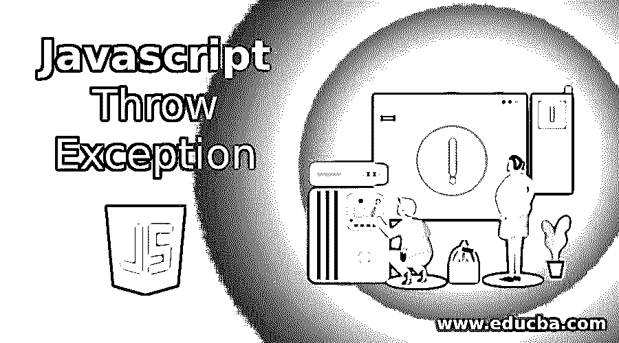
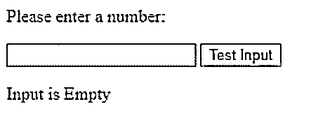
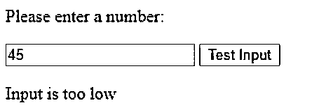
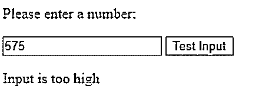

# Javascript 抛出异常

> 原文：<https://www.educba.com/javascript-throw-exception/>




## Javascript 抛出异常简介

当一个 javascript 语句产生一个错误时，它被称为抛出一个异常。throw 语句抛出一个错误。当错误发生时，javascript 将停止并生成一条错误消息，这意味着 javascript 抛出一个错误，而 throw 语句允许用户创建一个自定义错误，这意味着抛出一个异常。这些异常可以是 javascript 字符串、布尔值、数字或对象。将 try 和 catch 语句与 throw 一起使用时，用户可以控制程序流并生成自定义错误信息。

**语法:**

<small>网页开发、编程语言、软件测试&其他</small>

```
throw <expression>;
```

表达式是必须抛出的异常，可以是字符串、数字、布尔值或对象。

通常，错误由运行时引擎抛出，异常由开发人员抛出。在 javascript 中，所有的异常都类似于对象。抛出异常有两种方法，直接用错误对象和通过自定义对象。

一般异常需要一个异常对象来实例化一个错误消息作为构造函数的第一个参数，然后抛出，而自定义异常允许异常响应中的自动堆栈跟踪来检查抛出的异常。

### Javascript 抛出异常的例子

下面是抛出异常的示例:

#### 示例#1

**代码:**

```
<!DOCTYPE html>
<html>
<body>
<p>Please enter a number:</p>
<input id="demo" type="text">
<button type="button" onclick="myFunction()">Test Input</button>
<p id="message"></p>
<script>
function myFunction() {
var message, x;
message = document.getElementById("message");
message.innerHTML = "";
x = document.getElementById("demo").value;
try {
if(x == "")  throw "is Empty";
if(isNaN(x)) throw "is not a number";
if(x > 100)   throw "is too high";
if(x < 50)  throw "is too low";
}
catch(err) {
message.innerHTML = "Input " + err;
}
}
</script>
</body>
</html>
```

**输出:**


无需输入任何数字:




输入低于 50 的数字时:




输入非数字值时:


输入大于 100 的数字时:




**运行 throw 语句**

throw 关键字用于在遇到 throw 语句时抛出方法中的异常，并执行该语句。当前方法的执行被停止并返回给调用方。它允许用户创建并抛出用户定义的异常/错误消息。此外，用户可以将 throw 语句与 try 和 catch 语句一起使用。

语句 *throw* 和表达式之间没有行终止。

#### 实施例 2

**代码:**

```
<!DOCTYPE html>
<head>
<title>Throw Statement in JavaScript</title>
</head>
<body>
<script>
var x = 7, y = 7;
try {
if(x == y)
throw "e1";
else
throw "e2";
} catch(e) {
if(e == "e1")
document.write("Both are same value!");
if(e == "e2")
document.write("Both are different!");
}
</script>
</body>
</html>
```

**输出:**


如果 x = 7 且 y = 9


使用错误构造函数创建错误对象，当程序执行过程中出现错误时，这些错误对象会引发异常。

让我们使用错误对象修改上面的例子，

#### 实施例 3

**代码:**

```
<!DOCTYPE html>
<html lang="en">
<head>
<title>Throw Statement with Error constructor</title>
</head>
<body>
<script>
var x = 15, y = 10;
try {
if(x == y)
throw new Error("Both are same value!");
else
throw new Error("Both are different!");
} catch(e) {
document.write(e.message);
}
</script>
</body>
</html>
```

**输出:**


新错误是创建错误对象的错误构造函数。

用户还可以定义和初始化一个新的对象，当抛出一个对象时，对象属性被赋给对象参数。

在下面的示例中，sampleObj 是创建的对象，将分配所需的对象属性并在 catch 块中使用引用。

#### 实施例 4

**代码:**

```
<!DOCTYPE html>
<head>
<title>Throw Statement with Error constructor</title>
</head>
<body>
<script>
function sampleObj(errorcode, message) {
this.errorcode = errorcode;
this.message = message;
}
var x = 110, y = 54;
try {
if(x == y)
throw new sampleObj(200, "Both are same value!");
else
throw new sampleObj(201, "Both are different!");
} catch(e) {
document.write(e.errorcode +" : "+ e.message);
}
</script>
</body>
</html>
```

**输出:**


让我们看看使用 throw 语句的核心概念，即异常处理

在异常处理中，我们将许多紧密耦合的语句分组，如果其中一个语句在执行时导致错误，我们必须在导致错误的语句处停止，相反，我们通过检查语句可能失败的位置和时间来使用 throw 语句。

首先，我们需要找到问题并抛出异常，其次，我们需要捕捉这些异常。

**Try-Catch-finally 块:**

Try 语句是代码块，它允许测试代码和异常发生的位置，这些异常是使用 throw 语句抛出的。catch 语句处理由 throw 语句引发的任何错误。最后让用户执行代码。

### 一些错误构造函数

基本上，Error 是错误的通用构造函数，其他的是子构造函数。

*   **RangeError:** 表示数值超出了允许的范围。
*   **语法错误:**表示语法分析错误
*   **参考错误:**表示参考值无效
*   **类型错误:**指示的操作数的实际类型与预期的操作数不同

**堆栈跟踪:**有时，我们会遇到一些意想不到的异常，为了调试这些错误，我们通常需要一个调试器来调试这些问题，相反，我们可以尝试使用错误发生的跟踪进行手动调试。有了这个堆栈跟踪，我们就可以知道发生错误或异常的行号和导致错误或异常的数据，以及哪些数据传递了哪些值。

### 结论

用于处理异常的 throw 语句的确切定义以及一些例子。还查看了 throw 语句在程序中的工作方式，还学习了 try-catch-finally 块，它用于处理 throw 语句抛出的异常。我们能够在示例中定义一些自定义异常，并对我们在日常编程中处理的错误以及用于调试抛出的错误的堆栈跟踪有一个概述。

### 推荐文章

这是一个 Javascript 抛出异常的指南。这里我们讨论介绍、Javascript 抛出异常的例子、错误构造函数以及输出。您也可以浏览我们的其他相关文章，了解更多信息——

1.  [Javascript 嵌套函数](https://www.educba.com/javascript-nested-functions/)
2.  [Javascript void](https://www.educba.com/javascript-void/)
3.  [JavaScript 设置超时](https://www.educba.com/javascript-settimeout/)
4.  [JavaScript 文字量](https://www.educba.com/javascript-literals/)


