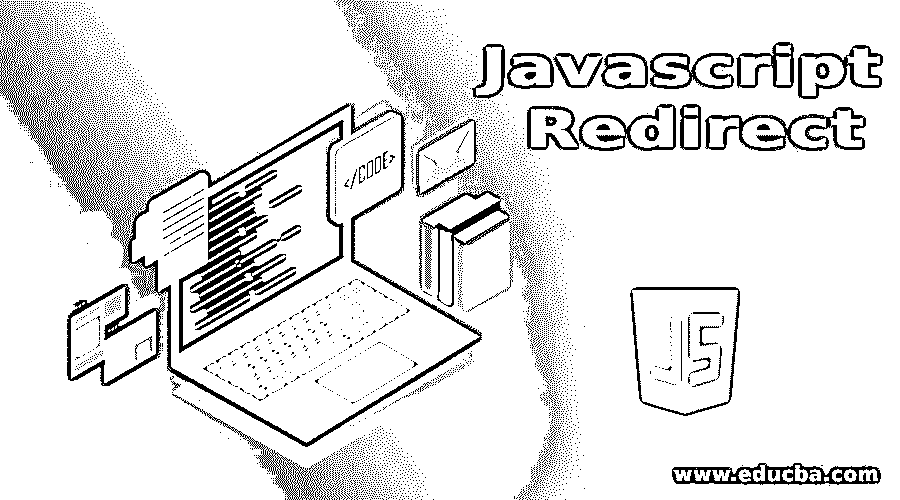
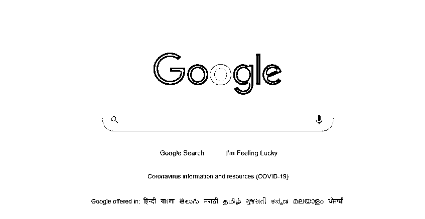
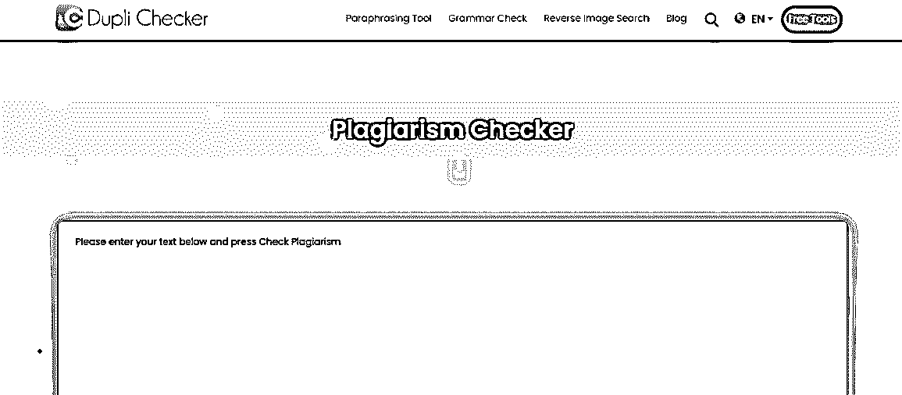

# JavaScript 重定向

> 原文：<https://www.educba.com/javascript-redirect/>




## JavaScript 重定向简介

JavaScript 重定向是通过访问相应的 URL(统一资源定位符)将请求从一个页面发送到另一个页面的过程。重定向 URL 也用于将用户从一个 URL 发送到另一个 URL。location 是 JavaScript 中用于在特定 URL 重定向的函数。

**实时场景**:我正在阅读某个网站上的某篇文章，当我在阅读的时候，我对特定的主题有一些疑问。我们可以简单地总结主题，并在可疑点之间提供 URL 链接，这样如果读者想了解更多，他可以通过点击 URL 来阅读。在这种情况下，URL 重定向起着至关重要的作用。

<small>网页开发、编程语言、软件测试&其他</small>

优点:通过 URL 重定向，我们可以在单个页面中添加更多信息。

**先决条件:**

*   基本 HTML
*   基本 JavaScript

### JavaScript 中的重定向是如何工作的？

JavaScript 重定向基于不同类型的重定向方法。每个重定向都有自己的规范。为了更好地理解，请遵守下面的语法及其描述。

**语法:**

```
location = "URL";
```

**描述**:设置当前窗口的新位置。

```
location.href = "URL";
```

**描述**:为当前窗口设置新的 href。

```
location.assign("URL");
```

**描述**:将新的 URL 分配给当前窗口。

```
location.replace("URL");
```

**描述**:将当前窗口位置替换为新位置。

```
location = "URL";
```

**描述**:它会自己设置当前窗口位置。

```
location = "URL";
```

**描述**:用当前窗口位置设置最上面的窗口位置。

**Note:** The difference between href and replace methods is replace() method removes the URL of the current document from the document history, means it is not possible to use the “back” button for navigating to the original document.

### JavaScript 重定向的示例

下面是一些例子:

#### 示例# 1–窗口位置 URL

**代码:**

```
<!DOCTYPE html>
<html>
<head>
<title>Redirec in Javascript</title>
<!-- CSS Styles -->
<style>
h1
{
text-align: center;
color: green;
}
p
{
font-size: 28px;
border: solid 3px blue;
color: maroon;
}
</style>
</head>
<body>
<h1>Introduction to JavaScript Redirect URL</h1>
<p>JavaScript redirect is the process to sending request form one
page to other page through accessing the corresponding URL (Unified
Resource Locator). Redirecting URL is also used for sending the user
from one URL to another URL. Window.location is the function used in
JavaScript to redirect at the specific URL.</p>
<h1>Real Time Scenario of Redirect URL</h1>
<p>Real Time Scenario: I am reading a particular article in some
website, while I am reading, I have some doubts with specific topics.
Instead of providing everything there itself, we can simply summarize
the topic and in between doubtable points can be provide with URL
links then if reader wish to know more then he can read by clicking
the URL. In this scenario URL redirect plays crucial role</p>
<script>
var url = "https://www.google.com/";
window.location = url;
</script>
</body>
</html>
```

**输出:**


几毫秒(1 秒)后移动到 URL:




#### 示例 2–有时间限制的窗口位置重定向

**代码:**

```
<!DOCTYPE html>
<html>
<head>
<title>Redirec in Javascript</title>
<!-- CSS Styles -->
<style>
h1 {
text-align: center;
color: brown;
}
p {
font-size: 28px;
border: solid 3px red;
color: green;
}
input {
text-align: center;
color: navy;
}
button {
font-size: 22px;
font-weight: bold;
color: white;
background: lightblue;
}
</style>
</head>
<body>
<h1>Introduction to JavaScript Redirect URL</h1>
<p>JavaScript redirect is the process to sending request form one
page to other page through accessing the corresponding URL (Unified
Resource Locator). Redirecting URL is also used for sending the user
from one URL to another URL. Window.location is the function used in
JavaScript to redirect at the specific URL.</p>
<h1>Real Time Scenario of Redirect URL</h1>
<p>Real Time Scenario: I am reading a particular article in some
website, while I am reading, I have some doubts with specific topics.
Instead of providing everything there itself, we can simply summarize
the topic and in between doubtable points can be provide with URL
links then if reader wish to know more then he can read by clicking
the URL. In this scenario URL redirect plays crucial role</p>
<div>
Type URL :<input class="urlClass" id="urlID" type="text" name="url"
placeholder="Enter a url to redirect"> <input type="submit"
name="button" onclick="getMyRedirectURL()">
</div>
<script>
function getMyRedirectURL() {
var url = document.getElementById("urlID").value;
document.write("It will redirect within 3 seconds.....please wait...");//it will redirect after 3 seconds
setTimeout(function() {
window.location = url;
}, 3000);
}
</script>
</body>
</html>
```

**输出:**


输入网址后，点击提交按钮:


#### 示例# 3–替换函数 URL

**代码:**

```
<!DOCTYPE html>
<html>
<head>
<title>Redirec in Javascript</title>
<!-- CSS Styles -->
<style>
h1 {
text-align: center;
color: navy;
}
p {
font-size: 28px;
border: double 2px teal;
color: lime;
}
input {
text-align: center;
color: fuchsia;
}
.button {
text-align: center;
}
button {
font-size: 22px;
font-weight: bold;
color: white;
background: red;
}
</style>
</head>
<body>
<h1>Introduction to JavaScript Redirect URL</h1>
<p>JavaScript redirect is the process to sending request form one
page to other page through accessing the corresponding URL (Unified
Resource Locator). Redirecting URL is also used for sending the user
from one URL to another URL. Window.location is the function used in
JavaScript to redirect at the specific URL.</p>
<h1>Real Time Scenario of Redirect URL</h1>
<p>Real Time Scenario: I am reading a particular article in some
website, while I am reading, I have some doubts with specific topics.
Instead of providing everything there itself, we can simply summarize
the topic and in between doubtable points can be provide with URL
links then if reader wish to know more then he can read by clicking
the URL. In this scenario URL redirect plays crucial role</p>
<h1>Click the below button to replace the document</h1>
<div class="button">
<button onclick="getMyReplaceFun()">Replace Document</button>
</div>
<script>
function getMyReplaceFun() {
location.replace("https://www.duplichecker.com/");//it will replace the document
}
</script>
</body>
</html>
```

**输出:**


点击替换文档按钮后:




### 推荐文章

这是一个 JavaScript 重定向指南。这里我们还讨论了 javascript 中的介绍和重定向是如何工作的？以及不同的示例及其代码实现。您也可以看看以下文章，了解更多信息–

1.  [JavaScript 中的多态性](https://www.educba.com/polymorphism-in-javascript/)
2.  [JavaScript getelement byid()](https://www.educba.com/javascript-getelementbyid/)
3.  [JavaScript 键盘事件](https://www.educba.com/javascript-keyboard-events/)
4.  [JavaScript 枚举](https://www.educba.com/javascript-enum/)


