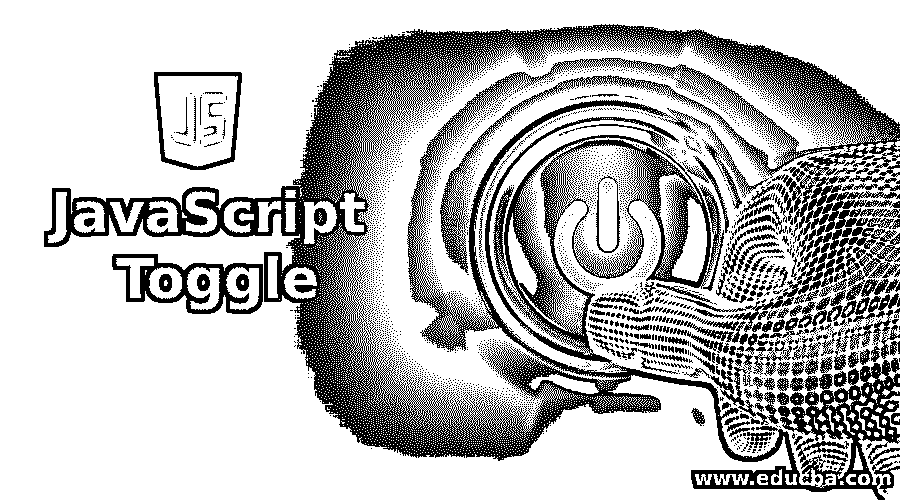
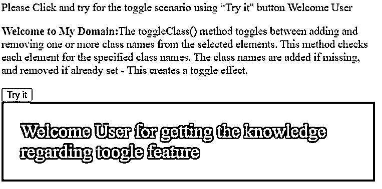

# JavaScript 切换

> 原文：<https://www.educba.com/javascript-toggle/>




## JavaScript 切换简介

在 JavaScript 中，toggle 是特性之一，它被用作默认方法来处理所选元素的 hide()和 show()。同时，该方法还检查特定选定元素的可见性，并使用 show()方法显示元素，使用 hide()方法显示隐藏的元素。当它处于可见状态时，这种效果也称为切换效果。切换还可以在整个 javascript 中添加和删除元素的类名。使用

标记，我们可以借助 id 属性添加切换类名。这可能需要 CSS 样式表。

**语法和参数:**

<small>网页开发、编程语言、软件测试&其他</small>

javascript 方法有默认的语法和规则，可以在 html 网页中使用。

```
<html>
<body>
<script>
function functionName()
{
--logics for showing and hiding the UI elements in the page----
We can write the logic and test using some if conditions etc---
}
</script>
</body>
</html>
```

在上面的代码中，我们已经编写了在 html 网页中使用切换功能的示例代码。根据不同的要求，它可能会在不同的部分使用，有时切换使用喜欢，不喜欢，黑暗模式，文本和类别，这些是 javascript 切换功能中可用的一些功能。

### JavaScript 中是如何切换的？

javascript toogle 特性是根据需求启用和禁用网页内容的特性。该特征主要用于显示和隐藏 web 应用程序中的数据。仅针对可见性特征的特定选定元素检查元素。show()方法仅在元素处于隐藏位置时运行，并且该方法是 hide()仅用于可见状态。这种效应也被称为触发效应。

toggleClass()方法用于在我们从所需的选定元素中添加和删除一个或多个类名时进行切换。如果类名是在元素丢失时添加的，并且它们已经在 set toggleClass()中被删除，这与 javascript 库 jquery 中使用的相同。切换功能将使用 id 的帮助使用

标签添加 css 样式表。当我们使用另一个也称为 thorn 的类时，它将调用其他类。这些类在 css 文件中使用和调用，但在 classList 等 javascript 元素中，它是一个只读属性，将返回 html 元素的 DOMTOKENLIST。

当我们使用 domtokenlist 时，它是一个接口，它有两组属性，称为 classList 的 value 和 length，value 属性返回字符串数据类型的类名列表，length 属性将一些指定数量的类存储在实例或对象中。要向

元素添加一个类，我们只需将方法链 has add()添加到 classList 元素属性。如果假设类名已经存在于标签元素中，那么在 add()方法中使用的 class 属性将被忽略。

移除类元素需要使用 css 样式表中的 remove()方法，它属于 html 元素的 classList 属性。我们将使用 add()和 remove()方法添加和删除多个 css 类。我们可以使用 contains()方法来编写代码，以便在元素的类名之间进行切换。我们最常使用的切换类有一些事件发生，如点击。我们在 html 代码中使用了<button>标签元素，同时我们在脚本中使用了 toggle，在点击它时使用标签元素 id。因此，明智的做法是 JavaScript 为 toggle()类提供了一些预定义的内置方法。</button>

### JavaScript 切换示例

下面是提到的例子:

#### 示例#1

**代码:**

```
<!DOCTYPE HTML>
<html>
<head>
<style>
.first {
color: green;
}
.second {
color: red;
}
</style>
</head>
<body>
<div id="demo" class="first">Welcome To My Domain</div>

<small>Have a Nice Day <a href="www.google.com"><u>Gud</u> day</a></small>

<script>
function third() {
this.classList.toggle('first');
this.classList.toggle('second');
}
document.querySelector('#demo').addEventListener('click', third);
</script>
</body>
</html>
```

**输出:**


#### 实施例 2

**代码:**

```
<!DOCTYPE html>
<html>
<head>
<meta name="viewport" content="width=device-width, initial-scale=1">
<style>
.sample {
width: 103%;
padding: 28px;
background-color: green;
color: white;
font-size: 27px;
box-sizing: border-box;
}
</style>
</head>
<body>
<p>Please Click and try for the toggle scenario using “Try it" button Welcome User</p>
<p><strong>Welcome to My Domain:</strong>The toggleClass() method toggles between adding and removing one or more class names from the selected elements. This method checks each element for the specified class names. The class names are added if missing, and removed if already set - This creates a toggle effect.</p>
<button onclick="demo()">Try it</button>
<div id="first">
Welcome User for getting the knowledge regarding <u>toogle</u> feature
</div>
<script>
function demo() {
var e = document.getElementById("first");
if (e.classList) {
e.classList.toggle("sample");
} else {
var c = e.className.split(" ");
var x = c.indexOf("sample");
if (x >= 0)
c.splice(x, 1);
else
c.push("sample");
e.className = classes.join(" ");
}
}
</script>
</body>
</html>
```

**输出:**


**点击尝试按钮后:**




#### 实施例 3

**代码:**

```
<!DOCTYPE html>
<html>
<head>
<link rel="stylesheet" href="https://cdnjs.cloudflare.com/ajax/libs/font-awesome/4.7.0/css/font-awesome.min.css">
<style>
.fa {
font-size:103px;
cursor: pointer;
user-select: none;
width: 103%;
padding: 28px;
background-color: green;
color: white;
font-size: 27px;
box-sizing: border-box;
}
.fa:hover {
color: blue;
width: 103%;
padding: 28px;
background-color: green;
color: white;
font-size: 27px;
box-sizing: border-box;
}
</style>
</head>
<body>
<p>Please click the icon for using the toggle feature for these options thumbs-up and thumbs-down (like/dislike):</p>
<i onclick="demo(this)" class="fa fa-thumbs-up"></i>
<script>
function demo(i) {
i.classList.toggle("fa-thumbs-down");
}
</script>
</body>
</html>
```

**输出:**


在上面的例子中，我们在 javascript 的不同场景中使用了切换功能，同时我们使用了脚本的默认类，类似地，我们调用了一些 css 样式来实现 html 网页中的这些功能。此外，我们使用了切换功能来隐藏和显示重要的数据。

### 结论

在结论部分，切换被用作 JavaScript 的重要特性，因为它主要用于场景的用户点。当用户需要在页面中显示数据时，它会隐藏数据。它支持所有类型的浏览器。

### 推荐文章

这是一个 JavaScript 切换指南。在这里，我们讨论 JavaScript Toggle 的介绍，它是如何工作的，以及编程示例。您也可以看看以下文章，了解更多信息–

1.  [JavaScript 应用](https://www.educba.com/javascript-apply/)
2.  [JavaScript onblur](https://www.educba.com/javascript-onblur/)
3.  [JavaScript 数组包含()](https://www.educba.com/javascript-array-includes/)
4.  [JavaScript 比较字符串](https://www.educba.com/javascript-compare-strings/)


