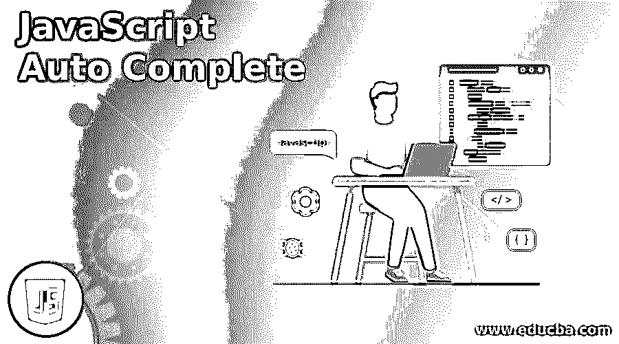
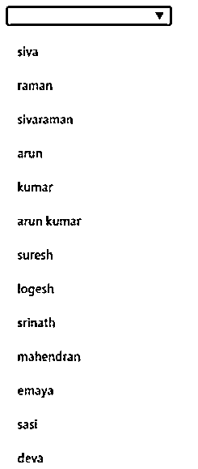
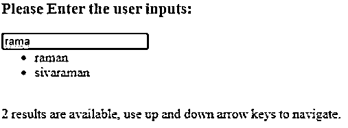
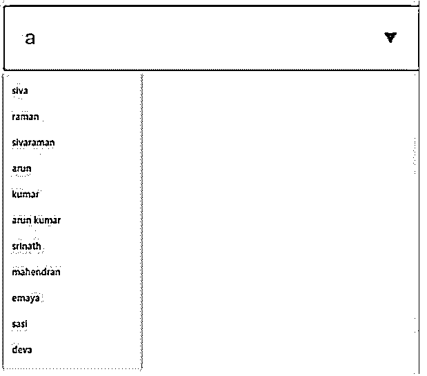

# javascript 自动完成

> 原文：<https://www.educba.com/javascript-auto-complete/>




## JavaScript 自动完成简介

以下文章提供了 JavaScript 自动完成的概要。自动完成是 JavaScript 的特性和小部件之一。当用户在前端的输入 UI 字段中输入他们看到的值时，它为用户提供建议，然后通过后端连接这些值。他们需要一些数据源来连接他们，即使 javascript 有空间使用 source 选项向小部件提供用户字段。他们使用数组概念来匹配字段和数据源。在 JavaScript 中，可能有许多方法来完成该功能。

**语法和参数:**

<small>网页开发、编程语言、软件测试&其他</small>

在 JavaScript 中，每个特性都有自己的语法和格式来利用网页。以便我们可以从用户和客户端更容易和更复杂地创建网页。

```
<html>
<head>
</head>
<body>
<script>
function name()
{
var v=["".""…]; //variable name initialisation using array format
----some javascript logics-----
}
</script>
<input type=”text” list=”datalist” onkeyup=”name()”>
<datalist id="datalist">
<options value=""></option>
<options value=""></option>
</datalist>
</body>
</html>
```

以上代码是 JavaScript 中自动完成功能的基本语法之一，我们也可以使用 jquery JavaScript 框架类来减少代码行并增加一些网页的附加功能。在这里，datalist 是特性之一，我们已经在 web 页面中将值作为一组参数传递。

### JavaScript 中的自动完成是如何实现的？

JavaScript 我们可以验证客户端请求，用户可以使用任何数量的输入字段，如 UI 标签，即文本框，滚动框等。无论用户使用哪个输入字段，这些值都会自动提取到数据库或任何其他存储器中，但这些值仅用于下拉菜单类型，因此会随着时间的推移自动完成。我们通常在

标签中使用自动完成功能，在 id 的帮助下使用#符号，从存储器中检索值，并显示其后面的透明输入元素的类型。

用户界面文本框中的每个用户类型的字符都非常珍贵，并且必须使用 div html 标签与类似的字符集重叠。每当用户在文本框中输入字符时，我们可以在 div 标签中添加相同类型的输入字符。它可以帮助用户从用户字符开始搜索可能的建议，并显示在 div 标签上。使用 JavaScript 事件函数在后端执行用户操作,“keyup”是一个事件，用于检测用户输入中按下的键，并改变要更新的 html div 标签元素和内容。

该事件也没有真正削减元素值，而且当用户输入为 null 或空时，对 div 标签元素执行一些延迟序列是很奇怪的，在网页中更新用户目标的输入数据在网页中的占位符类型之后。因此，我们可以借助“keydown”事件来避免上述情况，每当输入字段几乎为空时，都会保持按下退格键，它会自动立即将值更新为空的 div 标签。如果假设 html 表单具有自动完成功能，那么它也可以拥有大量的列表，并向用户显示相关信息。我们没有加载所有的数据，结果也会显示在 html 页面中。

### JavaScript 自动完成示例

以下是 JavaScript 自动完成的示例:

#### 示例#1

**代码:**

```
<!DOCTYPE html>
<html>
<head>
<title>Welcome To My Domain</title>
</head>
<body>
<script type="text/javascript">
var t = [
"siva",
"raman",
"sivaraman",
"arun",
"kumar",
"arun kumar",
"suresh",
"logesh",
"srinath",
"mahendran",
"emaya",
"sasi",
"deva"
];
var nam= t.length;
function demo(value) {
document.getElementById('datalist').innerHTML = '';
list=value.length;
for (var i = 0; i<nam; i++) {
if(((t[i].toLowerCase()).indexOf(value.toLowerCase()))>-1)
{
var n = document.createElement("option");
var v = document.createTextNode(t[i]);
n.appendChild(v);
document.getElementById("datalist").appendChild(n);
}
}
}
</script>
<input type=*"text"* list="datalist" onkeyup="demo(this.value)">
<datalist id=*"*datalist">
<option value="siva"></option>
<option value="raman"></option>
<option value="sivaraman"></option>
<option value="arun"></option>
<option value="kumar"></option>
<option value="arun kumar"></option>
<option value="suresh"></option>
<option value="logesh"></option>
<option value="srinath"></option>
<option value="mahendran"></option>
<option value="emaya"></option>
<option value="sasi"></option>
<option value="deva"></option>
</datalist>
</body>
</html>
```

**输出:**




#### 实施例 2

**代码:**

```
<!doctype html>
<html lang="en">
<head>
<meta charset="utf-8">
<meta name="viewport" content="width=device-width, initial-scale=1">
<title>Welcome To My Domain</title>
<link rel="stylesheet" href="//code.jquery.com/ui/1.12.1/themes/base/jquery-ui.
css">
<link rel="stylesheet" href="https://cdn.educba.com/resources/demos/style.css">
<script src="https://code.jquery.com/jquery-1.12.4.js"></script>
<script src="https://code.jquery.com/ui/1.12.1/jquery-ui.js"></script>
<script>
$( function() {
var t = [
"siva",
"raman",
"sivaraman",
"arun",
"kumar",
"arun kumar",
"suresh",
"logesh",
"srinath",
"mahendran",
"emaya",
"sasi",
"deva"
];
$( "#t" ).autocomplete({
source: t
});
} );
</script>
</head>
<body>
<div class="ui-widget">
<H3>Please Enter the user inputs:</H3>
<input id="t">
</div>
</body>
</html>
```

**输出:**




#### 实施例 3

**代码:**

```
<!DOCTYPE html>
<html>
<head>
<title>Welcome To My Domain</title>
<link rel="stylesheet" href="https://cdn.educba.com/resources/demos/style.css">
<style>
.sample {
width: 103%;
padding: 28px;
background-color: yellow;
color: blue;
font-size: 27px;
box-sizing: border-box;
}
</style>
</head>
<body>
<script type="text/javascript">
var t = [
"siva",
"raman",
"sivaraman",
"arun",
"kumar",
"arun kumar",
"suresh",
"logesh",
"srinath",
"mahendran",
"emaya",
"sasi",
"deva"
];
var nam= t.length;
function demo(value) {
document.getElementById('datalist').innerHTML = '';
list=value.length;
for (var i = 0; i<nam; i++) {
if(((t[i].toLowerCase()).indexOf(value.toLowerCase()))>-1)
{
var n = document.createElement("option");
var v = document.createTextNode(t[i]);
n.appendChild(v);
document.getElementById("datalist").appendChild(n);
}
}
}
</script>
<input type="text" list="datalist" onkeyup="demo(this.value)" class="sample">
<datalist id="datalist">
<option value="siva"></option>
<option value="raman"></option>
<option value="sivaraman"></option>
<option value="arun"></option>
<option value="kumar"></option>
<option value="arun kumar"></option>
<option value="suresh"></option>
<option value="logesh"></option>
<option value="srinath"></option>
<option value="mahendran"></option>
<option value="emaya"></option>
<option value="sasi"></option>
<option value="deva"></option>
</datalist>
</body>
</html>
```

**输出:**

**

** 

在上面的例子中，我们使用了 JavaScript 及其名为 jquery 的库，在自动功能网页的功能上使用了它。我们在第一个和第三个示例中使用了 keyup 事件功能，在第二个示例中使用了 jquery。

### 结论

在 JavaScript(js)市场上有许多不同的特性可用于行业中不同竞争对手的每个标准。其中，我们可以处理一些标准化的功能，使它们有助于创建更复杂的基于 web 的应用程序。自动完成功能更加舒适，并且与用户环境具有浏览器兼容性。

### 推荐文章

这是 JavaScript 自动完成的指南。这里我们讨论一下引言，自动完成是如何在 JavaScript 中完成的？还有例子。您也可以看看以下文章，了解更多信息–

1.  [JavaScript object.is()](https://www.educba.com/javascript-object-is/)
2.  [JavaScript 数组切片](https://www.educba.com/javascript-array-slice/)
3.  [JavaScript elseIf](https://www.educba.com/javascript-elseif/)
4.  [JavaScript 数组包含](https://www.educba.com/javascript-array-contain/)


