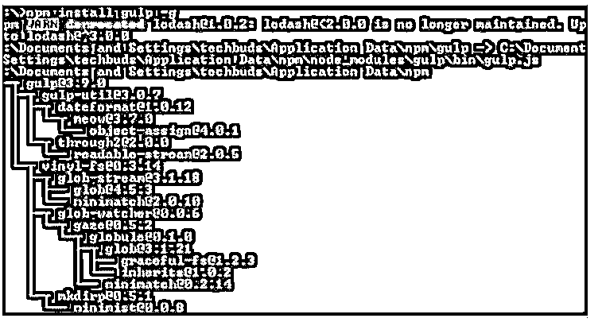

# 吞咽任务

> 原文：<https://www.educba.com/gulp-task/>


## 吞咽任务简介

我们知道 gulp 是一个开源的、跨平台的工具，它为开发者提供了不同种类的特性。在开发过程中，开发人员需要自动化其他开发任务；那时，我们可以根据开发人员的要求使用 gulp 任务。当我们从高层次思考时，gulp 会读取不同的文件，并将它们放入管道中，以流式传输它们的任务。所有这些任务都依赖于代码；有时，我们需要根据需求添加额外的插件。这项工作最重要的一点是，它帮助我们将源文件修改成生产文件。

### 什么是大口任务？

所有 Gulp 设置都记录在一个名为 gulpfile.js 的记录中，该记录位于企业的基础上。编写作业的例子是，您首先加载一个模块，您将使用该模块，然后描述依赖于该模块的项目的特征。Gulp 是模块驱动的；你想知道用哪个模块来完成某件事。通常，一个孤独的模块有一个孤独的原因，所有的模块都是习惯性的 [JavaScript](https://www.educba.com/what-is-javascript/) 。

<small>网页开发、编程语言、软件测试&其他</small>

要描述一项任务的特征，请使用 gulp.task()工作。每当你描述一个简单的任务时，这个能力需要两个赋值的名字和一个运行的能力。

**代码:**

```
gulp.task('sample', work () {
console.log('Hello welcome');
});
```

运行 swallow welcome 将导致“Hi welcome”被打印到控制中心。

一项任务也可能是不同差事的概要。例如，假设我们需要描述一个表单任务，它运行三种不同的任务，CSS、js 和 images。同样，我们可以通过表明各种承诺而不是能力来做到这一点:

**代码:**

```
gulp.task('build', ['css', 'js', 'images']);
```

**默认任务:**

这些将非并发地运行，所以你不能期望 CSS 差事在 js 开始时已经完成了运行过程；老实说，很可能不会。为了确保在下一个任务运行之前完成一项任务，您可以通过将各种分配与能力相结合来指明条件。例如，您可以这样做来描述 CSS 任务的特征，该任务在运行之前检查 welcome 分配是否已经完成。

**代码:**

```
gulp.task('css', [''sample''], work () {
// Manage CSS here
});
```

当您运行 CSS 任务时，Gulp 将执行 welcome 任务，等待它完成，然后调用您确定的容量。

**默认任务:**

您可以描述吞咽时运行的默认任务。您可以通过描述一个名为 default 的差事来做到这一点。

**代码:**

```
gulp.task('default', work () {
// default task
});
```

**用法大口任务:**

现在让我们来看看如下的用法吞咽任务:

首先，让我们看看如何用如下名称注册任务:

**代码:**

```
const { task } = require('gulp');
function build(demo) {
// body of function is omitted
demo();
}
task(build);
```

**说明:**

*   在上面的例子中，我们试图用注册的名字实现一个任务；这里，我们如上面的代码所示定义 const 任务，之后，我们创建一个函数来构建该任务。

让我们看看如何用匿名任务注册函数，如下所示:

**代码:**

```
const { task } = require('gulp');
task('build', function(demo) {
// body of function is omitted
demo();
});
```

**说明:**

*   在上面的例子中，我们可以看到匿名函数；这里，我们定义 const 任务，并创建一个在函数中声明的匿名函数名。

让我们看看如何访问注册名称，如下所示:

**代码:**

```
const { task } = require('gulp');
task('build', function(demo) {
// body of function is omitted
demo();
});
const build = task('build');
```

**说明:**

*   在上面的例子中，我们访问了一个已经注册的任务名，或者我们可以说，通过检索当时的任务名，我们可以使用上面所示的代码。

**参数:**

让我们看看在创建任务时需要使用哪些参数，如下所示:

如果没有给定 taskName，那么这个差事将由一个命名工作的 Name 属性或一个客户端特有的 displayName 属性来引用。taskName 边界应该用于缺少 displayName 属性的神秘容量。

让我们来看看不同的参数，详情如下:

*   **taskname:** 这是用作别名的参数之一，taskname 是一个字符串类型，我们可以在指定的任务内作为别名来访问它。重要的是，当我们需要为某项任务命名时；我们需要 taskname。
*   **taskfunction:** 这是一个必需的函数，串联()和并联()函数的组合；它还提供了附加的额外信息。

### 吞咽任务的示例

为了更好地理解，我们来看一个不同的任务示例，如下所示:

首先，我们需要借助以下命令来确认 gulp 的所有设置和安装。

**代码:**

```
node -v
```

**说明:**

*   使用上面的命令，我们可以看到 [Node.js](https://www.educba.com/what-is-node-js/) 的安装版本；执行之后，我们可以在下面的命令中看到结果。

**输出:**


在命令行提示符下，输入附带的命令以显示 npm (Node.js bundle chief)的变体，它用于引入模块。它将借助下面的命令显示引入的 Node.js 表单。

**代码:**

```
npm -v
```

**说明:**

*   执行上面的命令后，我们可以在我们的机器上看到当前安装的 npm 版本，如下面的截图所示。

**输出:**


我们成功安装了 Node.js 现在，我们需要使用下面的命令来安装 gulp。

**代码:**

```
npm install gulp -g
```

**说明:**

*   在上面的命令中，我们使用 g 作为标志，确保 gulp 对所有项目都是全局可用的。输入上面的命令后，我们得到下面的屏幕，如下面的截图所示。

**输出:**




为了验证 gulp，我们需要运行下面的命令。

**代码:**

```
gulp –v
```

**说明:**

*   执行上面的命令后，我们得到了当前安装的 gulp 版本，如下图所示。

**输出:**


现在让我们看看如何清理 html 文件，如下所示:

我们通常知道 gulp 在一个名为 gulfile.js 的 JavaScript 文件中编写所有任务，所以首先，创建那个文件并编写下面的代码。

**代码:**

```
var gulpfile = require('gulp'), htmlcleanfile = require('gulp-htmlclean');
var f = {
src: 'src/',
build: 'build/'
};
gulp.task('html', function() {
var o = folders.build + 'html/';
return gulp.src(folder.src + 'html/**/*')
.pipe(htmlclean())
.pipe(gulp.dest(o));
});
```

**输出:**

最终结果如下图所示:


### 结论

借助上面的文章，我们看到了关于吞咽任务。从这篇文章中，我们看到了关于吞咽任务和吞咽任务的集成的基本情况，以及我们如何在吞咽任务中使用它。

### 推荐文章

这是一个吞咽任务指南。这里我们讨论引言；什么是大口任务？以及更好理解的例子。您也可以看看以下文章，了解更多信息–

1.  [JavaScript 重新排列](https://www.educba.com/javascript-onresize/)
2.  [JavaScript onload](https://www.educba.com/javascript-onload/)
3.  [JavaScript 字符串到布尔值](https://www.educba.com/javascript-string-to-boolean/)
4.  [Javascript 字符串转换成小写](https://www.educba.com/javascript-string-to-lowercase/)


