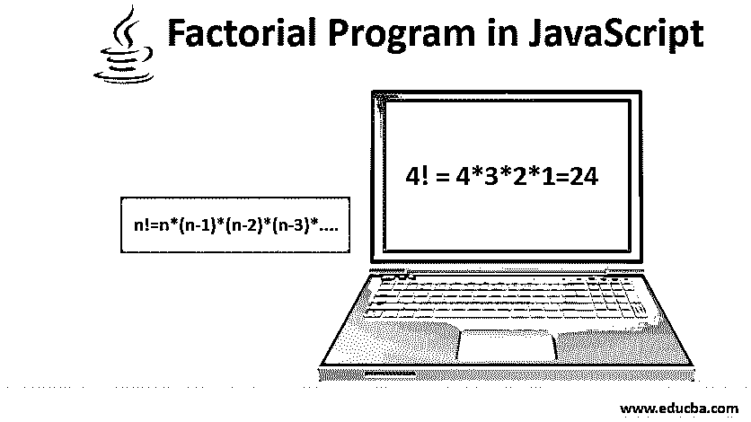
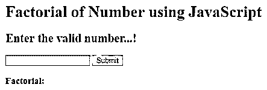
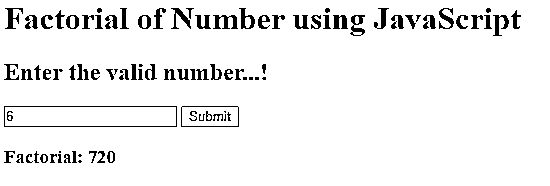

# JavaScript 中的阶乘程序

> 原文：<https://www.educba.com/factorial-program-in-javascript/>




## JavaScript 阶乘编程简介

阶乘是数学中一个重要的运算。它可以用于各种类型的应用。在浏览器上经常需要计算阶乘。我们很有可能使用 JavaScript 来计算数字[的阶乘。JavaScript 将允许我们在运行时计算任意数字的阶乘。数量大小没有限制。我们也有必要编写高效的代码来找出阶乘。在这篇 JavaScript 文章的阶乘程序中，我们将看到如何使用 javaScript 找出给定数字的阶乘。](https://www.educba.com/what-is-javascript/)

### JavaScript 中的阶乘逻辑

*   找出阶乘的逻辑基本上独立于所使用的编程语言，但是我们将讨论阶乘的一般逻辑，然后看看相同的逻辑如何应用于 JavaScript。
*   数字的阶乘不是别的，而是相同的数字乘以小于该数字的所有数字，直到 1，阶乘表示为！符号。
*   计算阶乘程序最简单的方法或逻辑是逐个遍历每个数字，并将其乘以初始结果变量。也就是说，为了找出 5 的阶乘，我们将从 5 遍历到 1，并继续将每个数与初始结果相乘。在 JavaScript 中，我们可以从 5 遍历到 1，也可以从 1 遍历到 5。在这两种情况下，我们都将使用循环语句来实现代码。初始结果变量可以包含除零或负值以外的任何值，否则结果将是错误的。请注意，阶乘总是为正数计算。
*   还有另一种方法或逻辑来计算阶乘，这被认为是一种有效的方法。在这个逻辑中，阶乘是通过使用递归技术来计算的。相同的函数被递归调用，直到我们满足某个最终条件。在 JavaScript 中，我们可以编写一个函数，它会递归地调用自己，直到达到极限条件，并以阶乘的形式给出最终结果。

### 如何在 JavaScript 中找到阶乘程序？

让我们看看使用上面讨论的方法在 JavaScript 中找出阶乘的例子。

<small>网页开发、编程语言、软件测试&其他</small>

#### 示例#1

在我们写下实际的 JavaScript 代码之前，我们应该有类似网页的东西来显示和交互。我们将设计一个简单的 HTML 网页，将有一个输入框作为数字，并将在同一页上显示输入数字的阶乘。

**代码:**

```
<!DOCTYPE html>
<html>
<head>
<title> Factorial of Number </title>
</head>
<body>
<h1> Factorial of Number using JavaScript </h1>
<h2> Enter the valid number...! </h2>
<input type = "number" min = "1" id = "num">
<button type = "button" onclick = "submit()" > Submit </button>
<h3> Factorial:   </h3>
<script>
// This function will get value from the user and pass it to Factorial function
function submit()
{
var num = parseInt( document.getElementById("num").value);
if( isNaN(num) )
{
alert( " Enter valid number " );
return;
}
document.getElementById("answer").innerHTML = num;
}
</script>
</body>
</html>
```

**输出:**




因此，我们有一个简单的页面，有一个输入框和提交按钮，提交或点击函数 submit()将被调用。该函数将解析输入的数字并显示在同一页面上。

让我们修改同一个函数来计算一个数的阶乘。 [submit()函数将解析](https://www.educba.com/jquery-submit/)输入的数字，并将它传递给另一个函数 calcFact()，后者将实际计算一个数字的阶乘。

#### 实施例 2

通过从 1 开始向前遍历数字。

**代码:**

```
<!DOCTYPE html>
<html>
<head>
<title> Factorial of Number </title>
</head>
<body>
<h1> Factorial of Number using JavaScript </h1>
<h2> Enter the valid number...! </h2>
<input type = "number" min="1" id = "num">
<button type = "button" onclick = "submit()"> Submit </button>
<h3> Factorial:   </h3>
<script>
// This function will get value from user and pass it to Factorial function
function submit()
{
var num = parseInt( document.getElementById("num").value);
if( isNaN(num) )
{
alert(" Enter valid number ");
return;
}
var factorial = calcFact(num);
document.getElementById("answer").innerHTML = factorial;
}
function calcFact( num )
{
var i;
var fact = 1;
for( i = 1; i <= num; i++ )
{
fact = fact * i;
}
return fact;
}
</script>
</body>
</html>
```

calcFact()函数将通过从 1 到数字本身遍历数字来计算阶乘。该函数以 num 形式接收一个参数，然后由用户输入数字，并对其执行操作。变量 fact 被初始化为 1，然后与 1 和输入的数字之间的所有数字相乘。

**输出:**


#### 实施例 3

同样的函数 calcFact()可以这样写，从数字本身到 1 反向遍历数字。

**代码:**

```
function calcFact( num )
{
var i;
var fact = 1;
for( i = num; i >= 1; i-- )
{
fact = fact * i;
}
return fact;
}
```

**输出:**


这里，变量 I 被初始化为数字本身，并通过执行 I–操作(即反向)来遍历。这个函数将给出与前一个类似的结果。

#### 实施例 4

通过使用递归函数。

**代码:**

```
function calcFact( num )
{
if(num == 1)
{
return num;
}
else
{
return num * calcFact( num-1 );
}
}
```

函数 calFact()将调用它自己，直到它达到值 1，但是在传递值时，它将每次传递递减 1 的值。它将继续与原始结果相乘，直到达到值 1。最终的乘法结果将是一个数本身的阶乘。

**输出:**




### 结论

因此，阶乘是数学中的一个重要运算，很容易在 JavaScript 中实现。JavaScript 允许我们执行动态操作，比如在运行时获取数字并对其执行操作。我们已经看到了在 JavaScript 中计算阶乘的不同方法。

### 推荐文章

这是一个 JavaScript 阶乘编程指南。在这里，我们讨论在 javascript 中寻找阶乘程序的逻辑和各种方法及其代码实现。您也可以阅读以下文章，了解更多信息——

1.  [c++中的阶乘程序](https://www.educba.com/factorial-program-in-c-plus-plus/)
2.  [JavaScript 对象](https://www.educba.com/javascript-objects/)
3.  [JavaScript 简介](https://www.educba.com/introduction-to-javascript/)
4.  [PHP 中的阶乘](https://www.educba.com/factorial-in-php/)


