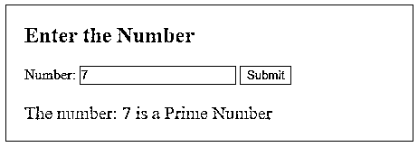
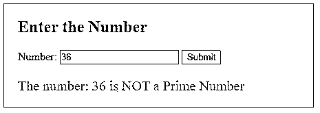
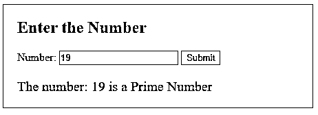
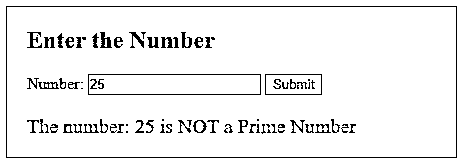
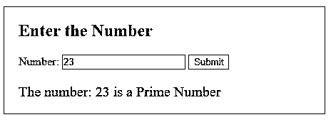
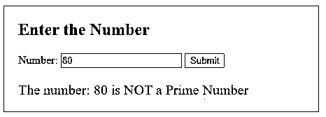

# JavaScript 中的质数

> 原文：<https://www.educba.com/prime-number-in-javascript/>


## JavaScript 中的质数介绍

质数是一个大于能被两个数整除的整数，包括同一个数本身。它是一个正数，除以小于它的数就不会被整除。写程序检查一个数是否是质数是编程中很常见的问题。它可以通过使用 JavaScript 的[在前端实现，这样客户机将用于计算。在本文中，我们将看到如何在 JavaScript 中检查数字是否是质数。](https://www.educba.com/what-is-javascript/)

**逻辑**

<small>网页开发、编程语言、软件测试&其他</small>

我们可以将输入的数除以 1 和小于它本身的数之间的所有数，并检查余数，如果在任何情况下余数为零，这意味着该数可以被整除并且不是质数。

### JavaScript 中素数的例子

以下是 JavaScript 中质数的例子:

#### 示例 1:使用 for 循环

**代码:**

```
<!DOCTYPE html>
<html>
<head>
<title>
Prime Number Check in JavaScript
</title>
<style>
.results {
border : green 1px solid;
background-color : aliceblue;
text-align : left;
padding-left : 20px;
height : 150px;
width : 95%;
}
.resultText {
font-size : 20px;
font-style : normal;
color : blue;
}
</style>
</head>
<body>
<div class = "results">
<h2> Enter the Number </h2>
Number: <input type = "number" name = "number" id = "number" required>
<button type = "button" onclick = "checkForPrime()" > Submit </button>
<div class = "resultText">
<p id = "result"> </p>
</div>
</div>
</div>
<script type = "text/javascript">
function checkForPrime() {
num = document.getElementById("number").value;
if(num == '' || num < 1) {
document.getElementById("result").style.color = "red";
document.getElementById("result").innerHTML = "Please Enter a Valid Number";
return;
}
var i;
var flag = true;
if (num == 1) {
flag = false;
} else {
for(i = 2; i < num-1; i++) {
if (num % i == 0) {
flag = false;
break;
}
}
}
if(flag == true) {
document.getElementById("result").style.color = "blue";
document.getElementById("result").innerHTML = "The number: " + num + " is a Prime Number";
} else {
document.getElementById("result").style.color = "red";
document.getElementById("result").innerHTML = "The number: " + num + " is NOT a Prime Number";
}
}
</script>
</body>
</html>
```

这里，我们在提交值时调用了函数 checkForPrime()。首先，我们检查用户是否输入了有效的输入。输入不应为空或负数，因为质数不能为负数。然后，我们用一个标志来表示，如果在用从 2 到 n-1 的数除这个数的过程中，我们得到的余数为零。如果我们在这两个数字之间得到零，这意味着这个数字不是质数，我们将立即改变标志的状态，打破循环，然后声明这个数字不是质数。如果标志状态没有改变，这意味着，在这个过程中，我们没有得到零作为余数，所以我们将把这个数声明为质数。

**输出**:

**为有效素数:**



**对于非质数:**




#### 示例 2:使用 while 循环

这个例子只是为了展示 JavaScript 的另一种实现方式。

**代码:**

```
<!DOCTYPE html>
<html>
<head>
<title>
Prime Number Check in JavaScript
</title>
<style>
.results {
border : green 1px solid;
background-color : aliceblue;
text-align : left;
padding-left : 20px;
height : 150px;
width : 95%;
}
.resultText {
font-size : 20px;
font-style : normal;
color : blue;
}
</style>
</head>
<body>
<div class = "results">
<h2> Enter the Number </h2>
Number: <input type = "number" name = "number" id = "number" required>
<button type = "button" onclick = "checkForPrime()" > Submit </button>
<div class = "resultText">
<p id = "result"> </p>
</div>
</div>
</div>
<script type = "text/javascript">
function checkForPrime() {
num = document.getElementById("number").value;
// valid input checking
var i;
var flag = true;
if (num == 1) {
flag = false;
} else {
i = 2;
while (i < num/2) {
if(num % i == 0) {
flag = false;
break;
}
i++;
}
}
if(flag == true) {
document.getElementById("result").style.color = "blue";
document.getElementById("result").innerHTML = "The number: " + num + " is a Prime Number";
} else {
document.getElementById("result").style.color = "red";
document.getElementById("result").innerHTML = "The number: " + num + " is NOT a Prime Number";
}
}
</script>
</body>
</html>
```

这里，我们使用了 while 循环对数字进行除法运算，注意，我们只在这里检查 n/2 的整除性。这是因为数学特性，即该数不能被大于该数一半的数整除。这将提高性能，因为这里将减少多个分割。

**输出**:

**对于有效的质数:**




**对于无效素数:**




#### 示例 3:使用递归

**代码:**

```
<!DOCTYPE html>
<html>
<head>
<title>
Prime Number Check in JavaScript
</title>
<style>
.results {
border : green 1px solid;
background-color : aliceblue;
text-align : left;
padding-left : 20px;
height : 150px;
width : 95%;
}
.resultText {
font-size : 20px;
font-style : normal;
color : blue;
}
</style>
</head>
<body>
<div class = "results">
<h2> Enter the Number </h2>
Number: <input type = "number" name = "number" id = "number" required>
<button type = "button" onclick = "checkForPrime()" > Submit </button>
<div class = "resultText">
<p id = "result"> </p>
</div>
</div>
</div>
<script type = "text/javascript">
function checkForPrime() {
num = document.getElementById("number").value;
if(num == '' || num < 1) {
document.getElementById("result").style.color = "red";
document.getElementById("result").innerHTML = "Please Enter a Valid Number";
return;
}
var i = 2;
var flag = isPrime(num, i);
if(flag == true) {
document.getElementById("result").style.color = "blue";
document.getElementById("result").innerHTML = "The number: " + num + " is a Prime Number";
} else {
document.getElementById("result").style.color = "red";
document.getElementById("result").innerHTML = "The number: " + num + " is NOT a Prime Number";
}
}
// new recursive function
function isPrime( num, i) {
if(num < 2) {
return false;
}
if(num == 2) {
return true;
}
if(i > num/2) {
return true;
} else {
if( num % i == 0) {
return false;
} else {
return isPrime(num , i+1);
}
}
}
</script>
</body>
</html>
```

**输出:**

**有效质数:**




**对于无效素数:**




这里，我们添加了一个递归调用自身的新函数。根据逻辑，我们有基本情况，函数将调用自己，直到它到达基本情况。它将继续将该数除以除数，即 2 到 n-1，并返回基于余数的值。

### 结论

我们已经看到属性号是质数，并在 JavaScript 中相应地实现了逻辑。我们可以使用多种类型的循环来实现相同的功能。

### 推荐文章

这是 JavaScript 中的质数指南。这里我们讨论 JavaScript 中素数的基本概念、逻辑和不同的例子。您也可以看看以下文章，了解更多信息–

1.  [JavaScript 自定义事件](https://www.educba.com/javascript-custom-events/)
2.  [JavaScript 字符串替换](https://www.educba.com/javascript-string-replace/)
3.  [JavaScript 比较字符串](https://www.educba.com/javascript-compare-strings/)
4.  [JavaScript 刷新页面](https://www.educba.com/javascript-refresh-page/)


