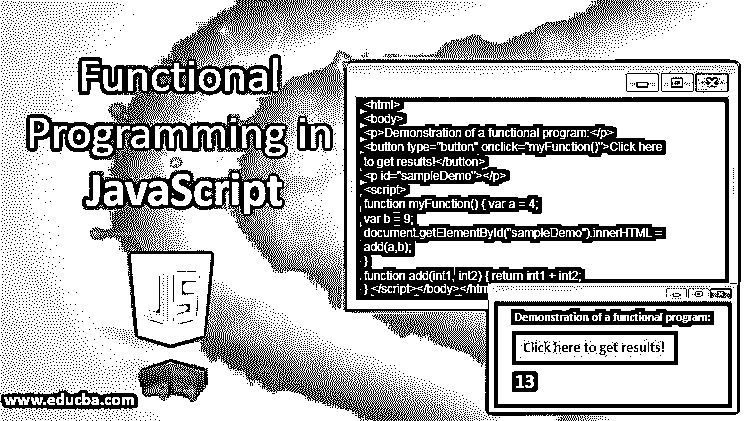
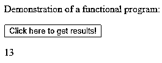
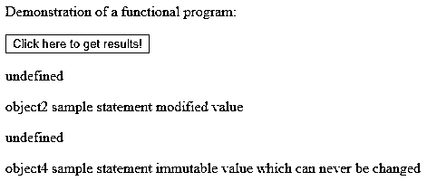
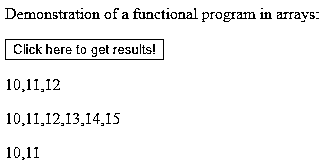

# JavaScript 中的函数式编程

> 原文：<https://www.educba.com/functional-programming-in-javascript/>




## Javascript 中的函数式编程是什么？

函数式编程是一种基于纯函数的编程模式或实践，专注于避免数据共享和突变。Javascript 是一种多范式语言，根据我们的需要和实现，它可以用作过程化的、面向对象的和功能性的。最重要的特性是第一级用法，直到版本 8 才在 java 中使用。Javascript 中的函数式编程之所以成为可能，仅仅是因为它的一流用法。这使得代码更具可读性，并提高了执行速度。提升执行性能的函数式编程的例子有 angular 和 react。过程循环可以用使编码、读取和调试更容易的函数来代替。

了解函数式编程在其代码中不包含的所有函数或编码风格是非常必要的。因此，首先我们将学习函数式编程中不使用的所有编码参数。

<small>网页开发、编程语言、软件测试&其他</small>

*   各种循环，包括 for、for each、while、do-while。
*   引用或内容的值。
*   不写任何东西的 Void 函数，因为它们有可能生成某个边。
*   使用 let 或。
*   数组、映射或设置赋值函数，如弹出、推送、复制、填充、反转、移位、取消移位、排序、拼接、添加、删除、清除、设置。

所以我们的目标是写一个代码，不会用上面提到的东西用 javascript 写一个函数式的程序。

### 纯函数和不纯函数

即使你的代码中包含了多个函数，也不能称之为函数式程序。这些函数必须是纯函数，这意味着在任何给定的状态下，对于相同的输入，它应该返回相同的输出，并且不应该变化。这被称为参照透明性，它不应该依赖于任何可变的状态。这是一个纯函数必须遵循的第一个条件，第二个条件是它应该没有副作用。它包括屏蔽任何对象或再次给变量赋值，或者任何 IO 操作，如记录日志或写入控制台。

**代码:**

```
<!DOCTYPE html>
<html>
<body>
<p>Demonstration of a functional program:</p>
<button type="button" onclick="myFunction()">Click here to get results!</button>
<p id="sampleDemo"></p>
<script>
function myFunction() { var a = 4;
var b = 9;
document.getElementById("sampleDemo").innerHTML = add(a,b);
}
function add(int1, int2) { return int1 + int2;
}
</script>
</body>
</html>
```

**输出:**


点击按钮后，

**输出:**




注意，在这里，myFunction 不是一个函数代码，而 add function 是一个函数方法，因为它对相同的输入返回相同的结果，并且没有副作用。我们关注于如何将我们的整个程序转换成一个功能程序。实际上，这是不可能的，因为我们经常需要在某些情况下产生运行时副作用。在这里，我们可以制定一个 80-20 规则。您试图让 80%的代码起作用，而剩下的 20%可能不起作用，并伴随着输出语句和 IO 副作用。

### 怎样才能完全实现函数式编程？

这里，我们必须确保变量的不变性，这可以通过使用 const 而不是 let 或 var 来声明对象引用来实现。因为 const 代表常数，所以它的参考值永远不能改变。第二件事是，我们必须确保对象的值不会被修改，这可以通过使用 Object 来实现。javascript 中的冻结方法。

当我们不希望对象的值被操作或改变时，可以使用 Object.freeze 方法。

#### 示例#1

让我们在一个例子的帮助下，检查如何在使用普通变量和对象的同时实现函数式编程。

**代码:**

```
<!DOCTYPE html>
<html>
<body>
<p>Demonstration of a functional program:</p>
<button type="button" onclick="myFunction()">Click here to get results!</button>
<p id="sampleDemoObject1"></p>
<p id="sampleDemoObject2"></p>
<p id="sampleDemoObject3"></p>
<p id="sampleDemoObject4"></p>
<script>
function myFunction() {
// CASE first: In first case, we will keep object as mutable and its variable can also be reassigned
let object1 = { sampleStatement: 'object1 sample statement value' };
// Object can be mutated
object1.sampleStatement = 'object1 sample statement modified value';
// variables can be reassigned
object1 = { message: "new object of object1 reference with sample statement value" };
// CASE second: In second case, we will keep object as mutable but its variable cannot be reassigned
const object2 = { sampleStatement: 'object2 sample statement value' };
// Object can still be mutated
object2.sampleStatement = 'object2 sample statement modified value';
// variables cannot be reassigned
// object2 = { message: 'new object of object2 reference with sample statement value' }; // result into an error!
// CASE third: In third case, we will keep object as immutable but its variable can be reassigned
let object3 = Object.freeze({ sampleStatement: "object3 sample statement immutable value" });
// Object cannot be mutated
// object3.sampleStatement = 'object3 sample statement modified value';
// result into an error!
// variables can be still reassigned
object3 = { message: "new object of object3 reference with sample statement value which can be modified" };
// CASE forth: In forth case, we will keep object as immutable but its variable
//cannot be reassigned which helps us in achieving the functional programming
const object4 = Object.freeze({ sampleStatement: 'object4 sample statement immutable value which can never be changed' });
// Object cannot be mutated
// object4.sampleStatement = 'object4 sample statement modified value' // result into an error!
// variables cannot be reassigned
// object4 = { message: "object4 sample statement modified value with modified reference" }; // result into an error!
document.getElementById("sampleDemoObject1").innerHTML = object1.sampleStatement ;
document.getElementById("sampleDemoObject2").innerHTML = object2.sampleStatement ;
document.getElementById("sampleDemoObject3").innerHTML = object3.sampleStatement ;
document.getElementById("sampleDemoObject4").innerHTML = object4.sampleStatement ;
}
function add(int1, int2) { return int1 + int2;
}
</script>
</body>
</html>
```

**输出:**




还必须避免使用 push()、pop()和上述其他方法。相反，它们可以通过以下方式修改成函数式编程。

#### 实施例 2

**代码:**

```
<!DOCTYPE html>
<html>
<body>
<p>Demonstration of a functional program in arrays:</p>
<button type="button" onclick="myFunction()">Click here to get results!</button>
<p id="sampleArrayObject1"></p>
<p id="sampleArrayObject2"></p>
<p id="sampleArrayObject3"></p>
<script>
function myFunction() {
const array1 = Object.freeze([10, 11, 12]);
// Instead of: array1.push(13, 14, 15);
const array2 = array1.concat(13, 14, 15);
// Instead of: array1.pop();
const array3 = array1.slice(0, -1);
document.getElementById("sampleArrayObject1").innerHTML = array1 ; document.getElementById("sampleArrayObject2").innerHTML = array2 ; document.getElementById("sampleArrayObject3").innerHTML = array3 ;
}
</script>
</body>
</html>
```

**输出:**




同样，我们可以对集合和地图实现这一点。函数式编程提高了性能，因此应该在你的程序中最大限度地灌输。

### 推荐文章

这是 JavaScript 函数式编程的指南。在这里我们讨论基本概念，我们如何实现函数式编程，并举例说明其代码实现。您也可以浏览我们推荐的其他文章，了解更多信息——

1.  [JavaScript 字符串格式](https://www.educba.com/javascript-string-format/)
2.  [Javascript 嵌套函数](https://www.educba.com/javascript-nested-functions/)
3.  [JavaScript 日期函数](https://www.educba.com/javascript-date-function/)
4.  [JavaScript 字符串替换](https://www.educba.com/javascript-string-replace/)


