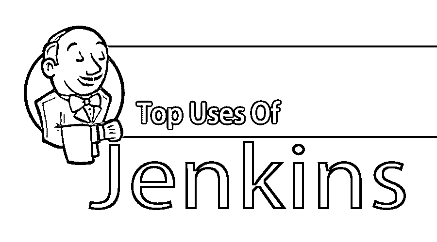

# 詹金斯的用途

> 原文：<https://www.educba.com/uses-of-jenkins/>

## 詹金斯用途介绍

[Jenkins 是一个用 Java 编写的](https://www.educba.com/what-is-jenkins/)开源自动化服务器。Jenkins 用于自动化软件开发中不需要人工干预的[部分。它用于持续集成，并为促进持续交付提供技术方面的支持。](https://www.educba.com/software-development-vs-web-development/) [Jenkins 通常安装在](https://www.educba.com/install-jenkins/)中央编译发生的服务器上。持续集成确保了开发人员的频繁构建。通常遵循的实践确保代码提交一完成，就触发构建。

### 詹金斯

开发人员首先检查他们的源代码，然后 Jenkins 发现代码中的变化，触发构建，如果需要的话还会运行任何测试。Jenkins 的构建输出显示在其仪表板上，在构建过程结束后，可以向开发人员发送通知。[持续集成](https://www.educba.com/what-is-continuous-integration/)可以定义为开发人员定期将代码集成到共享存储库中的开发实践。这样做是为了消除构建生命周期中的各种问题，比如以后出现的问题。

<small>网页开发、编程语言、软件测试&其他</small>

### Jenkins 的 10 大用途

Jenkins 是开源的，因此是免费的。它可以很容易地配置和扩展。Jenkins 附带了许多插件，确保了极大的灵活性。它立即部署代码，在部署后生成报告，显示代码或测试中的错误，并且几乎实时地检测和解决大量问题。由于集成是自动化的，因此对于集成来说也是非常好的。巨大的支持社区也是可用的。

在本节中，我们提供了 Jenkins 的 10 大用途。这些内容如下:-

#### 1.Jenkins 降低了重复编码的工作量

通过使用 Jenkins，可以将命令提示符代码转换为 GUI 按钮点击。这可以通过将脚本包装成 Jenkins 的工作来完成。可以创建参数化的 Jenkins 作业进行定制或接受用户输入。因此，可以节省数百行代码。

#### 2.个人工作的整合

詹金斯工作通常是小工具。它们的用途很小，也很简单。Jenkins 提供了管道插件，使用该插件可以合并多个作业。流水线提供了这样的好处，Linux 用户比任何人都更能理解。顺序或并行组合都是可能的。

#### 3.松弛同步

大型团队使用集中式平台进行交流。Slack 就是这样一个最受欢迎的平台。可以对 Jenkins 进行松弛集成，从而触发诸如活动、时间、用户名、结果等的通信。可以和其他人分享。

#### 4.轻松审计

Jenkins 作业在运行时会从 stdout 和 stderr 中捕获控制台输出。用詹金斯的用法排除故障也很清楚。对于每个单独作业的性能调优，可以使用时间戳插件来测量运行时间和识别最慢的步骤。

#### 5.为项目管理提供更大的数据支持

对于[项目管理](https://www.educba.com/project-management-as-a-career-path/)，每个活动都被包装成 Jenkins 的工作。对于每个 Jenkins 作业，可以识别成功或失败，并且可以测量作业完成时间。

Jenkins 支持 REST API 或 SDK 来衡量成功、失败或时间。

下面给出了一些[有用的 Jenkins 插件](https://www.educba.com/jenkins-plugins/):

*   管道插件，
*   Slack 插件，
*   精简备份，
*   时间戳，
*   仪表板视图，
*   JobConfigHistory 插件，
*   构建超时，
*   Naginator 插件，
*   Git 插件，以及
*   [GitHub](https://www.educba.com/install-github/) 拉请求生成器插件。

#### 6.手动测试选项

有时事情在本地很好，但在中央系统上却失败了。发生这种情况是因为，当他们推动时，事情发生了变化。持续集成根据代码库的当前状态测试代码，并在类似生产的环境中完成。

#### 7.增加代码覆盖率

CI 服务器如 [Jenkins 可以检查代码](https://www.educba.com/is-jenkins-free/)的测试覆盖率。测试增加了代码覆盖率。这激发了团队成员的透明度和责任感。测试结果显示在构建管道上，确保团队成员遵循要求的指导方针。[类似于](https://www.educba.com/code-coverage/)代码审查的代码覆盖确保测试在团队成员中是一个透明的过程。

#### 8.代码部署到生产环境

Jenkins 或另一个 CI 系统可以将代码自动部署到试运行或生产中，如果在一个特定的特性或发布分支中为相同的代码编写的所有测试都是绿色的。这在形式上也被称为持续部署。合并活动之前的更改也是可见的。这可以在动态暂存环境中完成，在它们合并后，可以直接部署到中央暂存系统、生产前系统甚至生产环境中。

#### 9.避免运输过程中的代码损坏

持续集成[确保代码覆盖](https://www.educba.com/code-coverage-tools/)良好，测试良好，只有当所有测试成功时才合并。这确保了主构建没有被破坏，并且没有被破坏的代码被发送到生产环境中。如果主构建被破坏，这样的系统会向所有开发人员发出警告。

#### 10.减少代码审查时间

诸如 Jenkins 之类的 CI 系统和诸如 Git 之类的版本控制系统可以相互通信，并在合并请求适合合并时通知用户。这通常是当所有的测试都通过，并且所有其他的要求都满足的时候。除此之外，代码覆盖率中的[差异也可以在合并请求本身中报告。这大大减少了审查合并请求的时间。](https://www.educba.com/code-coverage-vs-test-coverage/)

### 结论

随着软件技术的巨大进步，公司要求开发团队比竞争对手更好更快地生产和交付高质量的软件。今天，开发团队正在通过创建标准化开发及其最佳实践的可重复过程来构建可扩展的、高效的软件交付引擎。自动化测试就是这样一种活动，通过这种活动，对于每个变更和每个周期，开发人员的代码都以相同的标准方式进行测试，以便管理层和其他用户可以相信每个变更在进入生产之前都经过了充分的测试。

使用 Jenkins 可以为开发人员节省大量时间，提高代码质量和覆盖率，并为管理层提供对软件开发的强大控制。因此，它很受欢迎，许多公司每天都在使用它。对于即将到来的[软件开发者](https://www.educba.com/career-as-a-software-developers/)来说，这也是一个很好的学习工具。

### 推荐文章

这是一个在现实世界中使用 Jenkins 的指南。在这里，我们讨论了 Jenkins 的各种用途，如轻松审计、减少代码审查时间、整合单个工作等。您也可以阅读以下文章，了解更多信息——

1.  的用途。网络
2.  [HTML 的用途](https://www.educba.com/uses-of-html/)
3.  [Unix 的使用](https://www.educba.com/uses-of-unix/)
4.  [Hadoop 的用途](https://www.educba.com/uses-of-hadoop/)

