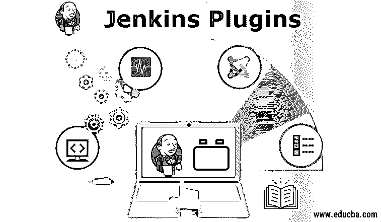
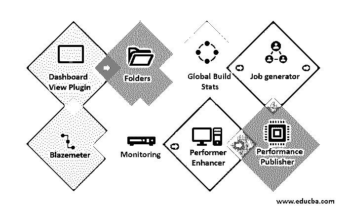

# 詹金斯插件

> 原文：<https://www.educba.com/jenkins-plugins/>

## Jenkins 插件简介

在 MIT 许可下发布，Jenkins 只不过是一个开源自动化服务器。Jenkins 是用 Java 语言写的。它在自动化与交付或部署、测试和构建软件相关的所有类型的任务时非常有用。它的工作原理是持续集成的原理。Jenkins 支持所有著名的源代码管理系统，如 Mercurial、CVS、Git，并构建工具，如 Grunt 和报告生成器&测试框架。为了在用其他语言编写的项目中扩展 Jenkins 的使用，已经发布了插件。插件为 Jenkins 增加了新的功能。市场上有大量的插件。每个插件都有不同的用途。

### Jenkins 的插件

下面是一些不同的詹金斯插件及其应用。

<small>网页开发、编程语言、软件测试&其他</small>

#### 1.仪表板视图插件

使用这个插件，你可以得到一个新的詹金斯仪表板。它使用户能够监控各种任务的状态。这个插件在跟踪任务和执行时间方面也很有用。

#### 2\. Folders Plugin

在这个插件的帮助下，你可以将不同的 Jenkins 任务分组。这是一个最有用的詹金斯可用。借助该插件中的嵌套文件夹，可以完美地组织和安排 CI 服务器。

#### 3.全局构建统计插件

了解系统需求的当前能力、容量和容量至关重要。在每周或每天的基础上，了解正在发生的构建的数量和花费的时间以及等待构建的时间是非常重要的。这个插件提供了与这些相关的所有数据。它还能够以图形格式提供数据，便于理解。

#### 4.作业生成器插件

在大公司，有时很难以同样的生产力管理整个工作。在这个插件的作业生成模板的帮助下，用户可以使用作业生成器模板生成一个新的作业。它为开发人员创造他们自己的工作提供了灵活性，但是仍然不能创造不符合公司标准的工作。可以通过基于角色的授权插件禁用配置访问。

#### 5.Blazemeter 插件

在 Blazemeter 平台的帮助下，这个插件使用户能够执行负载测试。它消除了理解测试基础设施和存储指标的额外工具的需要。它提供实时执行监控和矩阵存储。

#### 6.监视

在 JavaMelody 的帮助下，这个插件可以跟踪 Jenkins。这个插件帮助分配 HTTP，CPU，内存等的图表。它还提供有关头转储、日志帐户和其他数据的信息。人们可以检查正在考虑的作业的状态。它还提供统计数据来管理 Jenkins。

#### 7.表演者增强插件

这个插件在 GUI 作业和 Jenkins 管道中都有使用。这个插件有助于通过不同的测试工具[跟踪报告，比如 JMeter](https://www.educba.com/what-is-jmeter/) 、Taurus 和 JUnit。用户可以看到图形、趋势报告的性能，并相应地将构建状态设置为正确、失败或不稳定。

#### 8.Performance Publisher 插件

这个插件的重要特性是它可以和所有的测试工具一起工作。它创建测试结果分析的全局和趋势报告。它代表统计数据，强调回归和修改。

#### 9.Jenkins 安装插件

Kubernetes 插件:

*   这个插件与 Kubernetes 配合使用效果最好。如果有人[使用 Kubernetes 进行基础设施建设](https://www.educba.com/kubernetes-architecture/)，那么这个插件最适合设置和拆除 Jenkins 的代理。即使转移到 Kubernetes 很难处理，但这些插件的结果是值得的。
*   Amazon ECS 容器服务该插件用于部署基于集群的 Docker 应用程序和 Jenkins 处理。

### 测试分析插件

下面给出了测试分析插件:

#### 1.引导式多测试结果报告插件

这个插件使用户能够生成基于 HTML 的测试结果报告。在这个插件的帮助下，用户可以制作交互式报告，包括所有结果的总体情况和步骤状态的详细结果。

#### 2.测试分析插件

作为持续集成的[部分，人们可以在这个插件的帮助下运行任何类型的测试。但另一方面，詹金斯在执行后无法进行任何分析。这种类型的插件已经交付了所有构建的测试结果。这种类型的插件显示结果在不同类型的图表和详细的矩阵表。](https://www.educba.com/what-is-continuous-integration/)

#### 3.流插件

*   **构建管道插件:**这个插件提供了一个作业视图，makeup 在下游和上游构建管道。这个插件使得管道可脚本化，并提供了一个强大的途径来开发[复杂的 DevOps 管道](https://www.educba.com/what-is-devops/)。它使用户能够为某个可能需要在执行前反转的任务定义手动触发器。
*   多任务插件:在 Jenkins 中，这个插件有助于根据复杂任务的结构来组织它们。每当需要组织上游和下游作业的链定义时，就会使用这个插件。你可以使用这个插件来生成一个任务的层次结构，并按顺序执行。一个人可以用这个插件创建多任务项目。它拥有一个以上的作业，同时并行执行作业。
*   **管道插件:**在传统插件和自由式项目的帮助下，这个插件做复杂的任务。这个插件自动化了连续的交付管道。

#### 4.源代码管理插件

*   **SCM API:** 为了与 SCM 系统交互，这个插件提供了 API。这包括一个全功能的事件系统，向消费者提供细粒度的警报。
*   **Git 插件:**作为 SCM，提供[对 GitHub](https://www.educba.com/install-github/) 的访问。对于许多其他提供者来说，它相当于一个存储库浏览器。
*   **GitHub 集成插件:**这是一个用于将 GitHub 项目与 Jenkins 集成的基础插件。人们可以安排构建，从 GitHub 仓库中提取代码到 Jenkins，并根据需要触发构建。

### 结论

在上面的文章中，我们已经提出了关于 Jenkins 和插件的要点。这篇文章给出了关于不同的 Jenkins 插件及其用途的信息。Jenkins 不是必要的软件，而是一个社区，它使用许多插件来做任何事情。总之，Jenkins 提供了构建持续集成的功能。Jenkins 是一个开源软件，支持长期的持续部署、持续交付和持续灵活性。

### 推荐文章

这是一个关于 Jenkins 插件的指南。在这里，我们详细讨论不同类型的 Jenkins 和测试分析插件的基本概念。您也可以浏览我们推荐的其他文章，了解更多信息——

1.  [如何安装詹金斯](https://www.educba.com/install-jenkins/)
2.  [詹金斯的用途](https://www.educba.com/uses-of-jenkins/)
3.  [詹金斯训练](https://www.educba.com/software-development/courses/jenkins-training/)
4.  [詹金斯采访问&答](https://www.educba.com/jenkins-interview-questions/)

