# 詹金斯报道

> 原文：<https://www.educba.com/jenkins-reporting/>

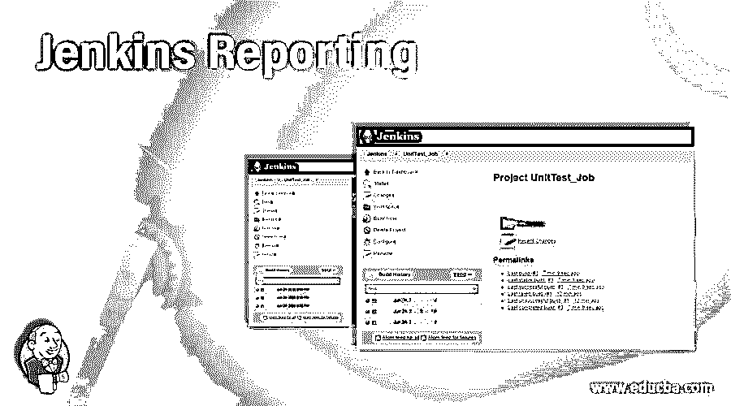

## 詹金斯报告简介

詹金斯的报告是一条信息。它实际上负责以结构化和图形化的方式表示被调查的数据，或者观察到的数据。它详细描述了詹金斯的工作。Jenkin 报告的目的在某种意义上是直截了当和不言而喻的，因此对于企业或 Jenkins 用户来说很容易理解。詹金斯的报告结合了不同的目的来包装信息和起草有关工作。它是对运行作业时生成的信息的详细分析或反映。作为一种输出，Jenkin 的工作提供详细的信息，并以与主题相关的良好对齐和描述性的形式交付给 Jenkin 的用户。

让我们举一个例子，我的组织需要为代码配置 JUnit 测试。另外，在 Jenkins 的帮助下，寻找以 xml 格式生成的 JUnit 报告。

<small>网页开发、编程语言、软件测试&其他</small>

根据这些使用案例，我们遵循以下步骤

Jenkins 构建工具通常会自动执行给定用例的以下活动:-

*   组织项目特定的文件
*   编译源代码
*   为源代码生成文档
*   运行 Junit 和集成测试用例
*   生成 JUnit 测试报告

### 为什么是 JUnit？

Junit 是一个自动化单元测试的框架；每当我们向软件添加新的特性时，我们都需要重新测试并编写具有所有功能的 Junit 测试用例。

因此，请找到以下配置，以 xml 格式设置 JUnit 测试报告:-

使用管理员凭据登录 Jenkins 帐户，然后单击管理 Jenkins 链接:-

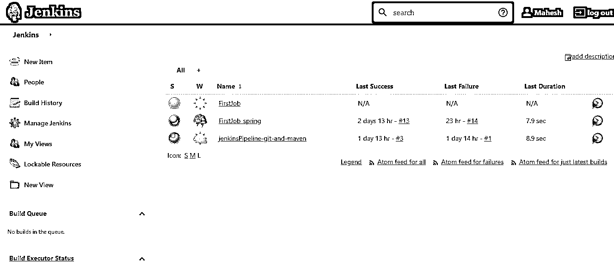

现在，你可以看到下面的屏幕。单击“manage plugins(管理插件)”并验证 JUnit 插件是否安装正确。

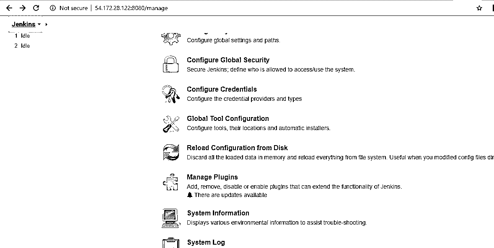

我们可以通过导航到 installed 选项卡来验证 Junit 插件是否安装成功。

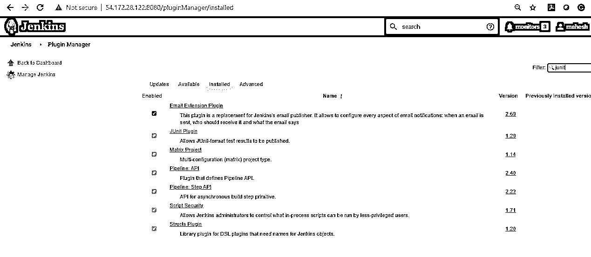

发布 ju*9/1nit 插件的成功安装，通过单击 Jenkins 标题转到作业。导航到您的工作后，单击“配置”链接

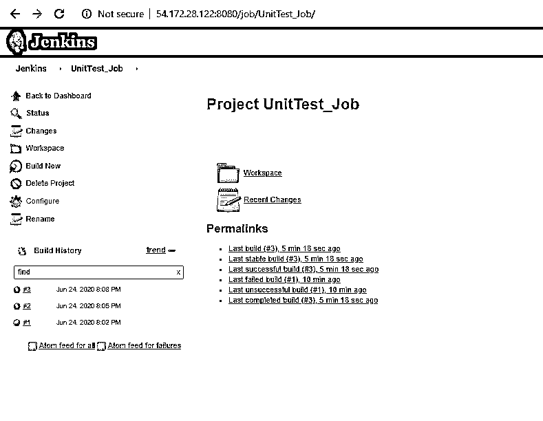

选择源代码管理，并在代码可用的地方为代码定义存储库细节。因为我们是基于 maven 项目生成报告的，所以请在 pom.xml 中找到以下用于 junit 测试的配置

`<dependency>
<groupId>junit</groupId>
<artifactId>junit</artifactId>
<version>4.12</version>
<scope>test</scope>
</dependency>`

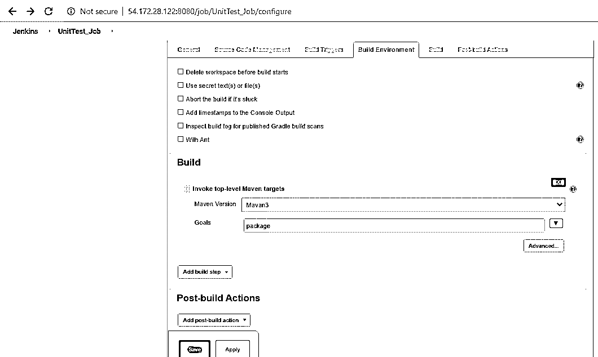

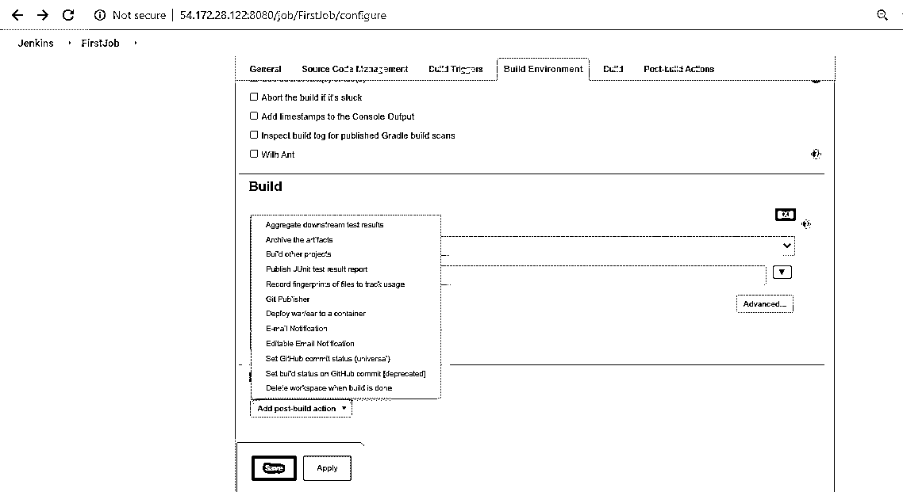

我们只需要运行构建作业，生成 xml 文件，然后我们就可以提供路径。path 指的是在测试用例执行后将产生 JUnit 报告的 xml 的路径。

对于这个 maven 用户，它使用 surefire 插件进行 JUnit 测试。

在后期构建操作中，单击添加后期构建操作，选择“发布 JUnit 测试结果报告”我们必须在 Test report xmls 下指定生成所有 XML 报告的目录。例如:目标/保证报告。因此，将路径指定为 reports/*。xml 以包含报告中存在的所有 xml 文件。因此，我们指定了客户工作区的位置；在这个工作区中，Jenkins 将查找 reports 文件夹，在 reports 文件夹中，它将查找 xml 文件。应用并保存更改。

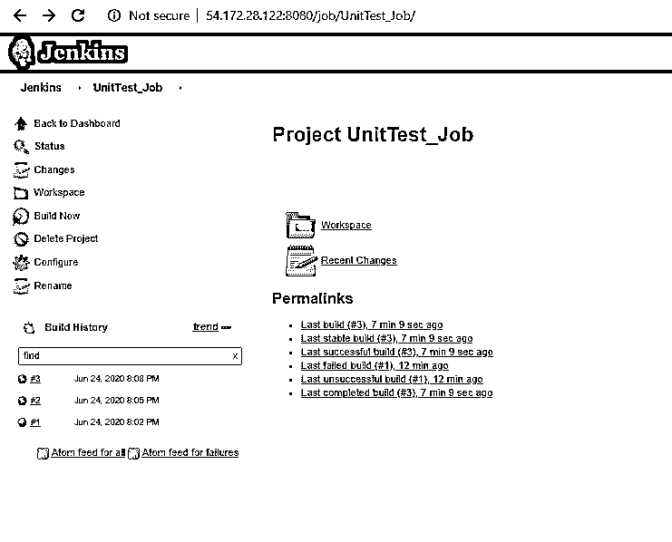

构建完成后，按照下面截图中提到的路径，您可以获得用于包含报告和摘要的 XML。接下来，我们需要重定向 mave 生成二进制文件或 jar 或 ear post 成功构建的目标文件夹。

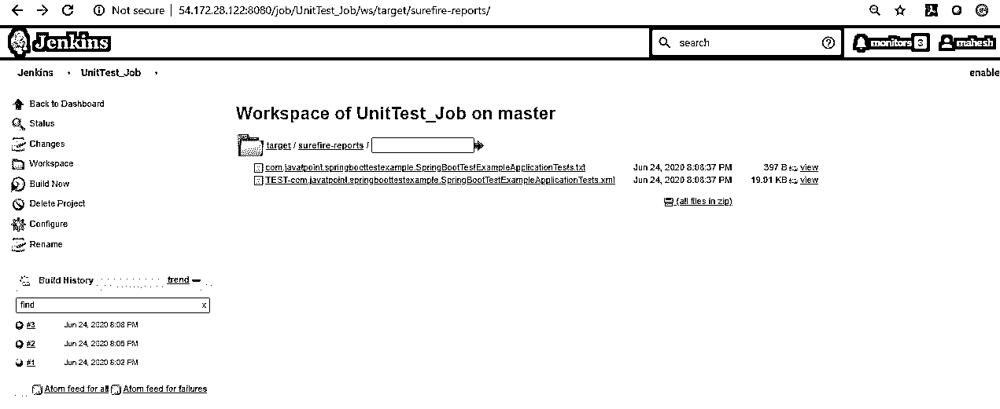

需要将 target/surefire 报告配置到 publish JUnit test result report 部分。这基本上是测试报告 XML 的路径。

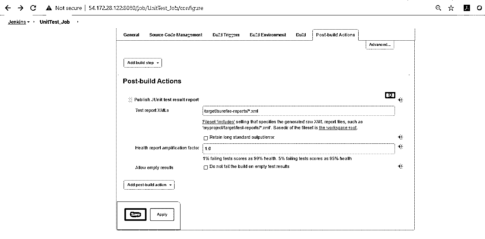

导航到您在 Jenkins 中的工作，您将看到报告的任何链接，但是一旦您现在进行构建，您将看到一个新的链接生成“最新测试结果”和一个显示测试失败的图表。

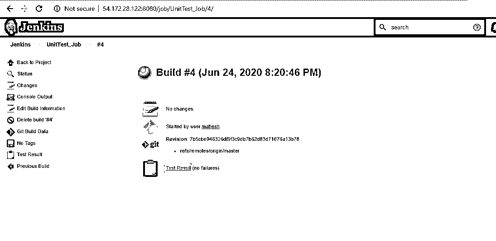

我们可以看到包含 JUnit 报告的 xml，其中包含基于测试用例的所有通过和失败记录。

请在下面找到生成 Junit 报告的测试代码:-

`import org.springframework.boot.SpringApplication;
import org.springframework.boot.autoconfigure.SpringBootApplication;
@SpringBootApplication
public class SpringBootTestExampleApplication
{
public static void main(String[] args)
{
SpringApplication.run(SpringBootTestExampleApplication.class, args);
}
}`

请在通常期望测试用例的地方找到样本 xml 代码。

`import org.junit.jupiter.api.Test;
import org.springframework.boot.test.context.SpringBootTest;
@SpringBootTest
class SpringBootTestExampleApplicationTests
{
@Test
void contextLoads()
{
}
}`

请找到生成报告的 pom.xml 代码表单

`<?xml version="1.0" encoding="UTF-8"?>
<project xmlns=http://maven.apache.org/POM/4.0.0 xmlns:xsi="http://www.w3.org/2001/XMLSchema-instance"
xsi:schemaLocation="http://maven.apache.org/POM/4.0.0 https://maven.apache.org/xsd/maven-4.0.0.xsd">
<modelVersion>4.0.0</modelVersion>
<parent>
<groupId>org.springframework.boot</groupId>
<artifactId>spring-boot-starter-parent</artifactId>
<version>2.2.2.BUILD-SNAPSHOT</version>
<relativePath/><!-- lookup parent from repository -->
</parent>
<groupId>com.point</groupId>
<artifactId>spring-boot-example</artifactId>
<version>0.0.1-SNAPSHOT</version>
<name>spring-boot-example</name>
<description>Demo project for Spring Boot</description>
<properties>
<java.version>1.8</java.version>
</properties>
<dependencies>
<dependency>
<groupId>org.springframework.boot</groupId>
<artifactId>spring-boot-starter</artifactId>
</dependency>
<dependency>
<groupId>org.springframework.boot</groupId>
<artifactId>spring-boot-starter-parent</artifactId>
<version>2.2.1.RELEASE</version>
<type>pom</type>
</dependency>
<dependency>
<groupId>org.springframework.boot</groupId>
<artifactId>spring-boot-starter-web</artifactId>
</dependency>
<dependency>
<groupId>org.springframework</groupId>
<artifactId>spring-webmvc</artifactId>
</dependency>
<dependency>
<groupId>org.springframework.boot</groupId>
<artifactId>spring-boot-starter-test</artifactId>
<scope>test</scope>
<exclusions>
<exclusion>
<groupId>org.junit.vintage</groupId>
<artifactId>junit-vintage-engine</artifactId>
</exclusion>
</exclusions>
</dependency>
</dependencies>
<build>
<plugins>
<plugin>
<groupId>org.springframework.boot</groupId>
<artifactId>spring-boot-maven-plugin</artifactId>
</plugin>
</plugins>
</build>
<repositories>
<repository>
<id>spring-milestones</id>
<name>Spring Milestones</name>
<url>https://repo.spring.io/milestone</url>
</repository>
<repository>
<id>spring-snapshots</id>
<name>Spring Snapshots</name>
<url>https://repo.spring.io/snapshot</url>
<snapshots>
<enabled>true</enabled>
</snapshots>
</repository>
</repositories>
<pluginRepositories>
<pluginRepository>
<id>spring-milestones</id>
<name>Spring Milestones</name>
<url>https://repo.spring.io/milestone</url>
</pluginRepository>
<pluginRepository>
<id>spring-snapshots</id>
<name>Spring Snapshots</name>
<url>https://repo.spring.io/snapshot</url>
<snapshots>
<enabled>true</enabled>
</snapshots>
</pluginRepository>
</pluginRepositories>
</project>`

请找出以下几点来理解 pom.xml:-

groupId: 这反映了客户的信息，我们正在为他们开发这个项目。从技术上讲，我们可以在这里输入任何值，但是我们遵循以下约定。
按照惯例，应该是公司名称或者公司的反向域名如下

`<groupId>xxxxxx</groupId>`

**artifactId:** 这代表项目名称，一些例子

`<artifactId>xxxxxxx</artifactId>`

**打包:**这表示需要由 maven 创建的软件包格式，举几个例子

`<packaging>war</packaging>`

**版本:**项目的当前版本

`<version>1.7.2</version>`

### 推荐文章

这是詹金斯报道指南。在这里，我们讨论为代码配置 JUnit 测试的示例，以及在 Jenkins 的帮助下以 xml 格式生成的 JUnit 报告。您也可以看看以下文章，了解更多信息–

1.  [詹金斯邮件通知](https://www.educba.com/jenkins-email-notification/)
2.  [詹金斯的用途](https://www.educba.com/uses-of-jenkins/)
3.  [詹金斯的替代方案](https://www.educba.com/jenkins-alternatives/)
4.  [詹金斯插件](https://www.educba.com/jenkins-plugins/)

