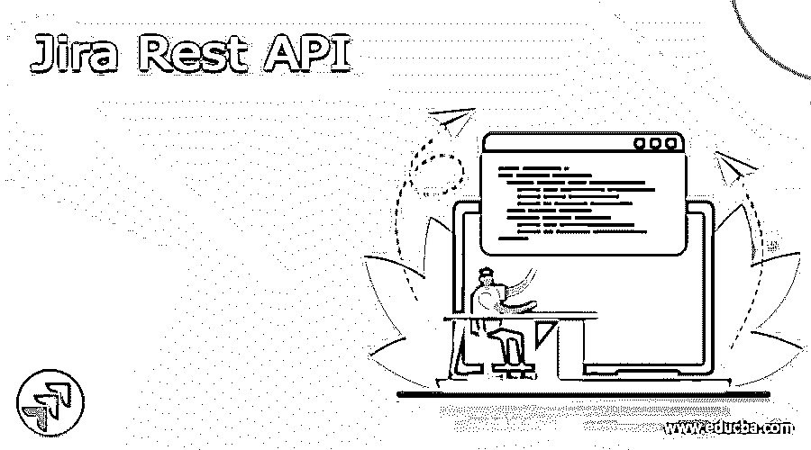
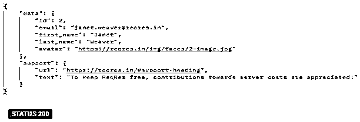

# 吉拉休息 API

> 原文：<https://www.educba.com/jira-rest-api/>

## 吉拉 Rest API 的定义

本质上，JIRA 给出了一些免费的 API 和一些我们根据自己的前提条件真正想买的 API。我们意识到，通过利用 JIRA API，我们可以与 JIRA 设备对话，这意味着我们可以自动传达。在这个 API 的帮助下，我们可以编造各种各样的用途，同样也可以编写与 JIRA 仪器通信的内容，或者我们可以根据需要构建一些其他的组合。吉拉 REST APIs 用于以良好的方式与吉拉服务器应用程序协同工作，例如，在规划 webhooks 时。吉拉服务器阶段将 REST API 赋予普通功能，如问题和工作流程。

### 吉拉 rest API 概述

基本上，我们知道在 JIRA API 的帮助下，意味着 REST API JIRA 仪器的混合，我们可以根据我们的需要装配各种应用程序。另一方面，JIRA 依赖于 JIRA 的各个阶段，或者我们可以说，JIRA 根据我们的前提条件提供了基于云的 REST API 来支持应用程序。

<small>网页开发、编程语言、软件测试&其他</small>

**确认**

在 JIRA，我们正在使用 REST APIs，它与 JIRA 设备结合在一起，并通过使用 JSON 令牌进行验证。在很大程度上，批准是通过与应用程序额外交换安全设置来实现的。该设置用于制作和认可嵌入在 API 调用中的 JWT 令牌。

有些混合 API，万一我们得到了不同 REST API 的确认，我们就可以协调预期的 API，实现事情的转变。

现在我们来看看 REST API 需求的确认，如下所示。

**OAuth 2.0–**这种基于令牌的系统是建议的策略。它比各种决策更通用、更安全。

**OAuth 1.0a—**这是一个传统的审批系统，因此不推荐使用。也许用 OAuth 2.0。

**基础 HTTP–**该程序仅适用于物品或机器人等设备。它更容易完成，但同时明显不太安全。

组合确认

假设您正在使用吉拉 REST APIs 组织内部应用程序，API 调用通过 OAuth 令牌进行确认。要获得令牌，需要对应用程序需要访问的 API 进行大量的 OAuth 认证。使用许可证通过调用来请求令牌

https://api.atlassian.com/oauth/token.

### 使用吉拉 rest API

现在让我们看看如何在吉拉使用 API 的其余部分，如下所示。

*   #### Expansion

现在我们来看看 API 中的扩展如下。

为了处理 API 反应，JIRA REST API 利用了资产开发。这意味着当明确提到时，API 可能会返回部分资产。

您可以利用增长问题边界来确定需要扩展的逗号分隔的物质列表，通过名称区分每一种物质。

要找到每个元素的标识符，看看父对象中的 growing 属性。在下面的 JSON 模型中，资产声明小工具是可扩展的。

`{
"extend": "gadgets",
"self": "http://www.demo.com/jira/rest/programming interface/asset/KEY-1",
"gadgets": {
"gadgets": [],
"size": 7
}
}`

你可以利用 spot 文档来指出另一种物质内部元素的发展。

*   #### Page number

分页意味着设置从大型集合返回的响应大小的限制。分页的最终输出是一个带有分页元数据的 JSON 对象。

现在让我们来看一个例子，以便更好地理解。

`{
"start" : 0,
"M_Results" : 20,
"total_cont": 150,
"values": [
{ /* output 0 */ },
{ /* output 1 */ },
{ /* output 2 */ }
] }`

**解释**

start 只不过是作为结果的分页的第一项。

*   M_result:最大结果用于显示每页的最大项目。
*   Total_count:要恢复的内容的完整数量，取决于服务器授权的限制。这个数字可能会随着客户端对结果页面的需求而变化。客户应该不断地期望所提到的页面可以是未填充的。REST API 购买者应该同样相信该领域是可自由支配的。在计算这个值代价太高的情况下，它可能不会因为反应而被记住。
*   #### sort

在吉拉，一些参数支持 orderby 的排序，以便我们可以根据我们的需求以升序或降序获取 JSON 对象，在吉拉我们可以使用+和–符号进行排序。

*   #### self-linking

有时我们需要以一个规范的位置作为链接来获取方法，这时我们可以在 JSON 对象中使用一个 self-link 字段。

**例子**

`"student": {
"self": "http://jira.atlassian.com/rest/api/1/user?studname=jenny",
"stud_name": "Jenny",
"email": "Jenny123@gmail.com",
"City": "Mumbai",
"active": true
},`

### 吉拉 Rest API 示例

现在让我们看一个 API 其余部分的例子，如下所示。

首先，我们要组装模块。此模块包含正常或辅助的替代零件。之后，我们同样需要创建插件 2:它包括安全部分和计划。以下重要的协调是物质属性:用于存储吉拉产品的临界值，并用于在吉拉创建、删除和更新 API。

Webhooks:同样重要，因为它给出了各种场合之间的联系。

**解释**

在上面的截图中，我们可以休息的 API，这是一个 JSON 格式，它包括不同的关键和值，如 id，关键，类型，名称，描述等。如果上面的 API 运行成功，那么它返回 200，如果无效，那么它返回 400 状态代码，如下图所示。

现在我们来看看获取 API 的例子如下。

[https://reqres.in/api/users/2](https://reqres.in/api/users/2)这个获取 API 的演示 URL 当我们运行这个 API 时，我们会得到一些记录，如下图所示，状态代码如下。

### 结论

借助上述文章，我们尝试了解 JIRA rest API。从这篇文章中，我们了解了 JIRA rest API 的基本情况，也看到了 JIRA rest API 的集成、扩展和基于云的集成。

### 推荐文章

这是一个吉拉 rest API 的指南。在这里，我们讨论定义、概述、如何使用、示例以及代码实现和输出。您也可以看看以下文章，了解更多信息–

1.  [吉拉积压](https://www.educba.com/backlog-in-jira/)
2.  [吉拉史诗](https://www.educba.com/jira-epic/)
3.  [冲刺吉拉](https://www.educba.com/sprint-in-jira/)
4.  [吉拉版本](https://www.educba.com/jira-versions/)

