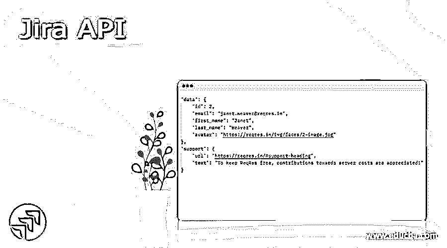
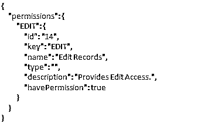
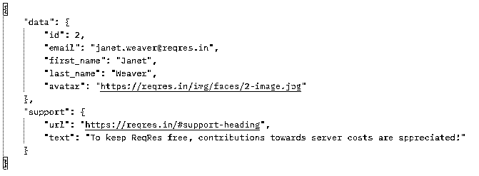

# 吉拉 API

> 原文：<https://www.educba.com/jira-api/>

## 吉拉 API 的定义

JIRA 提供了一些免费的 API 和我们需要购买的 API。我们知道，使用 JIRA API 可以与 JIRA 工具进行通信，这意味着通过编程，我们可以进行通信。在这个 API 的帮助下，我们可以构建不同类型的应用程序，编写与 JIRA 工具通信的脚本，或者根据我们的要求构建任何其他集成。例如，在设计 webhooks 时，吉拉 REST APIs 与吉拉服务器应用程序进行远程协作。吉拉服务器阶段将 REST API 赋予正常的亮点，类似于问题和工作流程。

### 吉拉空气污染指数简介

我们知道 JIRA API help 结合了 REST API JIRA 工具；我们可以根据自己的需求构建不同的应用程序。但是，另一方面，JIRA 依赖于 JIRA 的不同阶段，或者我们可以说，JIRA 提供了基于云的 REST API 来根据我们的要求开发应用程序。

<small>网页开发、编程语言、软件测试&其他</small>

#### 证明

我们正在使用与 JIRA 工具集成的 REST APIs，并在 JIRA 使用 JSON 令牌进行认证。验证的工作原理是在重要级别上与应用程序交换额外的安全设置。该设置用于制作和批准 API 调用中插入的 JWT 令牌。

一些混合 APIs 如果我们有身份验证来访问不同的 REST APIs，我们就可以集成所需的 API 并进行开发。

现在让我们看看 REST API 请求的身份验证，如下所示。

*   OAuth 2.0–这种基于令牌的策略是推荐的技术。它比不同的选择更具适应性和安全性。
*   OAuth 1.0a–这是一种继承验证策略，不建议使用。宁愿使用 OAuth 2.0。
*   **基本 HTTP**–该技术仅建议用于内容或机器人等设备。实现起来更简单，但安全性却大大降低。

#### 集成认证

假设您用吉拉 REST APIs 协调一个本地应用程序，API 调用通过 OAuth 令牌进行验证。要获得令牌，需要对应用程序需要访问的 API 进行一系列 OAuth 授权。通过致电，利用资格鉴定来要求令牌

[https://api.atlassian.com/oauth/token](https://api.atlassian.com/oauth/token)。

### 吉拉 API URI 结构

现在让我们看看 API 的 URI 结构如下。

JIRA 的 REST APIs 通过 URI 方式允许资产(信息实体)进入。

使用 Rest API，我们可以开发需要 HTTP 请求和响应的应用程序。例如，我们知道我们通常有一个不同的 HTTP 方法，可以在应用程序的开发过程中使用，如 GET、DELETE、PUT 和 POST。

目前有两个可用的 API 名称，我们将在下面进一步讨论:

1.  **auth**–用于与确认相关的任务，以及
2.  **编程接口**–用于所有其他事情。

当前的 API 格式副本是 2。尽管如此，同样，一个代表性的适应，所谓的最近，使计划的最新形式支持给定的 JIRA 案例。例如，要从 Atlassian 的公共问题跟踪器中恢复 JRA 9 号问题的 JSON 描述，您需要:

[https://jira.atlassian.com/rest/programming 接口/最新/下期/JRA-9](https://jira.atlassian.com/rest/programming%20interface/most%20recent/issue/JRA-9)

### 吉拉 API 云

本 API 中的大多数活动都需要获得同意。因此，调用客户端应该拥有活动所需要的许可。请注意，对于 Connect 应用程序，客户端应该对该活动有通常的同意，并且应用程序应该有许可该活动的范围。

*   **云站点权限:**基本上站点管理组有这个权限。
*   **管理吉拉:**这是吉拉管理员授予的全局权限。
*   **在吉拉管理项目:**此权限由管理项目授予指定项目。
*   **访问吉拉:**这是由吉拉管理员授予的全局权限。

此外，根据我们的要求，我们还需要不同的访问权限。

### 吉拉 API 内部集成

现在让我们看看如何集成吉拉 API，如下所示。

*   首先，我们需要构建插件:这个插件包含一个不同的通用或辅助组件。
*   之后，我们还需要开发插件 2，包括安全组件和设计。
*   集成的下一个重要部分是实体属性:用于存储吉拉对象的键值，并用于创建、删除和更新吉拉中的 API。
*   Webhooks:也很重要，因为它给出了不同事件之间的交互。

### 吉拉 API 示例

**解释**

在上面的截图中，我们可以 rest API 这是一种 JSON 格式，它由不同的键和值组成，如 id、键、类型、名称、描述等。如果上面的 API 运行成功，那么它返回 200。另一方面，如果无效，它返回 400 状态代码，如下图所示。

现在我们来看看 get API 的例子如下。

[https://reqres.in/api/users/2](https://reqres.in/api/users/2)这个获取 API 的演示 URL 当我们运行这个 API 时，我们将得到一些记录，如下图所示，带有状态代码。

### 膨胀

现在我们来看看 API 中的扩展如下。

为了处理 API 反应，JIRA REST API 利用了资产开发。这意味着当明确提到时，API 可能会返回部分资产。

您可以利用增长问题边界来确定需要扩展的逗号分隔的物质纲要，通过名称区分每个人。

查看父对象的 growing 属性，找到每个元素的标识符。例如，在下面的 JSON 模型中，资产声明小工具是可扩展的。

`{
"extend": "gadgets",
"self": "http://www.demo.com/jira/rest/programming interface/asset/KEY-1",
"gadgets": {
"gadgets": [],
"size": 7
}
}`

你可以利用 spot 文档来指出另一种物质内部元素的发展。

### 结论

借助上述文章，我们尝试了解 JIRA API。从这篇文章中，我们了解了 JIRA API 的基本情况，同时我们也看到了 JIRA API 的集成、扩展和基于云的集成。

### 推荐文章

这是吉拉空气污染指数指南。在这里，我们讨论定义，URI 结构，云，以及我们如何集成吉拉 API 以及扩展。您也可以看看以下文章，了解更多信息–

1.  [什么是吉拉软件？](https://www.educba.com/what-is-jira-software/)
2.  [JIRA 的替代方案](https://www.educba.com/jira-alternatives/)
3.  [吉拉项目管理工具](https://www.educba.com/jira-project-management-tool/)
4.  [什么是 API 集成？](https://www.educba.com/what-is-api-integration/)

