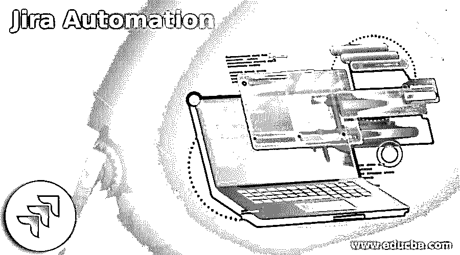
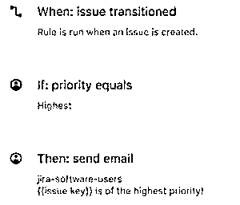
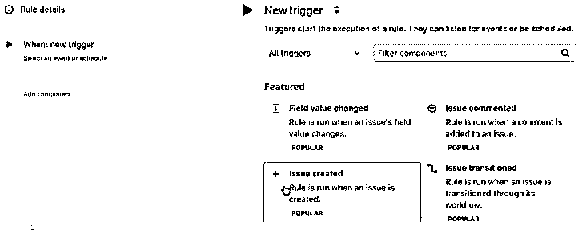
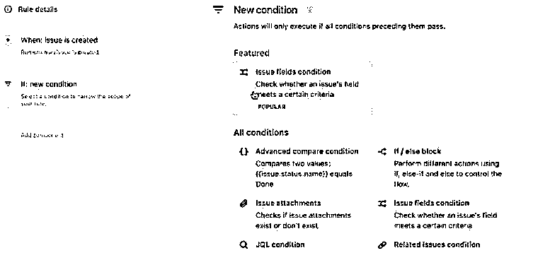
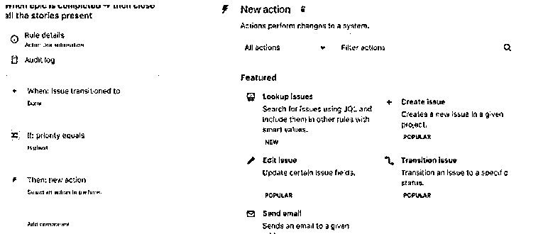
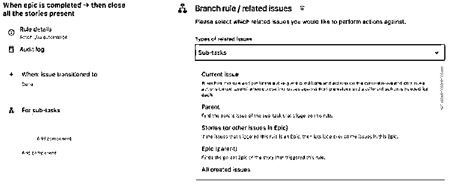

# 吉拉自动化

> 原文：<https://www.educba.com/jira-automation/>

## 吉拉自动化简介

吉拉自动化是吉拉提供的工具之一；我们知道自动化用于实现回归，这意味着避免重复的任务和手工工作。因此，吉拉自动化公司根据我们的要求，提供了使他们各自团队的流程和工作流程自动化的功能。此外，它提供了强大的自动化规则来处理复杂的场景。因此，在吉拉自动化中，一个重要的概念是自动化规则，它帮助我们根据标准在指定的系统中自动执行操作。

吉拉是世界上最著名的项目之一；董事会和工作流程是高级管理人员的设备，用于灵活编程改进小组和技术新业务。吉拉的主要资产是它的自动化，允许客户在其他情况下将他们的差事和任务更新计算机化。自动化加速了你的工作，打开了资产，减少了任务生命周期中任何失误的可能性。

<small>网页开发、编程语言、软件测试&其他</small>

这是吉拉软件和吉拉云应用程序中的一个元素，它允许客户根据吉拉的各种场合，利用这些条件，完全自动化他们执行的流程。它帮助你将持续占用你数小时时间的例行任务机械化，让你专注于建立自尊和批判性思考。这是一个“无代码”的亮点，意味着任何人都可以在吉拉制定自动化规则，不管他们的技术或编码信息如何。

在吉拉自动化系统的帮助下，我们实现了以下各种任务的自动化:

*   我们可以自动关闭父任务，自动完成子任务。
*   我们还能够将任务分配给特定的团队成员。
*   我们可以讨论其他吉拉应用程序中不同的客户问题。
*   通过使用吉拉自动化，我们可以向客户发送正在进行的状态。

### 吉拉自动化是如何工作的？

吉拉自动化的典型功能基于 if-then 规则，如下图所示:

例如，你可以建立一个电脑化的安排来提醒适用的同事，假设你正在进行的差事超过了特定的限制。或者，很自然地，为你的吉拉报纸上的每一期新内容做些小差事。无论如何，吉拉所有计算机化的成功都取决于特定的变量。因此，您应该理解这些变量对在吉拉完全使用自动化意味着什么。

### 吉拉自动化关键概念

吉拉自动化的关键概念如下:

#### 1.规则

规则是吉拉自动化的重要组成部分，它允许我们在系统的指定区域内自动执行操作。该区域基于我们将要设定的标准。自动化规则由三部分组成:触发器、条件和操作。触发器、条件和活动是机械化的结构方块。从本质上来说，整合这些部分来做出决策，这些决策可以做任何事情，从自动关闭旧问题到在交付已经发送时通知明确的组。例如，下面的屏幕截图显示了高优先级问题规则。

#### 2 .触发器

通常情况下，每个规则都是从一个触发器和我们实践的指定执行开始的。使用触发器，我们可以列出吉拉的所有事件，说明我们何时创建了问题并更改了值。这里更重要的一点是，我们可以安排触发器，并且根据我们的需求，我们可以定制应用的规则。例如，以下屏幕截图显示了新的触发器窗口，如下所示。

#### 3.情况

条件允许你限制你标准的范围。它们应该满足您的运行标准。例如，您可以设置您的标准来提出一个问题，假设它是非常需要的。如果条件不满足，规则将停止工作，如下图所示。

#### 4.行动

活动是你的标准的实践者。它们允许你将任务机械化，并在你的站点内部进行修改。它们允许您执行许多任务，如修改问题、发送通知或执行子任务，如下面的屏幕截图所示。

#### 5.分支问题

吉拉的问题很少存在于脱离接触中。它们经常包含子任务，是一部伟大史诗的重要故事，或者利用特定的联系与不同的问题相联系。这意味着在使用自动化时，活动必须定期应用，不仅仅是应用于引发标准的源问题，而是应用于与源问题相关的任何事项，如下面的屏幕截图所示。

#### 6.智能价值观

精明的价值观允许你在你的网站中获取和控制大范围的问题信息。它们会给你的标准增加巨大的力量和复杂性。

#### 7.规则参与者

标准艺人是执行标准的客户。该客户应获得相关同意，以设立酒吧并完成可能执行的任何活动。例如，假设一项措施在执行时会对某个问题进行评论，那么标准的艺人应该拥有添加评论的权限；否则，律师会犯大错。

#### 8.规则状态

如果当前规则是活动的，我们可以查看自动化状态，以下面的方式显示情况。

*   **已启用:**该节目的当前规则处于活动状态。
*   **禁用:**该节目的当前规则无效。
*   **草稿:**用于显示未发布的变更。
*   **审计日志:**在吉拉自动化系统中，每个规则都有一个审计日志，可用于审查法律。

### 结论

借助上述文章，我们看到了 JIRA 自动化。从这篇文章中，我们看到了 JIRA 自动化和 JIRA 自动化集成的基本情况，以及我们如何在 JIRA 自动化中使用它。

### 推荐文章

这是吉拉自动化指南。在这里，我们讨论介绍，吉拉自动化如何工作，以及关键概念。您也可以看看以下文章，了解更多信息–

1.  [吉拉积压](https://www.educba.com/backlog-in-jira/)
2.  [GitLab 吉拉集成](https://www.educba.com/gitlab-jira-integration/)
3.  [吉拉史诗](https://www.educba.com/jira-epic/)
4.  [冲刺吉拉](https://www.educba.com/sprint-in-jira/)

