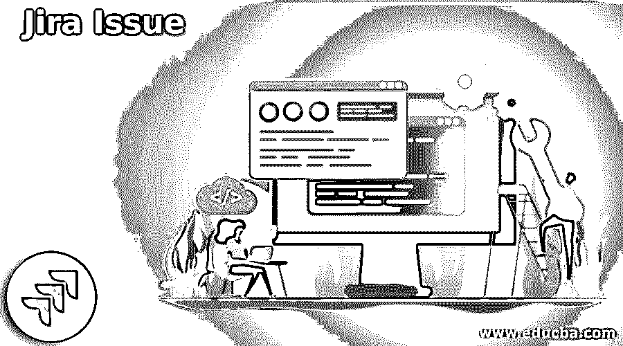
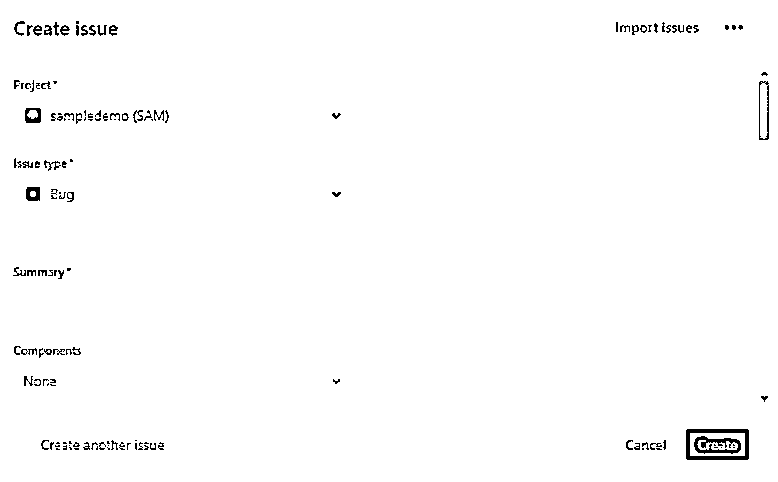
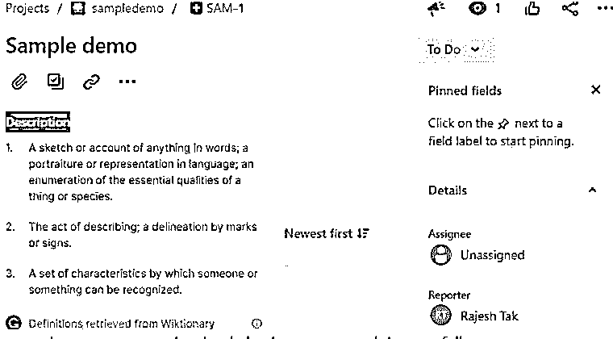
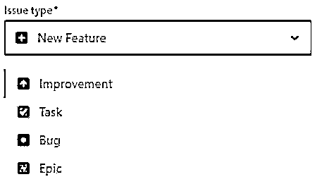
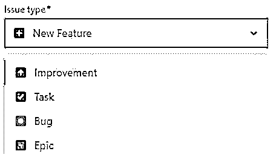
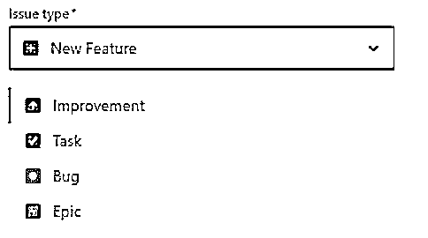
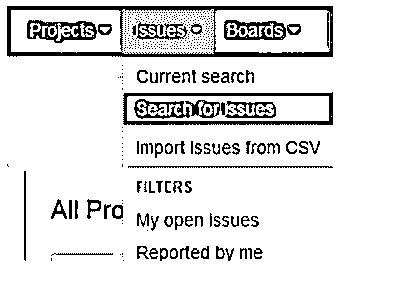
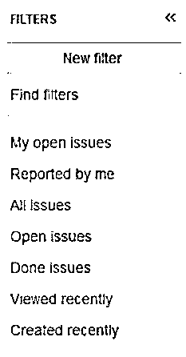

# 吉拉问题

> 原文：<https://www.educba.com/jira-issue/>

## 吉拉问题概论

我们知道吉拉是用来在整个项目生命周期中跟踪项目的；这里，问题用于跟踪个人级别的工作，并且该工作必须在指定的时间内完成。吉拉问题取决于团队，所以他们如何代表他们的工作是一个问题。问题用于跟踪项目，帮助我们管理冲刺计划。换句话说，我们可以说吉拉问题代表了项目的特性、用户的需求和其他软件缺陷。

### 什么是吉拉问题？

问题解决必须完成的活动。该活动可以是一项任务、一个 bug、一个元素需求，或者您的协会可能必须与之合作的任何活动。问题是吉拉应用程序的中心，因为所有的小组共同努力都是围绕工作和他们的组织进行的。您可以通过使问题集与每个项目甚至每个同意类型相关联来修改您的问题类型。一期杂志以突出的方式感知不同类型的工作，并帮助你认识、编排和展示你在吉拉网站上的参与。他们可以帮助你将更多的发展加入到你的工作循环中。

<small>网页开发、编程语言、软件测试&其他</small>

不同的问题帮助你搜索和分类你的聚会所做的工作，关注表达各种工作的进展，甚至检查你的小组如何回答错误或他们多快完成更好的驱动。每一个吉拉的东西都配有默认的问题，以适应你的练习和聚会的先决条件。你可以调整你的情况，以配合你想要的酋长事业的几个程序。

对吉拉酋长透明地制造问题类型的限制有时会引发不幸的结果。当问题类型被人为处理时，这将实现标准的吉拉有益性，而不是努力塑造。吉拉目前配备了许多默认问题类型，这些类型通常是编程改进的有力对应。如果这在你的隶属关系中不准确，它应该让你不要期望你处理工作的方式会使新的定制问题类型的创建合法化。

吉拉软件公司有五种标准问题类型，因此在类似的吉拉项目中，问题可以有不同的字段、工作流程或两者。例如，Bug 问题类型可以有明确的缺陷字段，如“重复步骤”和“预期结果”在任何情况下，这两个字段都不会出现在任务问题的屏幕上。

### 吉拉制造问题

现在让我们看看如何在吉拉制造一个问题:制造问题有不同的方法。下面让我们一个一个来看:

登录吉拉后，我们可以看到创建选项，如下图所示:

单击 create 按钮后，我们会看到下面的屏幕以供参考。见下面截图如下:

在此屏幕中，我们需要选择问题类型、summa，如果我们想要添加组件，则选择组件。填写完上面的表格后，我们成功地创建了问题，如下图所示。

为了进行确认，我们可以单击“查看问题”按钮，得到一个新屏幕，如下面的屏幕截图所示。

这里我们还有一个可选任务，即创建一个子问题，如下所示:

我们知道一个问题可以有子任务，或者我们可以说问题与父问题是一致的。换句话说，我们可以说它将任务分成了更小的部分，从开发人员的角度来看，使开发变得更容易。

吉拉提供了按优先级排列问题的功能。

排名的主要好处是团队或者我们可以看到 sprint 中的下一个一致的任务。

*   **标记为问题:**这也是一个可选的问题类型；旗帜的主要优势是在团队之间进行更好的交流，并为团队成员的协作提供支持。
*   **过渡问题:**不断变化的问题显示了整个工作流程的进展。要从一个部分开始更改主题，然后转到下一个部分，请拖动一个问题并将其定位到新的部分。

吉拉提供了以下不同类型的问题:

#### 1.病菌

功能不符合我们的要求。bug 是程序或设备中不可预见的问题。常见的问题通常是工程师没有预料到的外部阻抗对程序展示的影响。小错误可能会造成诸如屏幕冻结或无法解释的错误信息等问题，但这些问题不会对我们产生任何影响。

#### 2.改进

改进只不过是对现有任务的增强，或者我们可以说一个新的特性被添加到了当前正在开发的项目中。

#### 3.新功能

如下面的屏幕截图所示，在开发阶段，新的功能被添加到现有的项目中。

#### 4.故事

这是用户创建的用户故事，不能删除或编辑；更多信息，我们可以看下面的截图。

### 吉拉问题跟踪

现在，让我们看看如何跟踪吉拉的问题，如下所示:

在吉拉，看待问题有很多方式；首先，您需要选择搜索问题，如下图所示:

点击问题搜索后，我们会看到如下屏幕截图:

另一种方法是，我们可以根据我们的要求设置一个新的过滤器，并跟踪如下问题截图如下:

### 结论

借助上述文章，我们了解了吉拉问题。从这篇文章中，我们看到了关于吉拉问题和吉拉问题的整合的基本情况，以及我们如何在吉拉问题上使用它。

### 推荐文章

这是一本关于吉拉问题的指南。这里我们讨论引言；为了更好地理解，吉拉创建了问题和问题跟踪。您也可以看看以下文章，了解更多信息–

1.  [吉拉史诗](https://www.educba.com/jira-epic/)
2.  [吉拉版本](https://www.educba.com/jira-versions/)
3.  [JIRA Bug 生命周期](https://www.educba.com/jira-bug-life-cycle/)
4.  [冲刺吉拉](https://www.educba.com/sprint-in-jira/)

