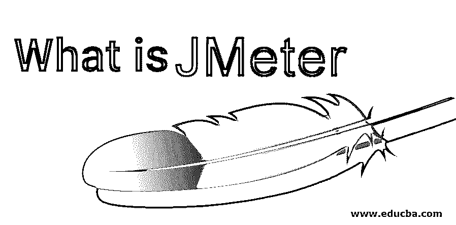
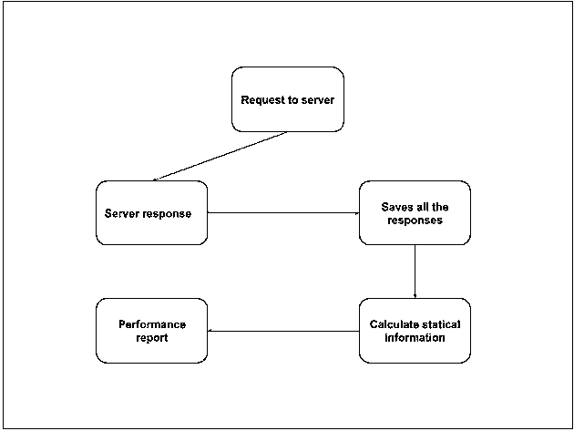

# JMeter 是什么？

> 原文：<https://www.educba.com/what-is-jmeter/>

## JMeter 概述

JMeter 是一个开源测试工具，由 Apache 软件基金会开发。它是一个纯 Java 应用程序，可用于测量静态和动态资源上的应用程序、不同软件服务和产品的性能。

最初，它是为测试 Web 应用程序而设计的，但后来，它扩展到测试其他功能，如[功能测试](https://www.educba.com/what-is-functional-testing/)、性能测试、[回归测试](https://www.educba.com/regression-testing/)、压力测试、基于各种技术测试的数据库服务器。它通过模拟浏览器行为向 web 或应用服务器发送不同负载的请求。

<small>网页开发、编程语言、软件测试&其他</small>

JMeter 的脚本语言是 Groovy(它是一种用于 Java 平台的[面向对象编程语言](https://www.educba.com/object-oriented-programming-in-java/))。

### 历史

JMeter 是由 Apache 软件基金会的 Stefano Mazzocchi 开发的。第一个 1.0 版本发布于 1998 年。它在 Apache License 2.0 下获得许可，稳定版本为 5.1，于 2019 年 2 月 19 日发布。

### 谅解

在[与 JMeter](https://www.educba.com/jmeter-alternatives/) 合作之前，你要明白它不是浏览器；它是一个工作在协议级的性能测试工具。它看起来像一个浏览器，但不执行浏览器支持的所有操作。它既不呈现 HTML 页面，也不执行 HTML 页面中的 JavaScript。有可能将响应视为 HTML。

### 它是如何工作的？

下图显示了工作流程:

*   用户组将把请求发送到目标服务器。
*   服务器将对用户请求做出响应。
*   接下来，它将保存给定请求的所有响应。
*   现在，它返回目标服务器的统计信息来显示应用程序的性能。
*   在最后一步中，它将显示应用程序的性能报告。

### JMeter 特性

*   它是一个开源工具测试，被世界各地的开发者所使用。
*   数据分析和可视化插件提供了良好的可扩展性和个性化。
*   它使用函数为测试数据操作提供动态输入。
*   它增加了复杂性和设置时间。
*   它在结果结束时提供报告，并保留在本地。
*   它集成了第三方开源库，如 Maven、Gradle 和 Jenkins。

### 你能用 JMeter 做什么？

您可以测试各种应用程序。以下是一些可以测试的应用程序:

*   网站——HTTP 和 HTTPS (Java，NodeJS，PHP，ASP.NET 等。)
*   Web 服务—[REST 和 SOAP](https://www.educba.com/soap-vs-rest/)
*   数据库服务器
*   [FTP 服务器](https://www.educba.com/what-is-ftp-server/)
*   [LDAP 服务器](https://www.educba.com/ldap-injection/)
*   邮件服务器—[SMTP](https://www.educba.com/smtp-protocol/)，POP3，IMAP
*   外壳脚本
*   TCP 服务器
*   通过 JMS 的面向消息的中间件
*   Java 语言(一种计算机语言，尤用于创建网站)

### 优势

*   **开源许可:**它是一个开源的测试工具，开发者可以自由使用源代码进行开发。
*   GUI: 它非常容易使用，因为它有一个友好的图形用户界面，您可以在短时间内熟悉它。
*   平台无关: JMeter 是一个纯桌面应用程序，因此它可以在不同类型的平台上运行，如 Windows、Linux 等
*   **多线程框架:**通过使用不同的线程组，赋予各种函数同步并行采样的权限。
*   **可视化测试结果:**通过使用 JMeter 工具，您可以查看各种格式的测试结果，如图表、表格、树和日志文件。
*   **安装简便:**无需安装。运行*即可轻松完成安装。bat 档。
*   高度可扩展: JMeter 允许使用可视化插件来扩展你自己的测试。
*   支持多种测试: JMeter 支持多种测试过程，比如负载测试、分布式测试和功能测试。
*   **支持多协议:** JMeter 支持 web 应用测试，也可以评估数据库服务器的性能。它提供了多种协议，如 HTTP、JDBC、LDAP、SOAP、JMS 和 FTP。
*   **记录和回放:** JMeter 密切关注用户在网络浏览器上的活动，并将其复制到网络应用程序的[形式中](https://www.educba.com/what-is-web-application/)。
*   **脚本测试:**您可以将 Bean Shell 和 Selenium 与自动化测试结合起来。

### 不足之处

*   **内存** **利用:** JMeter 重现重载，生成测试的信息。这导致了大量内存的使用，并从繁重的负载中产生大量的内存。
*   **Web 应用:**可以使用 JMeter 测试 Web 应用，但是不能用于测试桌面应用。
*   **不使用 JavaScript:** 您不能在应用程序中使用 [JavaScript 语言](https://www.educba.com/what-is-javascript/)；因为我们知道 JMeter 是测试工具，不是浏览器。
*   **有限的测试监控:**与其他测试工具相比，JMeter 提供有限的测试监控能力。
*   **缺乏脚本方面的知识** **:** 缺乏理解 JMeter 中脚本的知识。理解 JMeter 元素、[正则表达式](https://www.educba.com/regular-expressions-in-java/)、会话处理等需要一些经验。

### 我们为什么要使用或为什么需要 JMeter？

通过使用 Apache JMeter，您可以在静态和动态资源以及应用程序上执行测试操作。它模拟服务器、服务器组、网络或对象上的重负载，以测试或分析不同负载类型下的整体性能。它分析 web 应用程序或不同类型服务的性能。测试 web 应用程序的性能是测试应用程序的重负载、用户流量等的一种方式。

### 这项技术将如何帮助你的职业发展？

在目前的场景中，使用 JMeter 工具测试应用程序的性能已经成为一个巨大的领域。性能测试人员使用 JMeter 来处理站点上不同类型的情况，而不是使用数千人来手动测试 web 应用程序。至于你职业生涯中的性能测试者，JMeter 不仅测试 bug 和错误；还测试应用程序中的故障，验证基础设施，并识别与 web 应用程序相关的缺陷。

### 结论

总之，我们可以说 JMeter 适合测试不同的场景，比如负载测试、功能测试、性能测试、回归测试、数据库服务器测试等等。它通过向不同负载的 web 应用程序发送请求来解析响应。该测试可以针对高负载和并发用户流量的 web 应用程序来执行。它以图形方式评估性能报告。

### 推荐文章

这是 JMeter 的指南。这里我们讨论 JMeter 的工作，特点，职业，优点和缺点。您也可以浏览我们推荐的其他文章，了解更多信息——

1.  [自动化测试工具](https://www.educba.com/automation-testing-tools/)
2.  [JMeter 面试问题](https://www.educba.com/jmeter-interview-questions/)
3.  [软件测试职业](https://www.educba.com/careers-in-software-testing/)
4.  [JMeter 中的定时器](https://www.educba.com/timers-in-jmeter/)