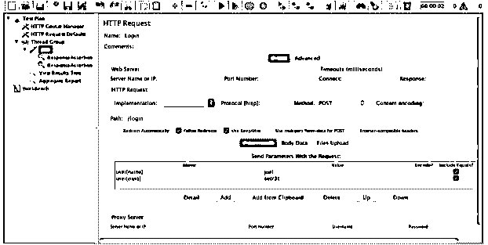
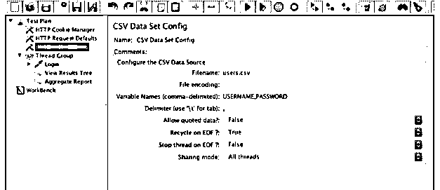
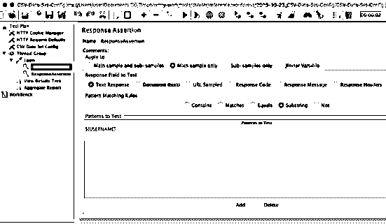
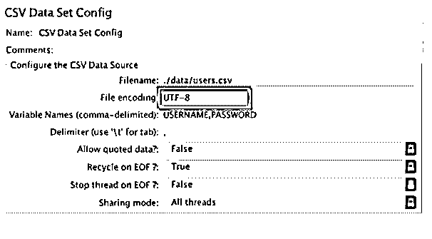
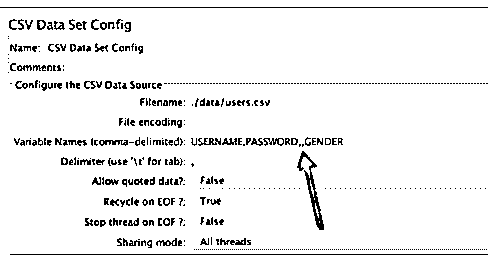
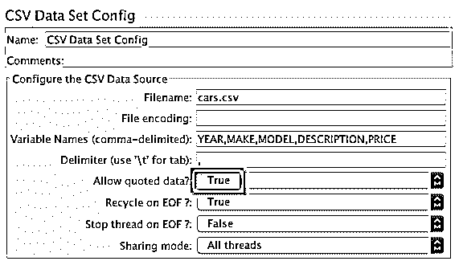

# JMeter CSV 数据集配置

> 原文：<https://www.educba.com/jmeter-csv-data-set-config/>

## JMeter CSV 数据集配置简介

JMeter 是一个应用程序和网站的性能和负载测试工具。它是开源的，包含一个元素，使用户能够以 CSV 格式处理外部数据集。它被称为“CSV 数据集配置”它从文件中读取行，并把它们分成变量。它比来自文件的字符串和 CSVread 选项更容易实现。它旨在管理更高维度的数据，对于测试唯一值和随机值非常有用。本文简要讨论 JMeter CSV 中的数据集配置。

### JMeter CSV 数据集配置概述

JMeter 中的 CSV 数据集配置用于查看给定文件中的行，并且可以根据需要划分为变量。它还用于测试随机值和唯一值。在运行时生成唯一的随机值在内存和 CPU 方面代价很高。因此用户可以在测试前创建数据。如果需要，来自任何文件的随机数据可以隐含地与运行时参数相结合，以从每次执行中开发一组不同的标准值。例如，串联实现比每次执行都生成值要便宜。

<small>网页开发、编程语言、软件测试&其他</small>

### 创建 JMeter CSV 数据集配置

以下步骤解释了 JMeter CSV 数据集配置的创建。然后，用户可以使用预定义 CSV 文件中的数据执行测试，并在执行时一起阅读。

*   生成一些类似于 CSV 文件中数据的用户名和密码。例如，让 tom、sam、joe 和 Jim 作为用户名，pas$$、groovy、scala 和 secret 作为密码。逗号是分隔 CSV 文件中各值的分隔符。最后，用适当的名称将文件保存在与测试计划相同的位置。

*   在测试计划中，通过以下步骤创建数据集配置:测试计划->添加->配置元素-> CSV 数据集配置。给出在上述步骤中创建的 CSV 文件的名称。在相关字段中提供变量名；每个变量相当于 CSV 中的一列。这些变量将有助于将来参考。确保使用逗号分隔这些值

*   通过从 CSV 文件中获取变量来替换登录请求中的常量数据。

*   在“线程组”字段中，将线程数设为 8。它应该等于 CSV 文件中的用户数。执行测试。每个请求都使用创建的 CSV 文件中的不同数据进行登录。

### 使用 JMeter CSV 数据集配置

提供应该读取的文件名。例如，在相同位置使用的带有. jmx 文件格式的测试计划应该在 CSV 文件中给出输入。然而，如果 CSV 文件与属于测试计划的文件有不同的位置，那么用户应该只给出 CSV 文件的绝对路径的名称。

在 Windows 中应该是 C:\ desktop \ JMeter \文件名. csv

在 Mac 中，应该是/Users/user/Desktop/文件名. csv

圆点代表测试计划中的当前文件夹。\可用于 Windows、Linux 和 Mac。

CSV 文件是一个纯文本记事本，因此用户可以像。txt 而不是. csv，但要确保格式没有改变。

对文件进行编码是用来读取它的，与任何平台无关。默认编码用于读取文件，并在所有类型的数据文件(如双字节其他语言)中帮助用户。用户可以将文件保存为 Unicode 或 UTF-8 格式，以确保数据不会在窗口中分离。但是在 Windows 中，默认编码是在 ANSI 和 JMeter 中编写的，当编码或读取该文件时，会因破坏数据而产生问题。为了避免这种情况，请在数据集配置下的所需文件编码字段中输入相同的文件编码。

如果变量名为 null，那么文件中的第一行用相同的列名列表读取和解释。变量可以用双引号引起来，也可以用分隔符区分。

分隔符用于分隔文件中的记录；有时，可以使用分号或制表符。例如，如果用户需要向文件中添加价格，他们可以更改分隔符并在 JMeter 中设置它。

启用引用数据，这仅允许分隔符值。如果数据有空格，它包含分隔符，并且值在下行。所以用双引号就解决了。所以要用双引号。

在文件末尾回收；默认情况下，它应该设置为 true。EOF 上的 stop thread 选项应该设置为 false。

共享模式在所有线程、当前线程组和当前线程中启用。文件中的所有线程在每个可用的线程之间共享。它对线程组上收到的请求不起作用，即使它是在循环中发生的。所以每个请求只查看一行 CSV，假设所有的数据集都在线程组内的同一级别。

### 结论

因此，数据集配置值可以很容易地在 JMeter 中实现，以查看每个文件线程。它在当前线程组中具有独特的功能；对于元素出现的每个线程组，每个文件都被查看一次。如果启动了一个新的线程组，它将从头开始读取文件，并假设所有数据集都存在于同一级别的线程组中。在当前线程中，每个用户都单独查看每个文件；对于每个线程来说，它是单独查看的，这意味着用户已经从头开始再次读取了该文件。只有线程中的循环会读取下一行。

### 推荐文章

这是 JMeter CSV 数据集配置指南。在这里，我们简要概述了 JMeter CSV 中的数据集配置。您也可以阅读以下文章，了解更多信息——

1.  [Matlab 读取 CSV](https://www.educba.com/matlab-read-csv/)
2.  [PostgreSQL 导入 CSV](https://www.educba.com/postgresql-import-csv/)
3.  [R CSV 文件](https://www.educba.com/r-csv-files/)
4.  [PowerShell 导出 CSV](https://www.educba.com/powershell-export-csv/)