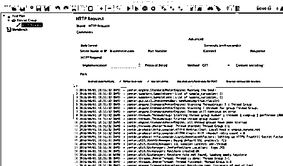
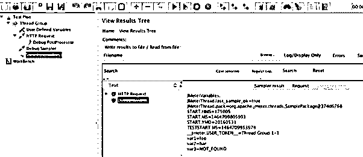

# JMeter 脚本

> 原文：<https://www.educba.com/jmeter-script/>

## JMeter 脚本简介

JMeter 是一个流行的网站和 web 应用程序的软件负载和性能测试工具。它功能强大，便于携带，使用简单。此外，该框架用于连续测试，这有助于掩盖执行性能测试的困难。此外，JMeter 是友好的和自动化的，可以用于 JMeter 的脚本来克服其不完善之处。该脚本在所有情况下都是隐含的，只需做一些修改。此外，脚本可以与 Jenkins 集成，以获得更高的性能。本文简要讨论 JMeter 脚本的脚本编写和执行。

### JMeter 脚本概述

JMeter 主要用作负载测试工具，用于分析和测量运行在 web 应用程序上的不同服务的性能。如果用户想要使用 JMeter 测试，那么负载运行器也会提供执行测试的能力。添加 JMeter 脚本，也就是，。jmx 文件，用户可以与其他负载并行执行一个或多个 JMeter 测试。负载运行中的企业测试有助于用户专注于一个点来执行性能测试。借助 load runner enterprise 和 JMeter 测试的数据输出，可以离线和在线查看计算和分析报告。

<small>网页开发、编程语言、软件测试&其他</small>

### JMeter 脚本运行

下面解释了执行 JMeter 脚本和 Loadrunner 配置以及运行时配置的过程。

*   在所有需要执行脚本的负载生成器机器上安装 JMeter，即最新版本的 64 位 JDK 或 JRE。
*   安装 JMeter 时，建议对所有负载生成器使用相同的路径，因为用户可以在性能测试设计器中配置运行时值时输入路径。
*   在 JMeter 中编写脚本，并将它们保存在本地文件夹中。脚本应该以 ZIP 格式保存，并且所有文件都在测试脚本文件夹中。脚本文件夹中的文件路径不应超过 260 个字符。
*   CSV 文件可以手动下载到 JMeter 上执行的负载生成器上，与脚本位置中的路径相关。
*   将 JMeter 的脚本上传到 Loadrunner enterprise 中。

*   在导航工具栏中，选择测试管理。接下来，选择目标文件夹，或者用户可以创建一个新文件夹。
*   从导航窗格中选择“上传脚本”按钮。
*   应配置上传设置并更新目标文件夹中的选定脚本。

*   将 JMeter 的脚本上传到 Loadrunner 后，在测试管理树中选择脚本并显示脚本以查看描述。
*   配置 JMeter 运行时的设置。一旦用户将 JMeter 脚本上传到 LoadRunner，从测试管理树中将它添加到测试中，然后开始编辑它。
*   在工作负载和组视图选项中，选择 Vuser groups 并编辑运行时。之后，弹出带有 JMeter 运行时设置的对话框。

*   JMX 度量是一个 UI 元素，用于在执行性能测试时启用 JMX 度量。
*   JMeter 路径用于在 JMeter 脚本中输入默认值，包括%JMETER_HOME%的环境变量
*   JMeter 端口用于选择默认端口，从 4000 开始，如果默认端口已经被占用，它将使用备用端口。JMeter 端口的范围是从 4445 到 4455。
*   远程测试用于在节点模式或服务器模式下执行 JMeter。JMeter 的执行可以在低版本计算机之间复制测试，模拟服务器上的最大负载。
*   JMeter 附加文件用于给远程负载生成器提供本地路径，它也可以用作远程 JMeter 节点或 JMeter 控制器。当选择远程测试时，它被启用。确保将添加的属性放在远程负载生成器的本地路径中，该路径在测试执行时用作远程 JMeter 节点或控制器。
*   进行一个 LoadRunner 企业测试，并使 JMeter 脚本与之一致。
*   从 JMeter 执行测试。
*   执行 Jmeter 脚本时需要注意的事项:一个虚拟用户可以运行 JMX 文件中已经定义的所有 JMeter 线程。因此，建议使用测试持续时间设置来执行测试，直到测试完成。

### 带有示例的 JMeter 脚本

可以实现云供应来使 JMeter 脚本对主机更可靠。此外，它表明云上的 JMX 脚本提供了有效的云供应方法，客户不需要付费就可以免费使用它来执行云测试。要定义云位置，选择可用位置的列表，从 API 密钥获取云令牌并运行模块。如果用户希望为同一个执行指定多个云位置，那么它会在所有位置之间分配吞吐量和并发性。

为了有效地使用云位置，用户应该给出正确的位置相对权重，它定义了并发吞吐量和在该位置执行的用户数量。

JMeter 脚本也可以通过 Jenkins 实现自动化，以获得最大的效率。在软件即服务公司中，持续交付变得越来越有吸引力，它可以创建一个新的网站，并持续改进它。软件开发在自动化过程、测试滞后、提高性能、最小化执行时间、容易发现错误等方面一直在增长。通过使用 Jenkins 在 JMeter 中执行一个 shell，项目配置被执行以形成一个有效的连续交付周期。

### 结论

JMeter 脚本用于访问 reporting services。比如很多测试工具以执行为目的；报告功能有助于以交互方式访问测试结果。此外，监控执行时间有助于以更好的方法找到和访问 JMeter 脚本。

### 推荐文章

这是一个 JMeter 脚本指南。这里我们对脚本的编写和脚本在 JMeter 中的执行进行了简要的讨论。您也可以阅读以下文章，了解更多信息——

1.  [JMeter 中的定时器](https://www.educba.com/timers-in-jmeter/)
2.  [手动测试工具](https://www.educba.com/manual-testing-tools/)
3.  [什么是 JMeter？](https://www.educba.com/what-is-jmeter/)
4.  [JMeter 版本](https://www.educba.com/jmeter-version/)