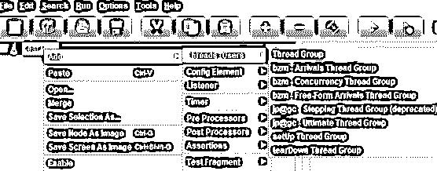
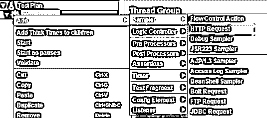
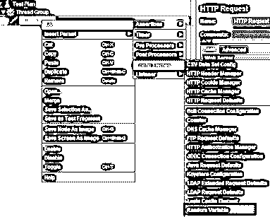
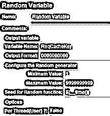
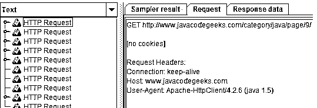

# JMeter 随机变量

> 原文：<https://www.educba.com/jmeter-random-variable/>

## JMeter 随机变量简介

下面的文章提供了 JMeter 随机变量的概要。今天，大多数编程语言都有一个产生随机数的 API。生成器算法生成一个没有任何结构、顺序或格式的典型数字序列。该算法基于驱动序列生成的种子值。在 JMeter 中，随机变量可以在负载测试中生成和传递。在负载测试中，需要将任意随机值传递给请求中受约束的参数。这可以通过从。csv 文件，在请求中使用不同的值。也可以在每次请求执行时生成随机变量。

### 什么是 JMeter 随机变量？

JMeter 使用户能够产生随机数，并将它们用作变量。这可以通过随机变量的配置元素来实现。它使用户能够配置所有强制参数，如格式字符串、变量名、每线程值、用户计数、随机速度以及最小和最大值。使用 JMeter 可以通过三种方法生成随机值。它们是使用 CSV 文件和随机变量采样器的历元方法。

<small>网页开发、编程语言、软件测试&其他</small>

### 如何使用 JMeter 随机变量？

要在 JMeter 中生成随机变量，必须设置所有的配置字段，并且用户应该确定他将使用哪种方法来生成随机变量。

它可以使用纪元时间来生成；然后，可以使用 CSV 文件生成它自己的一组生成值。然后，在随机变量采样器中，用户可以选择种子值、值的长度和其他可用的配置。

在 variable name 字段中，给出测试计划中使用的适当的名称，并且它可以被保存在这个变量中。

在格式字符串中，给出要生成的数字的格式。它可以用作字符串的前缀或后缀。也可以生成字母数字值。

在最小和最大字段中，用户必须定义需要生成的数字范围。例如，最小值可以是 10，最大值可以是 50。

在 per-thread 字段中，用户必须给出随机生成器是否应该由所有用户共享，或者每个线程是否有其实例随机值。可以使用 true 或 false 选项进行设置。

随机速度用于选择发电机的种子值。如果所有线程都使用相同的种子，它会为每个线程生成相同的数字。

### 创建 JMeter 随机变量

在下面的小节中，JMeter 中的测试计划被创建。

从树中选择测试计划，然后添加线程组。要包含线程组，右键单击测试计划并包含线程组中的新线程。

添加 HTTP 请求采样器中使用的 JMeter 的元素。HTTP 请求的控制面板指示需要传输的 URL 请求。右键单击线程组并选择采样器，然后选择 HTTP 请求。执行测试的 HTTP 请求中的一些值是请求的名称、服务器名称或 IP 或本地主机、端口、方法名称和请求的路径。

然后通过选择线程组上的配置元素添加一个随机变量，并从那里选择一个随机变量。缓存键的变量有参数值，reqcachekey 将生成随机值，传递给请求体中的参数 cache key。

Seed 生成随机值；如果留空，测试可以执行多次。但是，如果种子具有相同的一组重复值，则它不会留空。

然后监听器可以被添加到测试计划中，并且结果可以以不同的格式查看，比如表格、图形、树或者日志文件。在用户的查看结果树中，请求从监听器中选择查看结果树，然后包括在测试计划中。

保存测试计划，给测试计划起一个合适的名字，它将会以 JMX 格式保存。

通过点击顶部窗格上的绿色三角形来执行测试计划。

可以在查看结果树中查看执行状态，成功的请求用绿色标记。

### JMeter 随机变量示例

随机值可以在配置元素中生成。如今，生成或挑选随机变量的测试用例是一项艰巨的任务。因此，用户可以有一个测试用例，其中测试有一个随机数，并检查它是否是一个可接受的范围，或者数字格式是有效还是无效。另一个测试用例可以定义为用户给出几个随机数作为 URL 部分，比如 order id，或者可以提到页码。它用于在这些 URL 页面上执行负载测试。HTTP 请求中配置的变量可以用作 URL 请求这一部分的采样器。它将测试 JCG 网站上的 Java 部分页面。

如果用户希望在几个 URL 页面上执行负载测试，并且参数值可以在执行时动态替换，则可以使用随机变量选项。它还支持在 web 模型、客户端-服务器和具有静态和动态资源的主机上进行负载测试。此外，它还支持多种协议，如 HTTP、JMS、HTTPS、FTP 和 JDBC。

### 结论

用户有时必须生成 JMeter 脚本，然后处理请求。因此，在这种情况下，URL 需要一个自动生成的受约束的值作为合适的参数。JMetIn 另外，这里使用多种方法来产生随机变量，这里简单讨论一下。因此，选择合适的方法生成随机变量取决于用户。

### 推荐文章

这是一个 JMeter 随机变量的指南。这里我们讨论如何使用 JMeter 随机变量和例子。您也可以阅读以下文章，了解更多信息——

1.  [JMeter 备选方案](https://www.educba.com/jmeter-alternatives/)
2.  [JMeter 中的定时器](https://www.educba.com/timers-in-jmeter/)
3.  [安装 JMeter](https://www.educba.com/install-jmeter/)
4.  [JMeter 面试问题](https://www.educba.com/jmeter-interview-questions/)