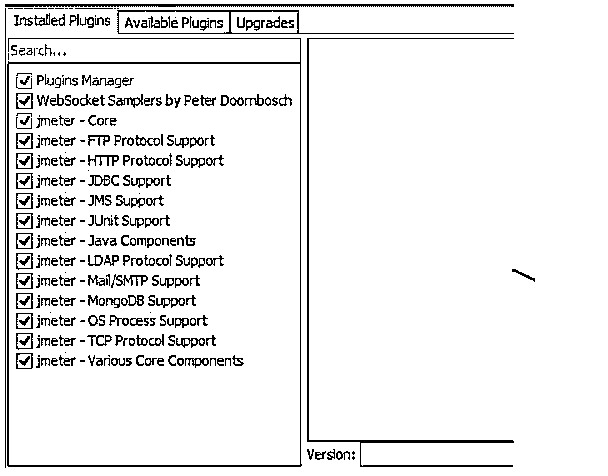
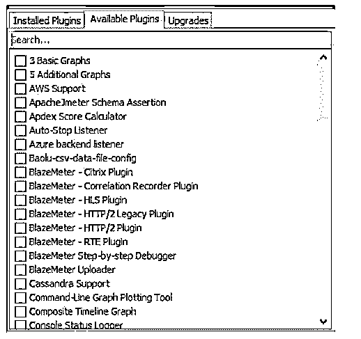
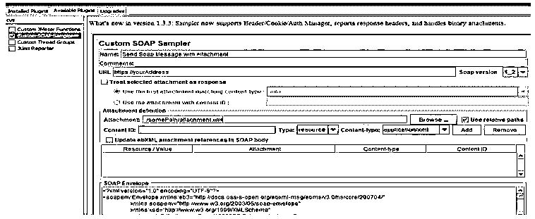
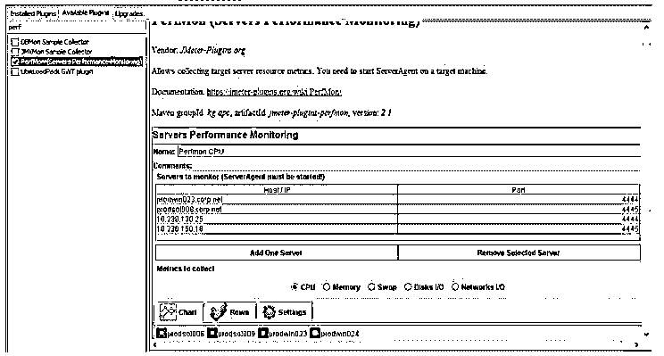
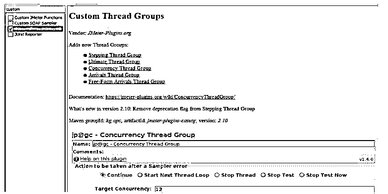
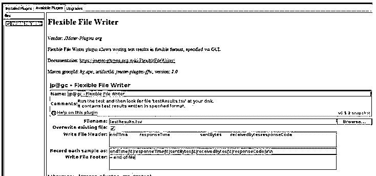
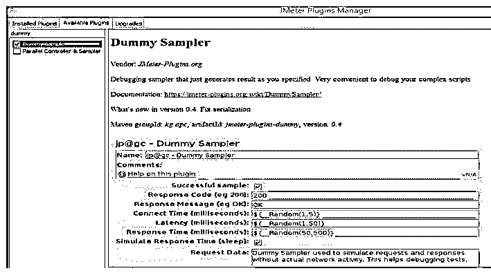
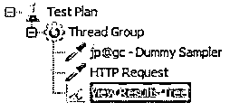
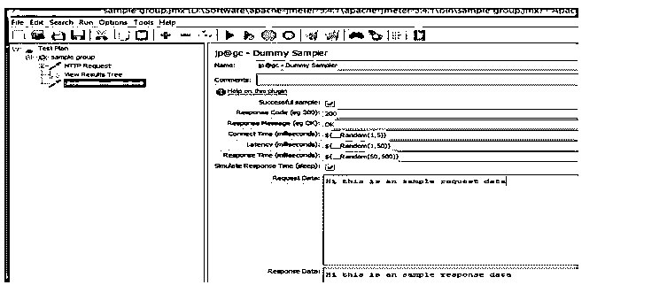
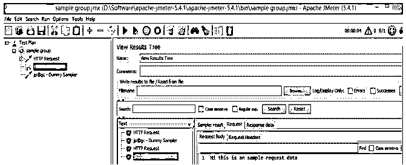

# JMeter 插件

> 原文：<https://www.educba.com/jmeter-plugins/>

## JMeter 插件简介

Jmeter 是一个开源的、用于进行性能测试的免费工具；插件不过是功能性的，或者我们可以说它是用来扩展 Jmeter 的特性的。我们知道 Jmeter 是用于执行负载测试、功能测试和压力测试的著名工具之一，因此在插件的帮助下，我们可以制作一个更强大的工具来进行负载测试。我们在市场上有多个插件，帮助我们为用户增加 Jmeter 的功能。JMeter 的另一个优势是我们可以对动态和静态应用程序进行测试。

### 什么是 JMeter 插件？

*   Apache JMeter 是一个基于 Java 的应用程序。该应用程序提供了一个易于理解的界面，重现，测试程序和其他测试亮点。
*   起初，JMeter 是为了测试 web 应用而创建的；然而，它现在已经扩展到了其他一些测试功能，比如实用测试、数据集服务器测试等等。该产品用于堆叠测试 web 服务器、web 应用程序和站点，以重新创建真实的客户端行为方式和测试条件。
*   它可以被描述为 JMeter 中用于扩展元素和附加功能的编程功能。在 JMeter 的帮助下，我们可以执行负载测试，它被广泛使用。
*   市场上有许多可供用户使用的插件，它们被用来提高 JMeter 的实用性。JMeter 插件为客户提供了一个更基本的介绍和保持 JMeter 工作的方法。在 JMeter 中，插件有各种用途，从图表设备和观众到工程设备。插件管理器为客户端引入、重新设计和卸载插件，使模块建立过程更加顺利和更有帮助。

### JMeter 插件安装

让我们看看如何在 JMeter 中安装插件，如下所示:

<small>网页开发、编程语言、软件测试&其他</small>

首先，我们需要安装插件管理器，帮助我们自动安装不同的插件，或者我们可以说没有手动任务。

因此，按照以下步骤安装插件管理器，如下所示:

1.首先，我们需要访问 JMeter 的官网，查看插件管理器。

2.之后，我们需要下载插件管理器的 JAR 文件。

3.下一步，我们需要将该文件复制到 JMeter 的 lib/ext 目录中，如下图所示。

下一步，我们需要打开 JMeter，点击 Options 选项卡，选择 Plugins Manager，如下图所示。

在上面的截图中，我们可以看到三个不同的已安装插件被用来显示所有已经安装的插件；第二个标签，可用插件，用于显示所有可安装的插件，如下图所示。

在第三个，我们可以看到升级插件，这意味着如果我们想升级已安装插件的版本，那么我们可以使用这个标签，如下图所示。

这里我们需要搜索插件进行升级。

### 前 5 名 JMeter 插件

以下是 5 大 JMeter 插件示例:

#### 1.定制肥皂取样器

这是顶级 JMeter 插件之一；在这个插件的帮助下，我们可以使用多个附件。使用这些插件，我们可以向 web 服务发送 SOAP 请求，并根据我们的要求从代码中添加和删除它，如下面的屏幕截图所示。

#### 2.PerfMon

这是 JMeter 的第二大插件。使用这些插件，我们可以监控服务器的性能，CPU 的使用，I/O 磁盘，网络，内存等。在下面的截图中，我们可以看到 PerfMon 插件的详细信息如下。

#### 3.自定义线程组

这是 JMeter 的另一个顶级插件；通过使用这些插件，我们可以根据需要添加不同类型的线程组，如下图所示。

#### 4.灵活的文件写入程序

如果我们想在 JMeter GUI 中做一些改变，我们可以添加灵活的文件编写器插件来为他们的用户增强 JMeter 的功能。观众被用来将测试结果组成一个使用 JMeter GUI 指示的可适应的记录设计。灵活的文件编写器显示在下面的截图中。

#### 5.虚拟取样器

如果我们需要创建一个 dumpy 请求和响应，我们可以使用这些插件。在没有真正运行它们的情况下复制请求和反应是被利用的。该模块对排除后处理器和提取器故障非常有帮助。虚拟采样器如下图所示。

让我们来看看下面这个虚拟采样器的例子:
我们知道，借助虚拟采样器插件的帮助，我们可以轻松地执行复杂的脚本，这意味着我们生成了结果。
所以我们需要遵循如下几个步骤:
1 .首先，我们需要将线程组添加到我们的测试计划中。
2。之后，我们需要添加一个 HTTP 请求示例，在这里我们需要填写所有需要的细节。
3。在下一步中，我们需要根据我们的要求添加侦听器来查看结果。
4。在最后一步，我们需要添加带有请求和响应数据的虚拟采样器，如下面的屏幕截图所示。

在 dumpy sampler 中，我们需要指定所需的细节，如下图所示。

在上面的截图中，我们可以看到请求和响应数据字段，所以这里是示例数据。之后，我们可以在视图结果树中看到虚拟采样器的详细结果，如下图所示。

同样，我们可以检查响应数据，如下图所示。

### 结论

在本文中，我们看到了不同类型的 JMeter 插件，以及这些 JMeter 插件的用途和特性。从文章中我们得到的另一点是我们如何在 JMeter 中安装和设置插件。

### 推荐文章

这是一个 JMeter 插件的指南。这里我们分别讨论介绍、安装和前 5 名 JMeter 插件的例子。您也可以看看以下文章，了解更多信息–

1.  [JMeter 测试](https://www.educba.com/jmeter-testing/)
2.  [JMeter 负载测试](https://www.educba.com/jmeter-load-testing/)
3.  [JMeter 用户定义变量](https://www.educba.com/jmeter-user-defined-variables/)
4.  [JMeter BeanShell](https://www.educba.com/jmeter-beanshell/)