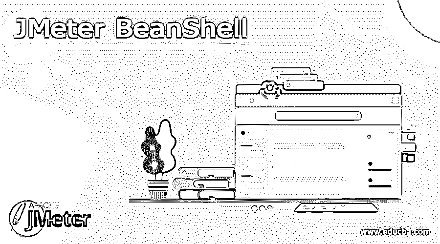
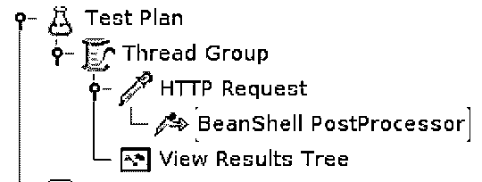
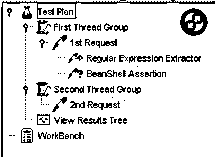
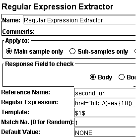
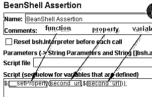

# JMeter 豆壳

> 原文：<https://www.educba.com/jmeter-beanshell/>

## JMeter BeanShell 的定义

Beanshell 是 JMeter 中的一个高级特性，支持 Java 语法和脚本特性，比如方法闭包、命令和松散类型。如果测试用例很少，并且在 JMeter 组件中实现，那么它就变得复杂了。但是 BeanShell 是实现这些目标的合适选择。Jmeter 中的 Beanshell 实体可以访问外部类和内部 API Jmeter，这些类和内部 API Jmeter 被提供给类路径，并且具有所有与之相关联的组件，这些组件可用于即时目的。本文简要介绍了 JMeter 中 BeanShell 的工作原理和特点。

### 什么是 JMeter BeanShell？

简单地说，Beanshell 是一个强大的断言，它为用户提供了对 JMeter 的 API 的完全访问。JMeter 的功能支持在采样器运行时执行定制的 BeanShell 代码。BeanShell 中还启用了其他实体。

<small>网页开发、编程语言、软件测试&其他</small>

一个独立的采样器被称为 BeanShell 采样器

另一个采样器的预处理器是在采样器之前执行的，并且隐含了获取一些输入的先决条件设置。BeanShell 的后处理器仅在采样器执行后执行，用于清理或恢复。

通过 Beanshell 断言可以实现对 JMeter 的 API 的完全访问的高级断言，它基于 Java 条件逻辑工作，用于配置断言结果。

Beanshell 的功能支持在采样器运行时执行在 Beanshell 中定制的代码。

### 如何使用 JMeter BeanShell？

JMeter 有很多高级的内置插件，可以即时使用。但是当编译复杂的测试执行时，用户会感到困惑。在这种情况下，建议使用 Beanshell 采样器，它非常强大和即时。如果用户是 Java 开发人员，他可以很容易地将 Java 代码获取到 Beanshell 并开始处理它。

如果用户不了解 Java，他会发现编写脚本 BeanShell 有点困难。但是在 Beanshell 中编写代码需要几个步骤。从控制台添加 Beanshell 采样器和线程组。Beanshell sampler 中提供了预定义的变量，可用于代码。它们是 isSuccess、Label、Responsemessage、responsecode、samplerresult、ctx、vars、log、filename 和 props。

该脚本可以在 Beanshell sampler 中执行，如果单独需要，他可以将它安装在 Beanshell 的控制台中。

命令 sudo–apt-get 安装 bsh

一旦用户在控制台中键入 bsh，提示消息就会显示在 BeanShell 的控制台中。下面讨论最常见和最重要的预定义类，

SampleResult 用于映射 JMeter 类，所有的方法和字段都可以被调用和访问。示例案例字符串 current URL = sample result.get()

响应代码被用作 java.lang.string，它表示采样器的响应代码

响应消息类似于响应代码，用 java 表示。lang.string

Issuccess 是一个布尔函数，用于表示采样器是通过还是失败。它被表示为真或假。它可以用在 if 或 else 语句中。

标签用于表示采样器，它是 java.lang.string，可以作为标准字符串设置或获取，该标准字符串在测试结果中作为采样器标签列出。

文件名由采样器中使用的 Beanshell 脚本组成。

Ctx 是 Beanshell 中使用的高级变量，在 Jmeter 上下文类中表示。它提供对 Jmeter 的引擎和采样器的读写访问，其中结果被定义为属性或变量。

Jmeter 变量被称为变量，经常使用。它是一个实例，提供对当前变量的写或读访问，可以更改现有变量或嵌套变量，也可以创建一个新变量。Jmeter 中的所有变量都声明为 Java 字符串。如果用户必须向 Jmeter 变量添加一些函数，他必须转换字符串。

Props 类似于 var，但它更多地暴露于 Jmeter 的特性，并支持全局范围，其中 var 在当前线程组的全局范围上具有有限的属性。
log 用于将消息追加到 Jmeter 的日志文件中。

在 Jmeter 中使用 BeanShell 的步骤如下:
打开 Beanshell 的采样器，执行在 Jmeter 中不做任何功能的测试。

从日志查看器中选择选项，并将其打开以查看前面的命令。

然后通过使用预定义变量开始在 Jmeter 中使用 API。

然后保存测试，页面就会显示完整的 URL

在 Beanshell 的采样器中配置属性

分析 BeanShell 中的脚本

从 Beanshell 中的脚本导入类，然后开始调试 BeanShell 脚本。
使用 BeanShell 后处理器和前处理器对 BeanShell 的采样器进行操作

### Jmeter BeanShell 组

在执行测试计划之前，连续点击 run thread 复选框，这是一个接一个执行线程组所必须的。
然后选择正则表达式提取器。

正则表达式的输出保存在变量的第二个 URL 中。洗牌是根据 Beanshell 的断言进行的。

Set property()是一个具有内置选项的函数，第二个 URL 用于保存正则表达式提取器。第二个 URL 是负责在线程之间传递值的一行。第二个 URL 的值可以从其他线程组获得。

第二个 URL 的值可以用 JMeter 函数属性增加和分析。第二个 URL 的属性可以定义为服务器名称。

### 结论

因此，这是 Jmeter BeanShell 的概述，它可以选择编译代码并执行代码以取得预期的结果。

### 推荐文章

这是一个 JMeter BeanShell 的指南。这里我们讨论一下定义，什么是 JMeter BeanShell，如何使用 JMeter BeanShell？代码实现示例。您也可以看看以下文章，了解更多信息–

1.  [JMeter 版本](https://www.educba.com/jmeter-version/)
2.  [JMeter vs Selenium](https://www.educba.com/jmeter-vs-selenium/)
3.  [JMeter 中的定时器](https://www.educba.com/timers-in-jmeter/)
4.  [JMeter 备选方案](https://www.educba.com/jmeter-alternatives/)