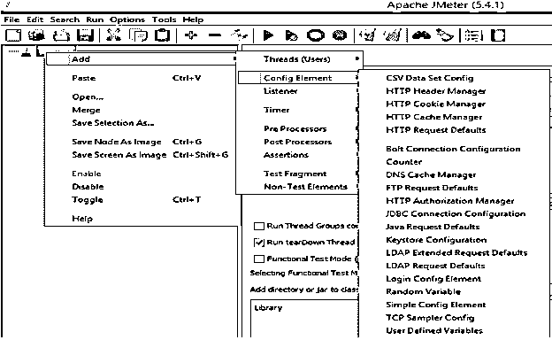
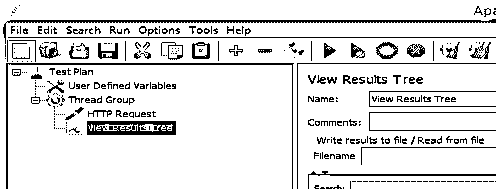
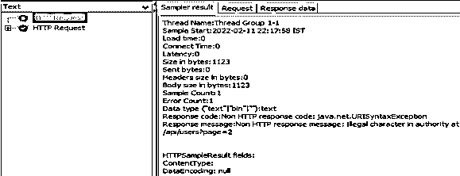

# JMeter 用户定义的变量

> 原文：<https://www.educba.com/jmeter-user-defined-variables/>

## JMeter 用户定义变量的定义

JMeter 向客户端提供各种属性，其中该变量是 JMeter 提供的属性之一。从根本上说，因子被用于字符串，这是 JMeter 的一个非常重要的属性，可以应用于所有字符串。假设我们想从其他采样器或其他组件调用值，那么我们可以利用 JMeter 来处理变量。我们可以根据我们的需要来制作因子，我们称之为客户端特征化因子，以及 JMeter，它把因子交给客户端来完成它们的执行。

### 什么是 JMeter 用户自定义变量？

在我们的测试计划中，有一些东西是您真正想在整个安排中使用的，例如，服务器名称或 IP、端口号或 HTTP 请求的协议。设想您的测试计划包含 100 个 HTTP 请求，并且具有与上面类似的数据。然后，在那个时候，在一个愉快的日子里，开发小组将气候转移到其他地方，新的服务器名称，新的端口；此外，您应该更改 100 个 HTTP 请求中的每一个。哎呀，这是不好的，正确的。我们希望能够像那样描述测试计划的一些广泛数据的特征。此外，最有效的方法是用户定义变量。

<small>网页开发、编程语言、软件测试&其他</small>

在 JMeter 中，用户定义变量配置组件用于声明和描述 JMeter 脚本中使用的因素。像应用程序 URL、端口等一些因素在很大程度上是由用户定义的变量组件来表征的。在您想要描述全局因素的情况下，在测试计划下添加这个组件。

处理容量时，JMeter 字符串因子尚未完全设置，因此作为边界传递的因子名称不会设置，用户定义的变量引用也不会工作。因此，split()和 regex()以及用户定义的变量评估容量不起作用。线程容量不起作用，而且在测试计划层面上看起来也不太好。

简单地考虑一种情况，我们有各种各样的 HTTP 请求，这些请求有各种各样的边界设置，但是 URL 是相似的。我们意识到，后来，改变网址。在这种情况下，我们应该改变每一个 URL，假设我们有很多这样的 URL，这将会是一个很大的错误，并且会增加时间。对于这种情况，利用用户定义的变量(UDV)是一种优越的方法。这种有用性允许在测试计划的不同点上改变边界。

### 如何使用自定义变量？

现在让我们看看如何在 JMeter 中使用用户定义的变量，如下所示。首先，我们需要在 JMeter 中创建一个测试计划，如下图所示。

现在，我们需要添加 Config Element 选项卡中的用户定义变量，如下图所示。

在用户定义的变量中，我们有一个不同的选项，如下图所示。

*   **Name:** 它只是我们可以在另一个地方使用的变量名，名称的语法如下。

**语法**

`${specified variable name}`

*   **Value:** 与 Name 部分的变量相关的值。此时，整个＄{ specified variable name }将被“Worth”段中的字符串替换。
*   **描述:**这里我们可以提供自定义变量的描述。

在下一步中，我们需要添加采样器，这里我们添加了一个 HTTP 请求，但在此之前，我们还需要添加线程组，如下图所示。

在这里，我们将用户定义的变量 Home_variable 赋值，如下图所示。

现在添加监听器来查看结果，如下图所示。

现在保存测试计划并运行它，在测试计划执行之后，我们可以在下面的屏幕截图中看到输出。

### JMeter 用户定义变量提示

现在让我们看看使用用户定义变量时有用的不同提示，如下所示。

设想这样一种情况，您有各种各样的 HTTP 请求，它们有各种各样的边界设置，但 URL 却很相似。您意识到以后可能需要修改 URL。在这种情况下，你应该改变每个 URL，并且假设你有很多 URL，那将会是错误的和时间集中的。

在这种情况下，利用用户定义的变量(UDV)是一种优越的方法。这种有用性允许在测试计划的不同点上改变边界。所以我们需要遵循以下提示。

1.一个测试计划中的所有 UDV 组件——不管它们在哪里——都在开始时被处理。为了简单起见，建议将 udv 唯一地放在线程组的开始处(或者可能在测试计划本身之下)。随后，无人机不能引用被描述为试验特征的因素，例如在后处理器中。

2.udv 不应该与每次被调用时都会产生各种结果的能力一起使用。只有主产能调用的结果会保存在变量中。

3.udv 是根据它们在计划中出现的模式来处理的，从开始到结束。如果运行时组件(例如，用户参数预处理器或正则表达式提取器)将具有相似名称的变量表征为 UDV 因子之一，则在该点，这将取代基础值，并且该串中的任何剩余测试组件将看到刷新的值。换句话说，假设因子被复制，可能是因为处理器、正则表达式提取器或其他 udv，那么，在这一点上，最后的值将被利用，并覆盖潜在的值。

### 结论

我们希望从这篇文章中，您能学到更多关于 JMeter 用户定义变量的知识。从上面的文章中，我们已经了解了 JMeter 用户定义变量的基本思想，我们也看到了 JMeter 用户定义变量的表示和示例。从本文中，我们了解了如何以及何时使用 JMeter 用户定义变量。

### 推荐文章

这是一个 JMeter 用户定义变量的指南。这里我们讨论一下定义，什么是 JMeter 自定义变量，如何使用自定义变量？，代码实现示例。您也可以看看以下文章，了解更多信息–

1.  [JMeter 版本](https://www.educba.com/jmeter-version/)
2.  [JMeter 中的定时器](https://www.educba.com/timers-in-jmeter/)
3.  [JMeter 备选方案](https://www.educba.com/jmeter-alternatives/)
4.  [什么是 JMeter？](https://www.educba.com/what-is-jmeter/)