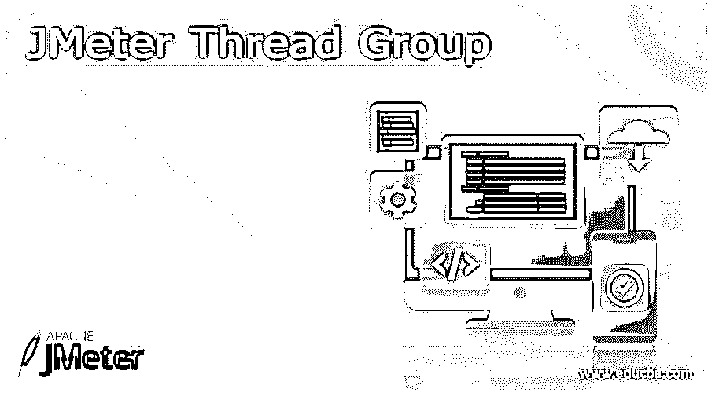
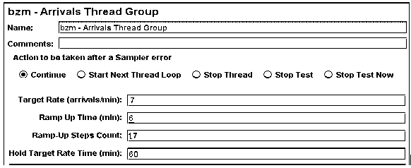
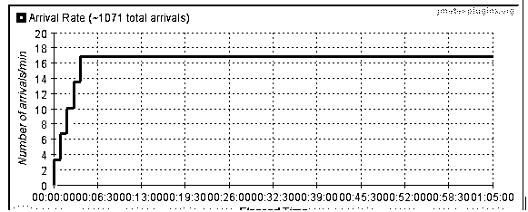
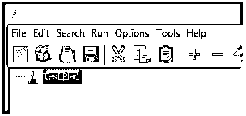

# JMeter 线程组

> 原文：<https://www.educba.com/jmeter-thread-group/>

## JMeter 线程组的定义

JMeter 是一个执行偏好和负载测试的开源工具；在 JMeter 中，我们有在我们称之为线程组的同一类别下维护所有测试场景的功能。换句话说，我们可以说它是用来执行同一组下的那组线程的。通常情况下，线程组是每个测试计划的基础元素。我们可以在 JMeter 中添加多个线程组，这可以模拟我们如何与应用程序交互。在线程组下，我们根据用户需求创建了多个采样器和监听器。

### 如何使用 SetUp JMeter 线程组？

现在让我们看看如何在 JMeter 中设置线程组。

<small>网页开发、编程语言、软件测试&其他</small>

线程组组件是任何测试计划的起点。JMeter 中所有的采样器和控制器都应该在一个指定的线程组下。不同的组件，例如，观众成员，可能被直接放在测试计划下，在这种情况下，它们将应用于所有的线程组。顾名思义，string bunch 组件控制 JMeter 用来执行测试的字符串数量。线程组的控件允许我们遵循如下几点。

*   我们可以根据需要设置线程组的数量。
*   设置增加的时间范围。
*   设置执行测试的时间。

在创建之前，我们必须确保 JMeter 工作正常。如果 JMeter 工作正常，我们需要遵循以下步骤。

1.首先，启动 JMeter。

2.在启动 JMeter 之后，我们需要选择测试计划。

3.这里，我们得到了线程组选项；点击它。

4.在线程组中，我们有不同的组件，比如名称、评论和动作。因此，根据我们的要求，我们在该选项卡上进行更改。

5.组件完成后，我们还可以根据需要设置线程属性。

### 线程组到达

让我们看看如何在线程组中使用到达，如下所示。

对于更传统的负载测试来说，Arrivals 线程组真的很棒。一个潜在的情况可能是这样的，“当客户在 60 分钟内每次购买 20 张票时，我们的框架表现得令人钦佩吗？”.

自由形式的 Arrivals 线程组对于负载测试来说确实很棒，但是对于压力测试情况(比如峰值测试)来说，它更是非同寻常。一个潜在的情况可能是类似的事情“我们的框架能够在进展开始后不久处理 40，000 个票据交易吗？如果我们需要对连接进行负载测试和压力测试的分离。

string bunch 与“appearances”计划一起工作，作为一种与堆通信的方法。“外表”意味着强烈的强调。它会在所有当前字符串都被占用的情况下生成新的字符串。

请注意，一致的出现率意味着同时扩大，所以要小心你输入的质量。使用“同时限制”字段作为一个良好的阀门来防止内存耗尽。

现在让我们看看如何将到达线程 apache 插件添加到 JMeter 中，如下所示。

首先，我们需要下载 jar 文件。成功完成下载后，解压缩该文件夹，并按照以下步骤操作。

1.解压文件夹后，复制 jar 并粘贴到 JMeter 的 bin 文件夹内。

2.现在复制插件 casutg jar 文件并粘贴到 JMeter 的 bin 文件夹中。

现在让我们看看如何将到达线程组添加到测试计划中。

1.首先，点击测试计划，选择 Add option，并选择 Thread 选项。

2.在线程选项中，我们得到了线程组选项，如下图所示。

现在，我们需要使用带有以下参数的到达线程来配置工作负载，如下所示。

目标速率:这里，我们需要根据我们的要求以分钟为单位设置目标速率。

上升时间:也是以分钟为单位。

斜坡上升步骤计数

时间单位

螺纹极限

日志线程的状态

并发的限制。

我们还需要如下设置输入字段。

*   Name:这里，我们需要提供线程组的名称。
*   备注:根据我们的要求，这是一个可选部件；我们可以添加评论。
*   Action:在 action 中，我们有不同的字段，可以根据我们的需求进行归档。

其他参数我们已经在同一点上讨论过了。

### 例子

现在让我们看看包含以下示例的 Arrivals 线程组的屏幕截图。

在上面的截图中，我们设置了所有的参数，下面的截图显示了如下的图形。

### 创建一个 JMeter 线程组

现在让我们看看如何在 JMeter 中创建一个线程组。

在上面，我们讨论了线程组的一种类型。现在让我们看看如何创建如下的例子。

首先，我们需要创建测试计划，如下面的屏幕截图所示。

现在右键单击测试计划，并选择 add option，如下面的屏幕截图所示。

在这里，我们可以根据需要设置线程组的名称和注释。

我们还有设置线程组选项，如下图所示。

现在添加 HTTP 请求采样器，如下图所示。

现在我们需要添加监听器来查看结果，如下面的屏幕截图所示。

现在保存测试计划并运行测试计划，我们可以在下面的截图中看到输出如下。

### 并发

现在在 JMeter 中设置并发线程组，在这里我们已经创建了一个与到达线程组相同的测试计划。下面的屏幕截图显示了线程组的并发设置，如下所示。

### 结论

我们希望从这篇文章中，您能更多地了解 JMeter 线程组。从上面的文章中，我们已经领会了 JMeter 线程组 t 的基本思想，我们也看到了 JMeter 线程组的表示和示例。从本文中，我们了解了如何以及何时使用 JMeter 线程组。

### 推荐文章

这是 JMeter 线程组的指南。这里我们讨论定义，如何使用 JMeter 设置线程组，以及用代码实现的例子。您也可以看看以下文章，了解更多信息–

1.  [JMeter 版本](https://www.educba.com/jmeter-version/)
2.  [JMeter 中的定时器](https://www.educba.com/timers-in-jmeter/)
3.  [JMeter vs Selenium](https://www.educba.com/jmeter-vs-selenium/)
4.  [JMeter 备选方案](https://www.educba.com/jmeter-alternatives/)