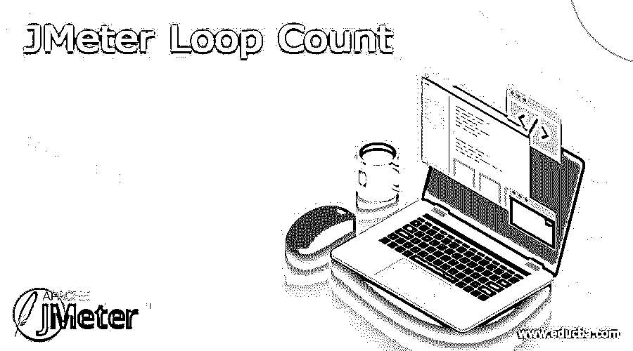
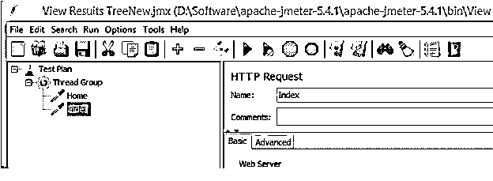
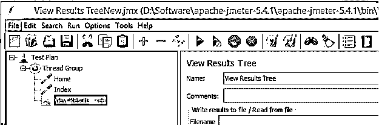
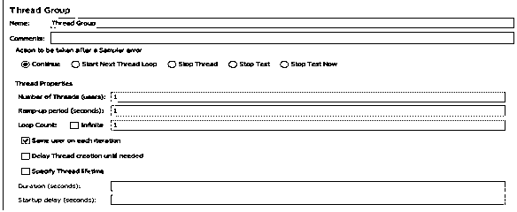
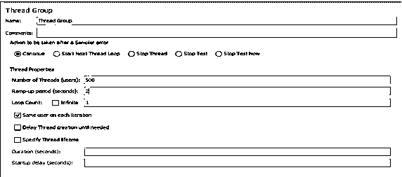
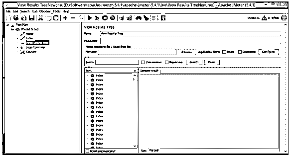
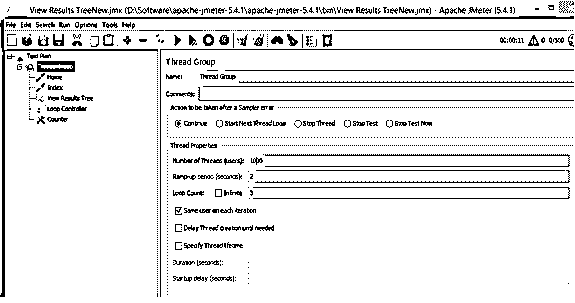
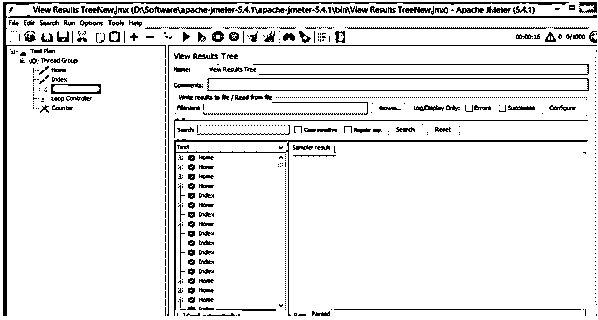
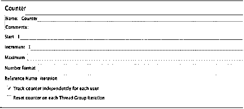

# JMeter 循环计数

> 原文：<https://www.educba.com/jmeter-loop-count/>

## JMeter 循环计数的定义

JMeter 为用户提供了不同类型的功能，其中循环计数是 JMeter 提供的功能之一。基本上，循环计数意味着我们可以根据我们的需求为每个用户设置迭代次数。一种典型的循环是计数循环，在计数循环中循环重复适当的次数。包含循环有规律地利用一个变量来从某个潜在值计数到某个最后值。这个变量通常被称为列表变量。JMeter 我们可以设置一次测试 100 个用户的 API 所需的用户数量，这样我们就可以使用循环计数函数。

### 什么是 JMeter 循环计数？

基本原理控制器是至关重要的测试计划组件，负责整理执行采样器和添加不同组件的请求。基本上，它允许您控制何时以及在哪个示例中向服务器发送请求。在我们开始讨论循环控制器之前，我们先来看看如何添加逻辑控制器。

<small>网页开发、编程语言、软件测试&其他</small>

基本原理控制器可以添加到线程组下，而且可以作为另一个调节器的后代。

许多人对 JMeter 循环计数和 JMeter 线程计数的利用感到困惑，更关键的是，这对他们的堆测试意味着什么。你知道答案吗？以下是两种情况:

情况 1:如果字符串计数的数量为 20，增加的时间为 20，循环计数为 1。

情况 2:如果字符串计数的数量为 2，增加时间为 2，循环计数为 20。

这两种情况有什么区别，会有不相上下的执行力动摇吗？情况 2 中需求之间的延迟是什么？在场景 2 中，每一根弦都还活着吗？许多人都知道字符串模拟客户端的方式，循环计数意味着字符串发出请求的次数。让我们直截了当地讨论一部分微妙之处。在这两种情况下，将制作 20 根琴弦。在情况 2 中，当另一串开始时，更建立的串保持活动。重要的是，在情况 1 中，字符串可能会平等地工作，而在情况 2 中，每个字符串在最后一个停止之后开始。此外，除非您指明，否则字符串之间没有延迟。

### 如何使用 JMeter 循环计数？

现在让我们看看如何在 JMeter 中使用循环计数，示例如下。当我们试图在 JMeter 中创建高级测试计划时，这意味着当我们增加用户数量时，我们可以使用循环计数函数来处理这种情况。

首先，我们需要创建一个测试计划，如下图所示。

创建测试计划后，我们需要添加线程组，在线程组中，我们可以根据我们的要求添加多个采样器，如下图所示。

现在我们需要将监听器添加到测试计划中，以查看测试执行的结果，如下图所示。

在这里，我们成功地创建了一个测试计划。现在考虑一个场景:我们需要为 500 个用户执行或维护 2 小时的并发性。那么我们如何处理这种情况，这个问题的答案是循环计数。因此，我们可以通过使用循环计数来轻松处理这种情况。因此，添加线程组中的循环计数，如下图所示。

我们可以看到，最初，循环计数是我们可以根据自己的需求来管理的，所以我们在这里增加了线程用户的数量和循环计数，如下图所示。

现在保存测试计划并运行，在测试计划执行之后，我们可以看到测试计划的输出，如下图所示。

在上面的截图中，我们可以看到，这里我们添加了 500 个用户，上升时间为 2 秒，循环计数为 1，然后我们得到上面的截图。现在增加循环次数，让我们看看会发生什么，如下图所示。

现在保存测试计划并执行，在测试计划执行之后，我们可以在视图树中看到输出，如下图所示。

### 在 JMeter 循环计数中使用 Config 元素

现在让我们看看如何在 JMeter 中为循环计数配置元素，如下所示。让我们考虑一个场景:假设我们需要通过使用一个 HTTP 请求在一个循环中添加不同的实体，所以通常我们所做的是复制和粘贴，但这是一个糟糕的选择。现在假设我们做同样的场景 200 次和 300 次，这很困难。
因此，更好的方法是我们需要在线程组中定义计数器，并根据我们的要求进行配置，如下图所示。

同样的场景我们可以通过使用计数器函数和脚本来解决。

### JMeter 循环计数特性

现在我们来看看 JMeter 中的循环计数有哪些特性如下。

*   在一些情况下，我们希望在不同的场合执行特定的区域，而不是整个测试套件。我们可以考虑下面提到的情况，例如:
*   每个客户端都登录到应用程序中。
*   搜索大约 15 个不同的项目。
*   客户端从应用程序中注销。

对于前面提到的情况，我们不能利用线程组的“循环计数”，因为它适用于整个实用程序流。这种先决条件可以通过在线程组下添加循环计数来解决。

### 结论

我们希望从这篇文章中你能学到更多关于 JMeter 循环计数的知识。从上面的文章中，我们已经了解了 JMeter 循环计数的基本思想，我们还看到了 JMeter 循环计数的表示和示例。从本文中，我们了解了如何以及何时使用 JMeter 循环计数。

### 推荐文章

这是一个 JMeter 循环计数指南。这里我们讨论一下定义，什么是 JMeter 循环计数，如何使用 JMeter 循环计数？代码实现示例。您也可以看看以下文章，了解更多信息–

1.  [JMeter 版本](https://www.educba.com/jmeter-version/)
2.  [JMeter 中的定时器](https://www.educba.com/timers-in-jmeter/)
3.  [JMeter 备选方案](https://www.educba.com/jmeter-alternatives/)
4.  [什么是 JMeter？](https://www.educba.com/what-is-jmeter/)