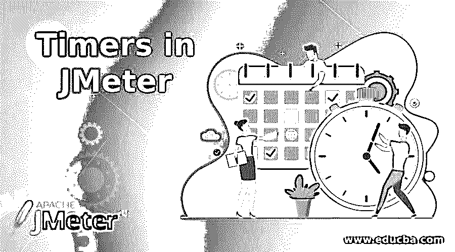
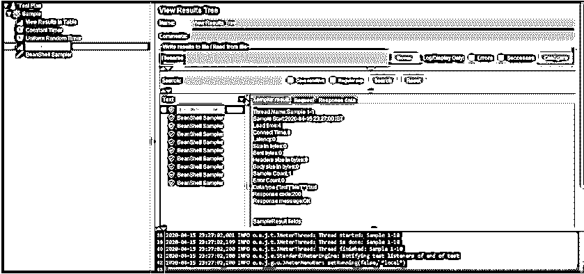
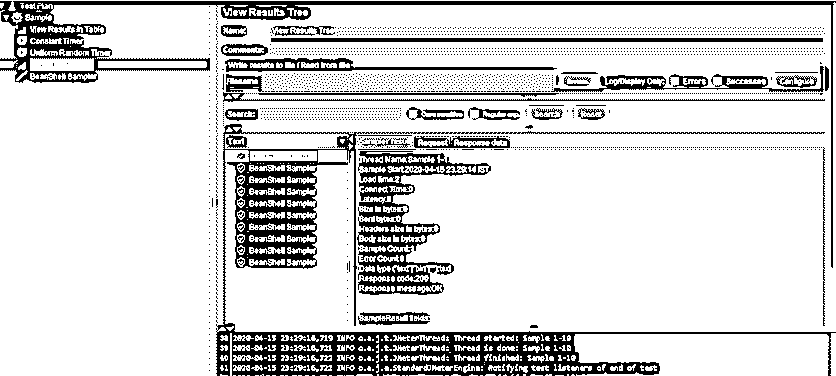

# JMeter 中的计时器

> 原文：<https://www.educba.com/timers-in-jmeter/>

## JMeter 中定时器的介绍

Jmeter 是一个基于 java 的工具，用于用户需求的负载平衡测试场景，并分析测量应用程序和相关服务性能的问题。jmeter 有不同种类的工具，Jmeter 中的计时器是内置工具之一，我们可以在 Jmeter 中插入主题，用于客户端请求。电表中有不同种类的计时器，如常数计时器、均匀随机计时器。每个定时器都有自己的功能和灵活性，在基于客户端请求的工具中，它可能会根据定时器中的设置而变化。默认情况下，Jmeter 会发送客户端请求，而不会在所有请求之间等待或暂停。

**语法:**

<small>网页开发、编程语言、软件测试&其他</small>

java 中 Jmeter 的基本语法如下。

`import java packages;
import jmeter packages;
class class name
{
main method()
{
---some user defined methods with jmeter parameters and method calls—
Program logic
}
}`

在 Jmeter 中，我们有一个独立的工具和插件，我们也可以在 Jmeter 环境中测试 http 请求。

### 如何在 JMeter 中使用定时器？

Jmeter 计时器用于定义客户端请求之间的持续时间间隔，如果我们没有在 jmeter 中指定任何客户端请求，它会在完成第一个请求后自动执行其他请求，没有等待时间默认值。jmeter 线程发送了多个请求，没有暂停请求等选项，我们可以指定延迟计时器，建议为每种类型的请求添加延迟，为线程组中的任何可用计时器添加延迟。

如果我们想在线程组中添加一个以上的计时器，计时器将启用并处理每个客户端的请求一定的时间。jmeter 用于对平均计时器求和，在执行用户请求之前，计时器会暂停一段时间，用户请求已经在计时器配置(如采样器)中指定。

如果我们想要像任何类型的请求 HTTP、java、jdbc 请求一样应用单个采样器，我们将在采样器的子节点元素中添加定时器配置。在血糖仪中执行采样器之前，将应用定时器配置。如果我们使用一些 jmeter 计时器，如高斯和泊松随机计时器，其工作在一些数学运算上，我们可以添加常数延迟偏移，一些偏差时间将被自动计算和重置。

### JMeter 中的定时器示例

以下是血糖仪中计时器的示例:

#### 示例#1

**代码:**

`public class JmeterTest {
public static void main(String[] args){
StandardJMeterEngine jmeter = new StandardJMeterEngine();
JMeterUtils.loadJMeterProperties("c://tmp//jmeter.properties");
HashTree h = new HashTree();
HTTPSampler Sampler = new HTTPSampler();
Sampler.setDomain("www.facebook.com");
Sampler.setPort(80);
Sampler.setPath("/");
Sampler.setMethod("GET");
TestElement loop = new LoopController();
((LoopController)loop).setLoops(1);
((LoopController)loop).addTestElement(Sampler);
((LoopController)loop).setFirst(true);
SetupThreadGroup group = new SetupThreadGroup();
group.setNumThreads(1);
group.setRampUp(1);
group.setSamplerController((LoopController)loop);
TestPlan test= new TestPlan("Welcome To My Domain");
h.add("plan", test);
h.add("loop", loop);
h.add("group", group);
h.add("Sampler", Sampler);
jmeter.configure(h);
jmeter.run();
}
}`

**输出:**

#### 实施例 2

**代码:**

`public class JmeterTest {
public static void main(String[] args) throws IOException {
int ports = JMeter.UDP_PORT_DEFAULT;
if (args.length > 1){
ports = Integer.parseInt(args[1]);
} else if (args.length == 0) {
throw new RuntimeException("commands [port]");
}
String s = args[0];
System.out.println("Request Sending "+s+" requestport "+ports);
DatagramSocket s1 = new DatagramSocket();
byte[] b = s.getBytes("ASCII");
InetAddress a = InetAddress.getByName("localhost");
DatagramPacket p = new DatagramPacket(b, b.length, a, ports);
s1.send(p);
s1.close();
}
}`

**输出:**

#### 实施例 3

**代码:**

`public class sample {
static final String root = "f://";
static final String jmx = "f:///";
static final String report = "f://";
static final String file = "f://";
private BrowserEventListener event;
private URL u;
private int c;
private CountDownLatch t;
private int time;
public sample(URL u) {
this.u = u;
t = new CountDownLatch(1);
this.c = 5;
time = 60;
}
private void setup() throws TemplateException, IOException {
Configuration cfg = new Configuration(Configuration.DEFAULT_INCOMPATIBLE_IMPROVEMENTS);
Map<String, Object> data = new HashMap<String, Object>();
data.put("protocols", u.getProtocol());
data.put("ports", String.valueOf(u.getPort()));
data.put("hosts", u.getHost());
data.put("paths", u.getPath());
data.put("Users", c);
Template template = cfg.getTemplate(root + file + ".ftl");
Writer files = new FileWriter(new File(jmx + file));
template.process(data, files);
files.flush();
files.close();
}
public void start() throws Exception {
this.addEventListener(new BrowserEventListener() {
@Override
public void onEvent(String event) {
t.countDown();
}
});
setup();
final String Extension = ".jmx";
final String jtl = ".jtl";
final String html = ".html";
final String log = report + "jmeter.log";
final String jmeter = root + "bin/jmeter.properties";
final File f = new File(root + "bin/jmeter-results-detail.xsl");
File fileFeports = new File(report);
if (!fileFeports.exists()) {
fileFeports.mkdir();
}
JMeter j = new JMeter();
String[] files = new File(jmx).list();
for (String file : files) {
if (file.toLowerCase().endsWith(Extension)) {
String fileNoExt = file.substring(0, file.length() - Extension.length());
String outputFileJtl = report + fileNoExt + jtl;
String[] arguments = { "-n", "-t", jmx + file, "-p", jmeter, "-d", root,
"-l", outputFileJtl, "-j", log };
j.start(arguments);
ByteArrayOutputStream baos = new ByteArrayOutputStream();
System.setOut(new PrintStream(baos));
boolean b = true;
do {
BufferedReader br = new BufferedReader(new StringReader(baos.toString()));
String line;
while ((line = br.readLine()) != null) {
b = !line.equals(“end");
}
} while (b);
String outputFileHtml = report + fileNoExt + html;
jtl2html(f, new File(outputFileJtl), new File(outputFileHtml));
}
}
File f2 = new File(jmx + file);
f2.delete();
}
private void jtl2html(File stylesheet, File datafile, File fileOutput) throws Exception {
DocumentBuilderFactory factory = DocumentBuilderFactory.newInstance();
DocumentBuilder builder = factory.newDocumentBuilder();
Document document = builder.parse(datafile);
TransformerFactory transformerFactory = TransformerFactory.newInstance();
StreamSource stylesource = new StreamSource(stylesheet);
Transformer transformer = transformerFactory.newTransformer(stylesource);
DOMSource source = new DOMSource(document);
StreamResult result = new StreamResult(fileOutput);
transformer.transform(source, result);
event.onEvent("end");
}
public boolean waitForEnding() throws InterruptedException {
return t.await(getTimeout(), TimeUnit.SECONDS);
}
public void addEventListener(final BrowserEventListener event) {
this.event = event;
}
public void setUrl(URL u) {
this.u = u;
}
public int getConcurrentUsers() {
return c;
}
public void setConcurrentUsers(int c) {
this.c = c;
}
public URL getUrl() {
return u;
}
public int getTimeout() {
return time;
}
public void setTimeout(int time) {
this.time = time;
}
}`

**输出:**

### 结论

在 Jmeter 中，我们已经测试了不同种类的环境，如 HTML、java、jsp 等，这些都在线程组的 sampler 下。我们为测试用例创建了不止一个线程组。Jmeter 定时器被期望加载测试专家使用来创建时间知道使用和应用的场景

### 推荐文章

这是一个 JMeter 中定时器的指南。这里我们也讨论一下 jmeter 中定时器的介绍和使用方法？以及不同的示例及其代码实现。您也可以看看以下文章，了解更多信息–

1.  [JMeter 备选方案](https://www.educba.com/jmeter-alternatives/)
2.  [安装 JMeter](https://www.educba.com/install-jmeter/)
3.  [杰姆特 vs 加特林](https://www.educba.com/jmeter-vs-gatling/)
4.  [什么是 JMeter？](https://www.educba.com/what-is-jmeter/)