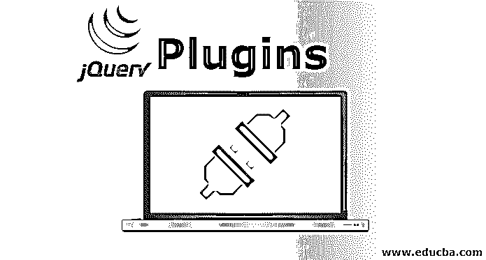

# jQuery 插件

> 原文：<https://www.educba.com/jquery-plugins/>




## jQuery 插件简介

jQuery 插件是可以在 jQuery 脚本块中添加和访问的扩展特性，可以使用语法“jQuery.pluginName.js”来实现。用于 jQuery 的插件有不同的形式，如 jQueryFunction 或 jQuery.fn 的简单原型模型，用于组合两个对象的 jQuery.extend()的特殊方法，以及具有两个或三个参数的接口小部件 jQuery factory 的复杂选项，即小部件原型、可选对象和名称空间。javascript 代码中常用的 jQuery 插件有 slider.js 和 datepicker.js。

### jQuery 插件

*   jQuery 插件的命名方式如下:

**代码:**

<small>网页开发、编程语言、软件测试&其他</small>

```
jQuery.pluginName.js
```

*   jQuery 为扩展 jQuery 提供了独立、简单的模式

1.  jquery.fn 的 jQueryfunction 的原型属性的简单别名
2.  另一种方法是使用 jquery.extend()方法。
3.  最后一种也是最复杂的方式是 jQuery UI 小部件工厂。

*   fn 可以按如下方式使用:

**代码:**

```
jQuery.fn = jQuery.prototype = { //jquery is placed here //}
```

*   $.extend()方法[用于 jQuery](https://www.educba.com/jquery-keydown/) 的增强，该方法用于合并两个对象。
*   小部件工厂是一个接受两个或三个参数的 jQuery 方法，它们是

1.  名称空间
2.  现有的小部件原型继承自
3.  一个可选的对象文字，它将成为新小部件的原型。

```
$.widget('namespace.someStuff', {}); 
```

### 插件开发指南

下面列出了插件开发的一些指导原则:

1.  这个关键字的正确用法——记住它指向当前的 jQuery 实例本身。
2.  确保$指向 jQuery，立即执行将$绑定到应该使用的 jQuery 的函数[。](https://www.educba.com/jquery-hover/)
3.  分号应正确使用。
4.  如果可能的话，尽可能多地返回 jQuery 对象。
5.  遍历对象并正确使用$.each。
6.  在 jQuery 名称空间中只声明一个名称。
7.  应该保留选项来接受插件行为控制的参数。
8.  应为默认插件设置提供公共访问。
9.  也可以基于适用性提供对次要功能的公共访问。
10.  私人功能应妥善处理。
11.  $提供的插件元数据支持。数据()。

### **使用 UI Widget 工厂**

以下是应注意的几点:

*   防止插件在同一对象上出现多个实例。
*   方法来启用、禁用或销毁小部件。
*   小部件是有状态的，因此销毁实例会将 DOM 元素恢复到原始状态。
*   命名空间和原型创建。
*   用新选项覆盖默认设置的能力。
*   设置和响应插件选项变化的方法。
*   插件实例可以通过对象的存储数据来访问。
*   自动方法查找表。

### **jQuery 插件列表**

让我们借助一个例子来看看 jQuery 插件列表:

#### 1.Slider.js

下面添加的代码表示带手柄的水平滑块，可随鼠标键移动。

**代码:**

```
<!doctype html**>**<html lang="en">
<head>
<meta charset="utf-8">
<meta name="viewport" content="width=device-width, initial-scale=1">
<title>jQuery UI Slider - Default functionality</title>
<link rel="stylesheet" href="//code.jquery.com/ui/1.12.1/themes/base/jquery-ui.css">
<link rel="stylesheet" href="https://cdn.educba.com/resources/demos/style.css">
<script src="https://code.jquery.com/jquery-1.12.4.js"></script>
<script src="https://code.jquery.com/ui/1.12.1/jquery-ui.js"></script>
<script>$( function() { $( "#slider" ).slider();} );
</script></head><body>
<div id="slider"></div>
</body></html>
```

#### 2.日期选择器. js

它是以这样一种方式，当用户将在输入框点击，一个交互式日历将打开，可以通过使用 ESC 键在其他情况下关闭。

**代码:**

```
<!doctype html>
<html lang="en">
<head>
<meta charset="utf-8">
<meta name="viewport" content="width=device-width, initial-
scale=1">
<title>jQuery UI Datepicker - Default functionality</title>
<link rel="stylesheet"
href="//code.jquery.com/ui/1.12.1/themes/base/jquery-ui.css">
<link rel="stylesheet" href="https://cdn.educba.com/resources/demos/style.css">
<script src="https://code.jquery.com/jquery-
1.12.4.js"></script>
<script src="https://code.jquery.com/ui/1.12.1/jquery-
ui.js"></script>
<script>
$( function() {
$( "#datepicker" ).datepicker();
} );
</script>
</head>
<body>
<p>Date: <input type="text" id="datepicker"></p>
</body>
</html>
```

*   同样，也有效果，效用和互动，它们都可以从[http://jqueryui.com](//jqueryui.com/)中看到和引用。

**让我们来看一个关于发布插件的小故事**

相同的步骤如下:

1.  在 Github 上启用 jQuery 插件服务钩子，在存储库的设置页面，点击 web hooks & Services-> Configure Services，然后启用 jQuery 插件服务。
2.  jQuery Plugins Registry 将在存储库的根级别中查找任何名为*.jQuery.json 的文件，根据[包清单规范](https://plugins.jquery.com/docs/package-manifest/)创建*your plugin*.jQuery.json。
3.  验证清单文件以检查错误。
4.  一旦服务挂钩设置完成，清单添加完成，现在您必须在 git 中标记版本，并将标记发布到 Github，插件站点现在会得到新标记可用的通知。
5.  请记住，注册表不允许重新处理它已经看到的标签。

### 结论

因此，我们对什么是插件，如何创建插件以及如何发布插件有了一个概念。我们还看到，在开发插件时，肯定有一些最佳实践和方法可以遵循。此外，插件应该从可信的来源被纳入，只有这样，他们才能加快开发过程，而不是通过引入图片中的错误来阻碍它。我们还看到了一些示例 jQuery 插件和源代码，遵循相同的方法，您也可以开发自己的插件。

### 推荐文章

这是 jQuery 插件的指南。在这里，我们讨论了插件的介绍、工作、指南和列表以及它们的代码。您也可以看看以下文章，了解更多信息–

1.  [JQuery 的用途](https://www.educba.com/uses-of-jquery/)
2.  [备忘单 JQuery](https://www.educba.com/cheat-sheet-jquery/)
3.  [jQuery 选择器](https://www.educba.com/jquery-elements/)
4.  [Java 监控工具](https://www.educba.com/java-monitoring-tool/)


