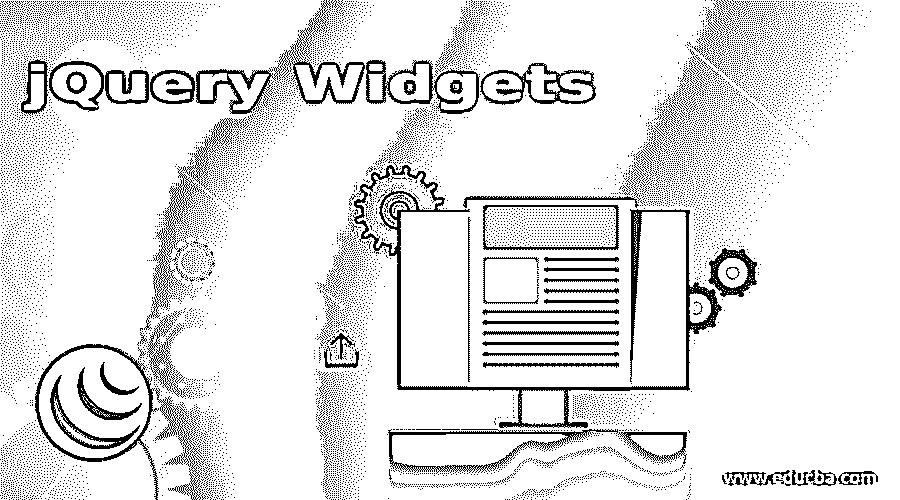
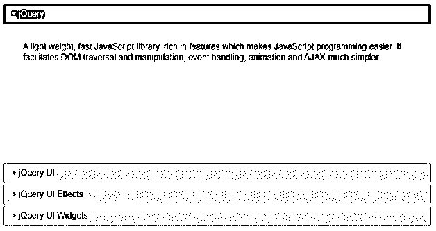
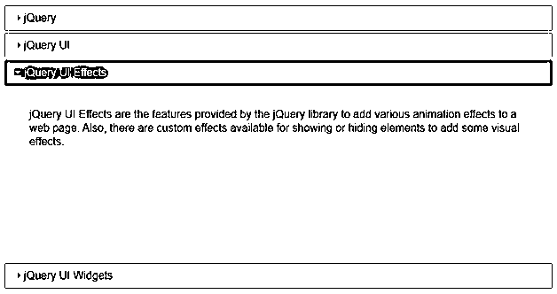
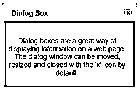

# jQuery 小部件

> 原文：<https://www.educba.com/jquery-widgets/>




## jQuery 小部件简介

jQuery 小部件是专门化的、独立于平台的、跨浏览器兼容的、有状态的插件，功能丰富，具有完整的生命周期以及一些方法和事件，构建在称为 jQuery UI 小部件工厂的可扩展基础上(简化了状态管理，并为任务提供了约定，例如公开插件方法、在实例化后更改选项，从而允许我们在 jQuery 小部件的现有功能中进行一些更改)。并结合动画视觉效果、CSS、HTML、jQuery 主题，形成一个完整的 jQuery UI，从而将 JavaScript 和 HTML UI 开发带到了一个全新的高度，成为发展最快的 JavaScript UI 框架之一。

### 热门 jQuery 小部件

下面是我们将要详细讨论的几个重要且常用的 jQuery 小部件的列表。

<small>网页开发、编程语言、软件测试&其他</small>

#### 1\. Accordion Widget

这个 jQuery 小部件允许折叠被分成多个逻辑部分的内容。手风琴基本上是用来将内容分成可以交换的逻辑部分，以节省空间。

**语法:**

```
$(function(){
$("#accordion").accordion();
});
```

#### 2.自动完成小部件

这个 jQuery 小部件在向字段中键入内容时提供建议，从而使用户能够轻松地从预先填充的值列表中找到并做出选择。这个小部件最大限度地利用了搜索和过滤。

**语法:**

```
$(#tags).autocomplete({
Source: availableTags
});
```

#### 3.按钮部件

这个小部件有助于增强设计和定制表单元素，例如按钮、输入和带有一些 CSS 样式的主题按钮的锚。这个按钮基本上是一个提交类型的输入和一个锚点。

**语法:**

```
$(function(){
$("input[type = submit], a, button")
.button()
.click(function(event){
event.preventDefault();
});
});
```

#### 4\. Datepicker Widget

这个小部件用于从交互式日历中打开和选择日期。默认情况下，当相关文本字段获得焦点时，日历会在一个小的覆盖区域中打开。

**语法:**

```
$("#datepicker").datepicker();
```

#### 5.对话框小部件

当您想要在交互式覆盖图中打开内容时，可以使用此小部件。使用对话框来显示页面上的内容是一种非常好的方式。

**语法:**

```
$("#dialog").dialog();
```

#### 6\. Menu Widget

这个小部件用于显示带有定制的项目列表，例如添加主题、鼠标和键盘导航支持以及其他样式。

**语法:**

```
$("#menu").menu();
```

#### 7.Progressbar 小工具

这个小部件用于显示进程的进度信息或状态。

**语法:**

```
$("#progressbar").progressbar({
value:numericValue
});
```

#### 8.选择菜单小部件

此小部件用于启用选择元素的样式替换，以便通过复制和扩展本地 HTM 选择元素的功能来克服本地控件的限制。

**语法:**

```
$(#menu).selectmenu();
```

#### 9.滑块小部件

这个小部件帮助用户通过拖动一个手柄来选择一个数值。我们在这里讨论的滑块是水平的，只有一个手柄，可以用鼠标或箭头键拖动。

**语法:**

```
$(#slider).slider();
```

#### 10.微调器小部件

这个小部件允许用户从集合中快速选择一个值，并使用上/下按钮和箭头键增强输入数值的文本输入。

**语法:**

```
$(#spinner).spinner();
```

#### 11.选项卡小部件

这个小部件提供了一个包含多个面板的内容区域，其中每个面板都与列表中的一个标题相关联，并用于在内容所分成的逻辑部分之间进行切换。

**语法:**

```
$(#tabs).tabs();
```

#### 12\. Tooltip Widget

这个小部件提供了可定制的工具提示，可以替代原生工具提示。

工具提示主要是向用户提供提示。

**语法:**

```
$(document).tooltip();
```

### 实现 jQuery 小部件的示例

让我们看几个例子来理解 jQuery 小部件的实现。

#### 示例#1

让我们考虑一个例子来理解 Accordion 小部件是如何实现的。

**代码:**

```
<!DOCTYPE html>
<head>
<title>jQuery UI Accordion Widget Example</title>
<link
rel="stylesheet"
href="https://code.jquery.com/ui/1.12.1/themes/base/jquery-ui.css"
/>
<script src="https://code.jquery.com/jquery-1.12.4.js"></script>
<script src="https://code.jquery.com/ui/1.12.1/jquery-ui.js"></script>
<script>
$(function () {
$("#accordion").accordion();
});
</script>
<style>
#divstyle {
width: 800px;
height: 150px;
}
</style>
</head>
<body>
<div id="divstyle">
<div id="accordion">
<h3>jQuery</h3>
<div>
<p>
A light weight, fast JavaScript library, rich in features which
makes JavaScript programming easier. It facilitates DOM traversal
and manipulation, event handling, animation and AJAX much simpler .
</p>
</div>
<h3>jQuery UI</h3>
<div>
<p>
jQuery UI is a combination of a set of user interface interactions,
effects, themes and widgets, which is built on top of jquery JS
library.
</p>
</div>
<h3>jQuery UI Effects</h3>
<div>
<p>
jQuery UI Effects are the features provided by the jQuery library to
add various animation effects to a web page. Also, there are custom
effects available for showing or hiding elements to add some visual
effects.
</p>
</div>
<h3>jQuery UI Widgets</h3>
<div>
<p>
jQuery Widgets are specialized, platform independent, cross browser
compatible, stateful plugins rich in features, with a full life
cycle along with some methods and events, built on an extensible
base called jQuery UI Widget Factory
</p>
<p>
A few jQuery UI Widgets are listed below.
</p>
<ul>
<li>
Accordion Widget
</li>
<li>
Autocomplete Widget
</li>
<li>
Button Widget
</li>
<li>
Datepicker Widget
</li>
</ul>
</div>
</div>
</div>
</body>
</html>
```

**输出:**

*   当上面的代码被执行时，下面的屏幕显示。




*   您可以单击标题来展开内容，分成逻辑部分，如下所示。




#### 实施例 2

这里我们用另一个例子来说明对话框小部件的实现。

**代码:**

```
<!DOCTYPE html>
<head>
<title>jQuery UI Dialog Example</title>
<link
rel="stylesheet"
href="//code.jquery.com/ui/1.12.1/themes/base/jquery-ui.css"
/>
<script src="https://code.jquery.com/jquery-1.12.4.js"></script>
<script src="https://code.jquery.com/ui/1.12.1/jquery-ui.js"></script>
<script>
$(function () {
$("#dialog").dialog();
});
</script>
<style>
#dialog {
width: 600px;
height: 250px;
padding-top: 20px;
padding-left: 5px;
font-size: 16px;
text-align: center;
color: maroon;
background-color: cadetblue;
}
</style>
</head>
<body>
<div id="dialog" title="Dialog Box">
<p>
Dialog boxes are a great way of displaying information on a web page.
The dialog window can be moved, resized and closed with the 'x' icon by default.
</p>
</div>
</body>
</html>
```

**输出:**

*   当上面的代码被执行时，下面的屏幕显示。




*   如您所见，对话框是一个带有标题和信息的浮动窗口。可以使用“X”图标移动、调整大小和关闭。

### 结论

在本文中，我们讨论了各种 jQuery UI 小部件，它们基本上是基于 jQuery 小部件工厂构建的有状态插件，提供了丰富的特性，使网页更具交互性。

### 推荐文章

这是 jQuery 小部件的指南。在这里，我们讨论 jQuery 小部件及其示例和代码实现的简要概述。您也可以浏览我们推荐的其他文章，了解更多信息——

1.  [jQuery toggle()简介](https://www.educba.com/jquery-toggle/)
2.  [jQuery empty()(示例)](https://www.educba.com/jquery-empty/)
3.  [如何使用 jQuery insertAfter()方法？](https://www.educba.com/jquery-insertafter/)
4.  [jQuery appendTo() |参数|示例](https://www.educba.com/jquery-appendto/)


