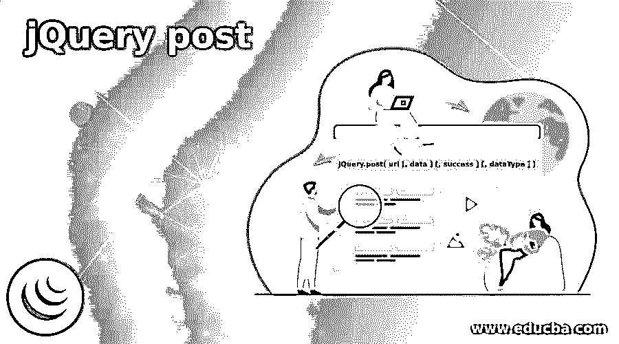
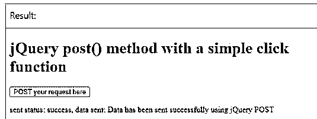
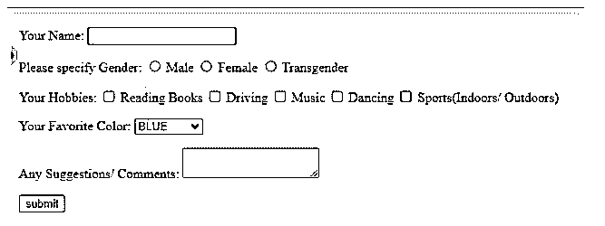
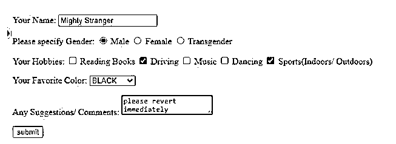
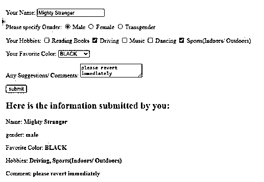

# jQuery 帖子

> 原文：<https://www.educba.com/jquery-post/>




## jQuery post 简介

jQuery post 方法使用 HTTP post 请求从服务器请求数据。该方法向服务器发送一个异步请求，向服务器提交数据并获得响应。jQuery.post()方法返回一个 XML HTTP 请求对象。这个方法是一个 AJAX 方法，用于调用服务器页面，如。POST 方法与 jQuery 中的 GET 方法相同，使用$。get()或$。post()，取决于服务器端的要求。在传输大量数据的情况下，例如表单数据时，将使用 POST 请求而不是 GET 请求，因为 GET 对服务器上来回的数据传输有严格的限制。

**语法**

<small>网页开发、编程语言、软件测试&其他</small>

jQuery post 请求的基本语法可以写成如下形式:

```
jQuery.post( url [, data ] [, success ] [, dataType ] )
```

### 因素

**1。url:** 必需的参数，其数据类型字符串包含请求必须发送到的请求 url 或必须从其接收数据的请求。

**2。数据:** JSON 数据，作为发送到服务器的数据。数据类型为普通对象或字符串的可选参数，随请求 url 一起发送到服务器。

**3。success:** 可选参数，请求方法成功或数据加载成功时执行的回调函数。

如果提供了数据类型，则为强制参数，但在这种情况下也可以采用空值。也可以写一个函数(data，status，xhr)，data 包含结果数据，status 包含请求处理后的状态；可能是超时，成功，解析错误等。，xhr 包含 XMLHttpRequest 对象。

**4。dataType:** 可选参数，表示作为回调函数返回的数据类型(字符串)；响应可以是 xml、脚本、json、html、jsonp 或文本的形式。

*   XML 是一个 XML 文档。
*   该脚本作为 JavaScript 运行，并返回纯文本。
*   JSON 作为 JSON 运行，并返回一个 [JavaScript 对象](https://www.educba.com/javascript-objects/)。
*   HTML，纯文本。
*   Jsonp 使用 JSONP 加载一个 JSON 块，并向指定回调的请求 URL 添加一个回调。文本，纯文本字符串。

在一种简单的格式中，jQuery post 语法也可以写成:

```
$.post( URL, data, callback);
```

让我们看看这个 jQuery 是如何使用. post()方法的？

jQuery 脚本必须在实现时使用，即可以是任何版本:

```
<script src="https://ajax.googleapis.com/ajax/libs/jquery/3.5.1/jquery.min.js"></script>
```

### jQuery post 示例

下面是提到的例子:

#### 示例#1

具有简单点击功能的 jQuery post。

**代码:**

```
<!DOCTYPE html>
<html>
<head>
<meta name="viewport" content="width=device-width" />
<script type="text/javascript"
src="https://ajax.googleapis.com/ajax/libs/jquery/1.11.2/jquery.min.js">
</script>
<script type="text/javascript">
$(document).ready(function () {
$('#jQuerybutton').click(function(){
// request URL
$.post('/jquery/submitData',
// data submitted to POST request
{ myData: 'Data has been sent successfully using jQuery POST' },
// callback function on success
function(data, status, jqXHR) {
$('p').append('sent status: ' + status + ', data sent: ' + data);
});
});
});
</script>
</head>
<body>
<h1> jQuery post() method with a simple click function
</h1>
<input type="button" id="jQuerybutton" value="POST your request here" />
<p>
</p>
</body>
</html>
```

**输出:**


点击时:




#### 实施例 2

jQuery post 方法。

**代码:**

```
<!DOCTYPE html>
<html lang="en">
<head>
<meta charset="utf-8">
<title>jQuery POST Request using AJAX</title>
<style>
label{
display: block;
margin-bottom: 15px;
color: red
}
</style>
<script src="https://code.jquery.com/jquery-3.5.1.min.js"></script>
<script>
$(document).ready(function(){
$("form").submit(function(eventObj){
eventObj.preventDefault();
var actionBtn = $(this).attr("action");
var formValue = $(this).serialize();
$.post(actionBtn, formValue, function(empdata){
$("#resultData").html(empdata);
});
});
});
</script>
</head>
<body>
<form action="/php/empComment.php">
<label>Your Employee Name: <input type="text" name="empname"></label>
<label>Comments for improvement: <textarea cols="25" name="empcomment"></textarea></label>
<input type="submit" value="Send Here">
</form>
<div id="resultData"></div>
</body>
</html>
In empComment.php
<?php
$name = htmlspecialchars($_POST["empname"]);
$comment = htmlspecialchars($_POST["empcomment"]);
echo "Hi, $empname. Your comment has been received successfully." . "";
echo "Here's the comment what you've entered: $empcomment";
?>
```

**输出:**


输入值时:


提交时:

#### 


#### 实施例 3

jQuery post 方法||提交表单。

**代码:**

```
<!DOCTYPE html>
<html lang="en">
<head>
<meta charset="utf-8">
<title>jQuery POST method||Submit Form page</title>
<script src="https://code.jquery.com/jquery-3.5.1.min.js"></script>
<script>
$(document).ready(function(){
$("form").on("submit", function(eventObj){
eventObj.preventDefault();
var htmlFormValues= $(this).serialize();
var submitAction = $(this).attr("action");
$.post(submitAction, htmlFormValues, function(formData){
$("#formResult").html(formData);
});
});
});
</script>
</head>
<body>
<form action="/php/formProcess.php">
<p>
<label>Your Name:</label>
<input type="text" name="name">
</h3>
<p>
<label>Please specify Gender:</label>
<label><input type="radio" value="male" name="gender"> Male</label>
<label><input type="radio" value="female" name="gender"> Female</label>
<label><input type="radio" value="transgender" name="gender"> Transgender</label>
</h3>
<p>
<label>Your Hobbies:</label>
<label><input type="checkbox" value="Reading Books" name="hobbies[]"> Reading Books</label>
<label><input type="checkbox" value="Driving" name="hobbies[]"> Driving</label>
<label><input type="checkbox" value="Music" name="hobbies[]"> Music</label>
<label><input type="checkbox" value="Dancing" name="hobbies[]"> Dancing</label>
<label><input type="checkbox" value="Sports(Indoors/ Outdoors)" name="hobbies[]"> Sports(Indoors/ Outdoors)</label>
</h3>
<p>
<label>Your Favorite Color:</label>
<select name="color">
<option>BLUE</option>
<option>YELLOW</option>
<option>GREEN</option>
<option>ORANGE</option>
<option>BLACK</option>
</select>
</h3>
<p>
<label>Any Suggestions/ Comments:</label>
<textarea name="comment"></textarea>
</h3>
<input type="submit" value="submit">
</form>
<div id="formResult"></div>
</body>
</html>
In formProcess.php
<h1>Here is the information submitted by you:</h1>
<h3>Name: <b><?php echo $_POST["name"] ?? ''; ?></b></h3>
<h3>gender: <b><?php echo $_POST["gender"] ?? ''; ?></b></h3>
<h3>Favorite Color: <b><?php echo $_POST["color"] ?? ''; ?></b></h3>
<h3>Hobbies: <b><?php if(isset($_POST["hobbies"])){ echo implode(", ", $_POST["hobbies"]); } ?></b></h3>
<h3>Comment: <b><?php echo $_POST["comment"] ?? ''; ?></b></h3>
```

**输出:**




在此输入详细信息:




点击提交后:




我们在这里已经看到，每次 post 方法都会将一些数据发送到指定的其他文件中，并且这里显示的一些例子也是将发布的数据检索给用户。

GET 方法用于从任何指定的 URL 获取数据。

### 结论

我们已经看到了它是如何工作的，它的各种形式的语法解释了上面所有必需的和可选的参数。此处解决的示例将向您概述如何使用它将数据发送到任何指定的文件。这是一个提交表单数据的好例子，它将数据发送到一个 php 文件，并显示发送到该文件的数据。

### 推荐文章

这是一个 jQuery post 的指南。在这里，我们讨论 jQuery post 的介绍以及一些例子，以便更好地理解。您也可以看看以下文章，了解更多信息–

1.  [jQuery UI 可选](https://www.educba.com/jquery-ui-selectable/)
2.  [jQuery zindex](https://www.educba.com/jquery-zindex/)
3.  [jQuery 扩展](https://www.educba.com/jquery-extend/)
4.  [jQuery off](https://www.educba.com/jquery-off/)


