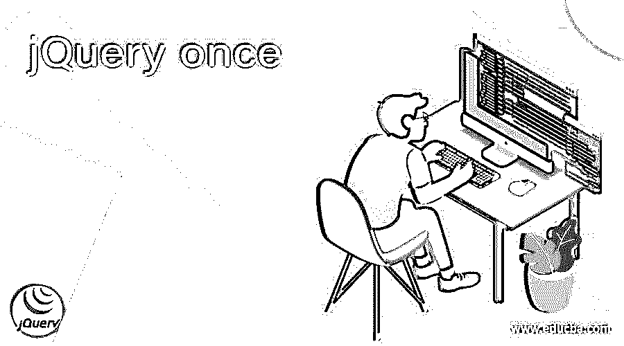
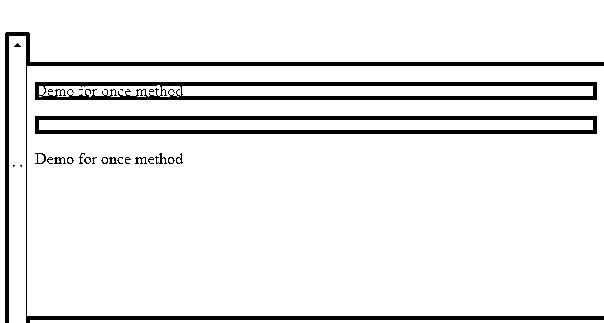

# jQuery once

> 原文：<https://www.educba.com/jquery-once/>




## jQuery once 简介

顾名思义，“once”这个方法用于对元素或类应用任何东西一次。一次，使用 jQuery 从应用了属性或过滤器的列表中过滤出所有元素。因此，通过使用 once 方法，我们可以只向元素和类添加一次行为。这个方法负责过滤掉所有元素和类，这些元素和类在 jQuery 中的任何操作或函数中应用了相同的行为。一旦该方法也确保我们在程序执行中对相同的元素或类只应用一次相同的行为，在接下来的部分中，我们将讨论如何在编程中使用它。

**语法和参数**

<small>网页开发、编程语言、软件测试&其他</small>

此方法将两个参数作为输入，以防止同一行为多次应用于元素和类。为了使用它，我们需要包含。js 文件，或者我们必须通过 npm 使用一些命令来安装它。例如，我们将看到它的语法，以及为了更好的理解它需要什么参数，见下文；

1.$('element ')。一次('键')。css('你的财产')；

在上面一行代码中，我们可以提供任何 HTML 元素的名称；在那之后，我们可以调用 once()方法，在这个方法中，我们可以指定我们的键，在这个键上我们只需要应用 css 或行为一次。为了更好地理解使用 once 方法()，我们将看到一个实践示例，见下文；

**举例:**

```
$('span').once('hello').css('color', 'Yellow');
```

2.我们还有一种方法可以使用 once 方法；这里，我们可以使用 foreach 将这种效果应用到 HTML 元素上(见下文);在接下来的部分中，我们将对此进行更多的讨论。

**举例:**

```
$('element').once().each(function() {
// your logic goes here
});
```

### jQuery 中的 once 方法是如何工作的？

到目前为止，我们知道这个方法只用于在元素上应用一次行为。该方法负责过滤掉过去已经使用过相同行为的所有元素。所以我们总是有一个要求，比如我们只想改变文件的颜色一次，或者我们只想加载文件一次。在许多实时场景中，我们可以使用这种方法来获得它的好处。这一节将会看到如何在我们的程序中使用这个方法，它需要多少个参数以及它们是如何工作的。但是在继续之前，我们将首先讨论它的签名，它是由 jQuery 给出的。下面我们来看看；

$('element_name ')。一次()。function():所以在这里，我们可以看到，这个方法有两个参数一个是键，另一个是函数。在 once()方法中，我们可以指定一个键，我们只希望在这个键上应用一次行为。同样，在开始时，我们需要选择与键相关联的 HTML 元素；在这之后，只有我们可以调用 once()方法。一旦我们完成了所有的键和元素名，我们就可以在上面调用任何函数。所以这个方法只对类或元素应用一次行为。我们也可以传递类名；这里并不强制要求它只接受元素名。

首先，这个方法将过滤掉已经应用了行为的元素；然后，它通过检查其他人来对他们执行操作。为了在程序中使用这个方法，我们需要在应用程序中有一个 once.js 文件。有两种方法可以做到。让我们详细讨论每种方法；见下文；

**1。通过 npm 安装:**我们也可以通过 NPM 安装 jQuery once.js 依赖项。但是我们需要在这里执行一些命令。我们将详细了解如何在实践中做到这一点；

*   要安装 js，我们需要执行下面的命令:

**举例:**

```
npm install jquery-once --save
```

*   **版本:**在这之后，我们就可以检查版本了。目前正在我们的程序中安装的 js。

**举例:**

```
npm --version
```

*   为此，我们需要再执行一个命令

**举例:**

```
bower install jquery-once
```

**2。直接添加。js 文件进入应用:**我们也可以直接下载。js 文件并把它放在我们的应用程序中。在下面一行中键入以获取。js 文件

**举例:**

```
jquery.once.js
```

*   在这之后，我们可以将这个文件的路径包含到我们的程序中。见下文；

**举例:**

```
<script type="your_type" src="Your_path_for_ jquery/jquery.once.js"></script>
```

现在我们将看到一个程序，让初学者更好地理解它，熟悉代码，见下文；

```
$('#tag1').once().css({
background: 'Red'
});
```

**HTML 文件:**

```
<p id ="tag1">Hello World !!</p>
```

但是要执行这段代码，我们的应用程序中需要有 jqury . once . js；否则，代码将不起作用；在任何浏览器中输入“jqury.once.js”都可以在线找到这个文件。

### 例子

在本例中，我们试图通过在此手动包含 jquery.once.js 代码来使用 Jquery 中的 once()方法。对所有开发者都一样。

**举例:**

jqury.once.js 文件:这个文件也需要包含；这个代码可以在网上任何地方找到。

```
(function($) {
$.fn.once = function(identifier, callback) {
var $elems, className;
if (typeof identifier === 'function') {
callback = identifier;
identifier = "";
}
className = "__processed_once_" + (typeof identifier === "undefined" ? "" : identifier);
$elems = $(this).not("." + className).addClass(className);
if (typeof callback === 'function') {
$elems.each(callback);
}
return $elems;
};
})(jQuery);
```

**我们的代码:**

```
$(function() {
//our code to apply the once method on element
$('#tag1').once().css({
background: 'Red'
});
$('#tag2').once('red').css({
background: 'black'
});
$('#tag3').once('red').css({
background: 'yellow'
});
});
```

**输出:**




### 结论

通过这种方式，我们可以只对元素或类应用一次函数。当我们试图多次覆盖同一个元素或类上的任何行为时，这一点很重要，因此它不允许这种情况在 jQuery 中发生。这确保了我们在整个程序执行过程中只应用一次该行为。

### 推荐文章

这是 jQuery once 的一个指南。在这里，我们将讨论 once 方法在 jQuery 和示例中是如何工作的，以及代码和输出。您也可以看看以下文章，了解更多信息–

1.  [jQuery 查找子节点](https://www.educba.com/jquery-find-child/)
2.  [JQuery attr()](https://www.educba.com/jquery-attr/)
3.  jquery ui
4.  [jQuery 可见](https://www.educba.com/jquery-is-visible/)


