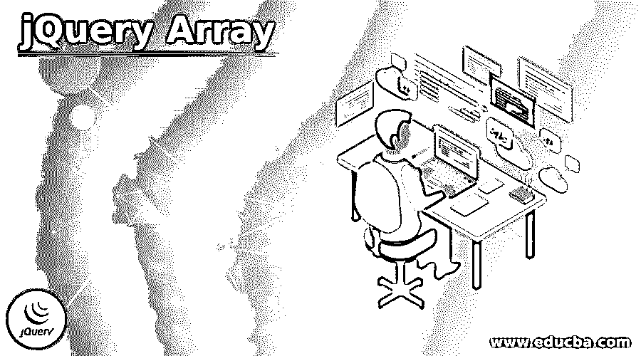
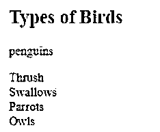

# jQuery 数组

> 原文：<https://www.educba.com/jquery-array/>




## jQuery 数组简介

jQuery 数组用于在单个数组变量中存储多个对象/值。jQuery 是一个紧凑而快速的 JavaScript 库。它有很多新的增强功能。它简化了 HTML 文档的遍历和操作、动画、事件处理和 Ajax。jQuery 有一个易于使用的跨浏览器的 API。它可以用来存储这些值，并在程序中进一步利用它们。

**语法:**

<small>网页开发、编程语言、软件测试&其他</small>

从在 jQuery 中创建一个数组，到在数组中寻找匹配的元素等等，可以执行不同的操作。

1.使用 jQuery makeArray 方法。

```
jQuery.makeArray(obj)
```

**参数:**

*   jQuery makeArray 方法总是只接受一个参数，这个参数就是需要转换的对象。
*   这个 makeArray jQuery 方法的返回类型是 Array。

2.使用 jQuery inArray 方法从数组中搜索特定的值/对象。

```
jQuery.inArray(value, arrayObj, fromIndex)
```

**说明:**

*   jQuery inArray 方法用于从数组中搜索特定的值/对象，它接受的第一个参数是需要搜索的值。
*   第二个参数是 arrayObj，我们将从中寻找提到的值。
*   fromIndex 的第三个参数是可选参数，它是搜索应该开始的数组的索引。
*   这个 inArray jQuery 方法的返回类型是 objArray 中值的索引位置。

### jQuery 中如何初始化数组？

下面给出了如何初始化一个数组:

**代码:**

```
jQuery.makeArray(obj)
```

jQuery makeArray 方法用于将 jQuery 对象转换为数组。

**解说** **:**

*   jQuery makeArray 方法总是只接受单个参数，而这个单个参数就是需要转换的对象。
*   这个 makeArray jQuery 方法的返回类型始终是一个数组。

**Note:** The jQuery makeArray method when applied to any object will always return a plain array object and whatever features the object had prior to conversion will no longer be present after conversion.

### 如何在 jQuery 中给数组赋值？

下面给出了如何赋值:

**代码:**

```
var arrayElements = document.getElementsByTagName(tagName)
```

在 jQuery 中，从 HTML DOM 获取值并将它们分配给一个数组非常简单。为此，我们将使用文档对象从 HTML DOM 中获取详细信息列表，使用 id 或类选择器，或者使用 getElementsByTagName 方法，并提及在 HTML 中定义的标记。

document.getElementsByTagName 方法只接受一个参数，该参数将是标记名，其值需要从 HTML 中获取并转换为数组。

### 可以在 jQuery 数组上执行的各种操作

可以执行各种不同操作。要执行任何动作/任何操作，我们需要确保元素被转换成，然后才能执行任何动作，否则会导致错误。

下面给出了可以执行的不同操作:

#### 1.arrayElements.reverse()

**说明:**

*   可以反向应用 jQuery 方法。
*   此方法用于按照元素被推送的顺序反转元素列表。
*   reverse 方法的返回类型是一个数组对象，其元素的顺序与其初始顺序相反。
*   这个函数不需要任何参数。

#### 2.jQuery.merge(数组 1，数组 2)

**说明:**

*   如果我们需要合并两个数组元素，可以使用 jQuery 方法 merge。
*   此方法形成一个新数组，其中包含两个数组中的所有元素。
*   合并序列始终是 firstArray 元素在前，secondArray 元素追加到第一个元素后。
*   jQuery 的这个合并方法是破坏性的，因此它改变了 firstArray 的索引和其他属性。
*   merge 方法的返回类型是一个数组对象，其元素组合了两个数组对象。
*   这个函数接受两个参数，第一个是 firstArray，第二个是 secondArray。

#### 3.jQuery.inArray(value，arrayObj，fromIndex)

**解说** **:**

*   jQuery inArray 方法用于从数组中搜索特定的值/对象，它接受的第一个参数是需要搜索的值。
*   第二个参数是 arrayObj，我们将从中寻找提到的值。
*   fromIndex 的第三个参数是 option parameter，它是应该开始搜索的数组的索引。
*   这个 inArray jQuery 方法的返回类型是 objArray 中值的索引位置。

### jQuery 数组示例

下面是提到的例子:

在这个例子中，我们将使用 jQuery 方法 makeArray，然后对这个数组执行反向操作，并将其打印在 HTML DOM 上。

**代码:**

```
<!doctype html>
<html lang="en">
<head>
<meta charset="utf-8">
<title>jQuery array Example</title>
<style>
div {
color: blue;
}
p {
color: green;
}
</style>
<script src="https://code.jquery.com/jquery-3.5.0.js"></script>
</head>
<body>
<h2> Types of Birds </h2>
<div>Owls</div>
<div>Parrots</div>
<div>Swallows</div>
<div>Thrush</div>
<p>penguins<p>
<script>
// Step 1: Fetching Elements from the HTML Dom using div as tag name
var arrayElements = document.getElementsByTagName( "div" );
// Step 2: Converting the arrayElemnts into jQuery Array
var finalArray = jQuery.makeArray( arrayElements );
// Step 3: Performing reverse operation on finalArray object using jQuery method
finalArray.reverse();
$( finalArray ).appendTo( document.body );
</script>
</body>
</html>
```

**输出:**

使用我们可以看到，HTML Dom 中的原始列表序列是:


执行反转后的输出如下所示:




另一个需要注意的要点是，我们只选择了标签名为 div 的 Div 元素，这就是为什么企鹅没有在数组列表中被选中，也没有在 HTML DOM 中被反转和保持原样。

### 结论

使用 jQuery，我们从 HTML Dom 生成数组，并根据需要对这些数组执行各种不同的操作。不同的技术有不同的版本支持，所以要确保在应用程序中使用正确的方法。

### 推荐文章

这是一个 jQuery 数组指南。在这里，我们讨论的介绍，如何初始化，赋值，各种操作执行&例子。您也可以看看以下文章，了解更多信息–

1.  [jQuery 选择选项](https://www.educba.com/jquery-select-option/)
2.  [jQuery 背景色](https://www.educba.com/jquery-background-color/)
3.  [jQuery JSON 编码](https://www.educba.com/jquery-json-encode/)
4.  [jQuery 承诺](https://www.educba.com/jquery-promise/)


