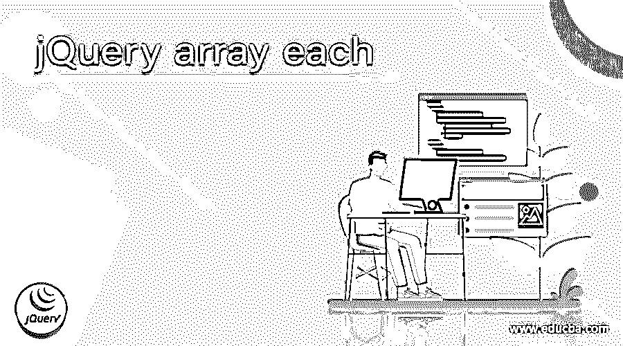
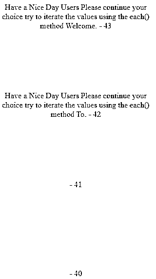
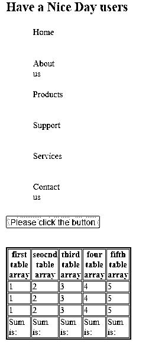
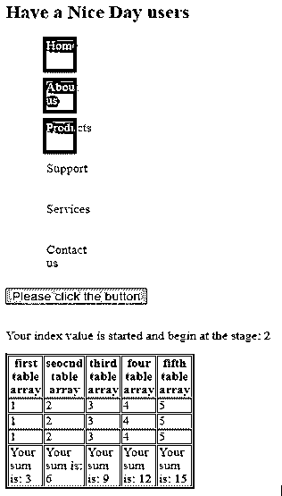

# jQuery 数组每个

> 原文：<https://www.educba.com/jquery-array-each/>




## jQuery 数组简介

jQuery array each 是可用于迭代值的函数之一，它还创建了与集合相关联的独立对象。它可以是数组，也可以是对象，如果是数组，回调函数会将相应的值传递给数组索引。每次参数值在相同的位置传递给元素时，each()也是一个通用迭代器函数，它计算基于数组的对象的索引长度，从 0 到-1 的范围开始。我们也可以使用回调函数来执行每种类型的值。

**语法:**

<small>网页开发、编程语言、软件测试&其他</small>

在 jQuery 数组中，each()是 jQuery 集合中的一个方法，用于迭代集合中匹配的元素。元素的索引将传递给当前索引，当前索引指向回调方法的参数。

```
<html>
<head>
<script src=" https://code.jquery.com/jquery-3.5.0.js"/>
</head>
<body>
<script>
var or let vars=["",""];
var or let vars1 = { };
jQuery.each(vars, function(variable, variable1) {
----some logics depends on the user requirement----
});
</script>
</body>
</html>
```

以上代码是在基于 web 的应用程序中使用 jQuery.each()方法的基本语法。

### jQuery 中每个方法如何工作？

JQuery 有一些默认的方法，可以在用户友好的环境中实现 UI 应用程序。基本上，在循环语句中使用 each()方法来迭代每一对的值。迭代器可以是任何类型，比如对象或数组，它们都是用长度属性项计算的，并且每一个都有独立的函数参数。它还返回了美元。用于存储和检索带有数组或对象的长度属性的数据的方法中的每个()函数都传递给脚本。它与使用 DOM 元素的 jQuery 对象结合使用，数组的迭代方式与我们前面提到的特定变量数组的迭代方式相同。所以包装的元素是现成的行为。我们不包括索引和值，它们只是与当前将要迭代的 DOM 元素相关的参数。有时 jQuery.each()方法对用户元素有一些延迟，我们也可以中断$。each()方法有时会在循环上迭代特定的时间，它使回调函数以返回值为布尔条件，如 true 或 false。如果条件为真，那么它会像循环语句中使用 continue 关键字声明的语句一样继续执行，我们可以继续执行该语句，它也会立即跳过该语句，进入下一次迭代。

#### 示例#1

**代码:**

```
<!DOCTYPE html>
<html>
<head>
<style>
div { color:green;
width: 342px;
height: 177px;
padding-top: 25px;
padding-left: 6px;
font-size: 18px;
text-align: center;
}
New { color:red;
width: 342px;
height: 377px;
padding-top: 25px;
padding-left: 6px;
font-size: 18px;
text-align: center;
background-color: green;
}
</style>
<script src="http://code.jquery.com/jquery-latest.js"></script>
</head>
<body>
<div id="Welcome"></div>
<div id="To"></div>
<div id="My"></div>
<div id="Domain"></div>
<div id="New"></div>
<script>
var vars = [ "Welcome", "To", "My", "Domain", "New" ];
var vars1 = { Welcome:43, To:42, My:41, Domain:40, New:35 };
jQuery.each(vars, function() {
$("#" + this).text("Have a Nice Day Users Please continue your choice try to iterate the values using the each() method " + this + ".");
return (this != "To");
});
jQuery.each(vars1, function(i, val) {
$("#" + i).append(document.createTextNode(" - " + val));
});
</script>
</body>
</html>
```

**输出:**




在上面的例子中，我们使用了 jQuery.each()方法，对堆栈中的每个元素使用了单独的索引。也就是在变量 var 或 let 关键字上声明的变量，我们也可以通过在 each()函数上使用 append()方法来追加文本。

#### 实施例 2

**代码:**

```
<!DOCTYPE html>
<html>
<head>
<title> Welcome To My Domain its a second example </title>
<script src="https://ajax.googleapis.com/ajax/libs/jquery/3.5.1/jquery.min.js"></script>
<style>
new{
text-align: center;
}
ul{
list-style-type: none;
float: center;
color:green;
}
li {
width: 34px;
height: 43px;
margin: 7px;
padding: 4px;
font-size: 16px;
float: center;
border: 3px blue;
color:green
}
button{
font-size: 16px;
}
</style>
</head>
<body>
<h2> Have a Nice Day users</h2>
<ul>
<li> Home </li>
<li> About us </li>
<li id = "first"> Products </li>
<li> Support </li>
<li> Services </li>
<li> Contact us </li>
</ul>
<button onclick = "demo()"> Please click the button </button> <br/><br/>
<p></p>
<script>
function demo() {
$(document).ready(function(){
$("li").each(function(index, valus) {
$(valus).css("background", "blue");
if ($(this).is("#first")) {
$("p").text("Your index value is started and begin at the stage: " + index ).css("fontSize", "16px");
return false;
}
});
});
$('table thead th').each(function(i) {
example(i);
});
}
function example(index) {
var tt = 0;
$('table tr').each(function() {
var vals = parseInt($('td', this).eq(index).text());
if (!isNaN(vals)) {
tt += vals;
}
});
$('table tfoot td').eq(index).text('Your sum is: ' + tt);
}
</script>
<table id="first" width="129" border="3">
<thead>
<tr>
<th>first table array</th>
<th>seocnd table array</th>
<th>third table array</th>
<th>four table array</th>
<th>fifth table array</th>
</tr>
</thead>
<tbody>
<tr>
<td>1</td>
<td>2</td>
<td>3</td>
<td>4</td>
<td>5</td>
</tr>
<tr>
<td>1</td>
<td>2</td>
<td>3</td>
<td>4</td>
<td>5</td>
</tr>
<tr>
<td>1</td>
<td>2</td>
<td>3</td>
<td>4</td>
<td>5</td>
</tr>
</tbody>
<tfoot>
<tr>
<td>Sum is:</td>
<td>Sum is:</td>
<td>Sum is:</td>
<td>Sum is:</td>
<td>Sum is:</td>
</tr>
</tfoot>
</table>
</body>
</html>
```

**输出:**




**点击按钮后:**




在第二个例子中，我们使用$开发了一些 UI 标签元素。当我们单击按钮时，each()方法开始突出显示元素的索引，直到脚本声明的结束索引。这里我们还使用了表格 HTML 元素来表示字符串，并以表格格式计算数组元素。

#### 实施例 3

**代码:**

```
<!DOCTYPE html>
<html>
<head>
<title> Welcome To My Domain it’s a third example </title>
<script src="https://ajax.googleapis.com/ajax/libs/jquery/3.5.1/jquery.min.js"></script>
<style>
</style>
</head>
<body>
<h2> Have a Nice Day users</h2>
<script>
var vars = {
"a": "A",
"b": "B",
"c":"C",
"d":"D",
"e":"E"
};
$.each( vars, function( index, vals ) {
alert( index + ": " + vals );
});
</script>
</body>
</html>
```

**输出:**


在最后一个例子中，我们使用了一个普通数组，在变量 vars 上声明了基于索引的元素。通过使用$。每个()方法我们都可以通过“index”和“vals”使用 alert()函数对结果进行预警。

### 结论

jQuery.each()方法是 web 应用中运用数组概念的一种有价值的方法。与其他方法相比，通过使用这种方法，我们可以缩短和减少线条的数量。它支持 javascript 库上使用的数组、集合和 util 包。

### 推荐文章

这是一个 jQuery 数组指南。这里我们讨论描述、语法、数组每个方法在 jQuery 中如何工作，以及代码实现的例子。您也可以看看以下文章，了解更多信息–

1.  [jQuery eq()](https://www.educba.com/jquery-eq/)
2.  [jquery internhtml](https://www.educba.com/jquery-innerhtml/)
3.  [jQuery next()](https://www.educba.com/jquery-next/)
4.  [jQuery 子选择器](https://www.educba.com/jquery-children-selector/)


