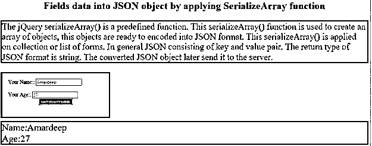
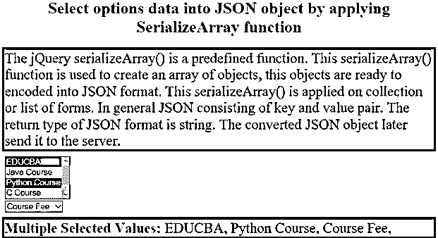
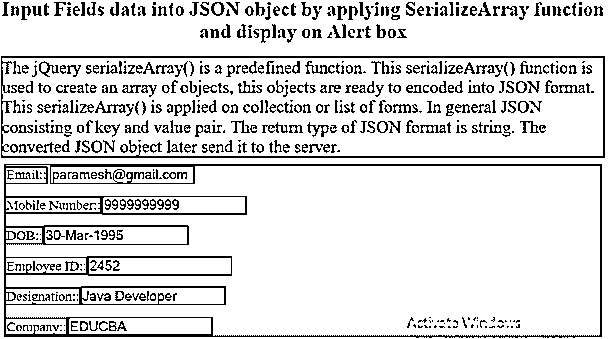
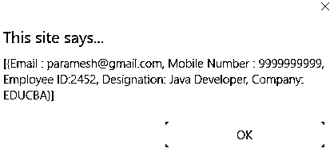

# jQuery serializeArray

> 原文：<https://www.educba.com/jquery-serializearray/>


## jQuery serializeArray 简介

jQuery serializeArray()是一个预定义的函数。这个 serializeArray()函数用来创建一个对象数组，这些对象准备好被编码成 JSON。此 serializeArray()应用于表单集合或列表。一般来说，JSON 由键和值对组成。JSON 格式的返回类型是字符串。转换后的 JSON 对象稍后会将其发送到服务器。

**实时示例:**如果客户端要求将数据收集到 JSON 中，那么我们可以使用 serializeArray()函数。

<small>网页开发、编程语言、软件测试&其他</small>

### jQuery 中 serializeArray()函数是如何工作的？

jQuery 正在处理一个列表、集合或数组值，通过应用 serializeArray()函数将它们转换成 JSON。

#### 语法#1

```
$(document).ready(function() {
$(selector).serializeArray();
//some code
}
```

**解释:** serializeArray()不接受函数的任何参数。serializeArray()函数返回 JSON 格式的对象字符串。

#### 语法# 2–JSON 格式

```
object=[
{"key:"value"},
{"key:"value"},
{"key:"value"},
.
.
.
.
]
```

#### 语法#3

要使 jQuery 应用程序发挥作用，我们必须在 html 页面中包含以下脚本

```
<script src="https://ajax.googleapis.com/ajax/libs/jquery/3.4.1/jquery.min.js">
</script>
```

**Note:** Include jQuery code inside html page by using <script> tag, within this script tag we can write jQuery code.

### 实现 serializeArray 的示例

以下是实现相同功能的示例:

#### 示例#1

对字段应用 serializeArray()函数的 JSON 数据。

**代码:**

```
<!DOCTYPE html>
<html>
<head>
<title>SerializeArray</title>
<script src="https://ajax.googleapis.com/ajax/libs/jquery/3.4.1/jquery.min.js"></script>
<style>
.fields {
border: 3px solid brown;
margin-bottom: 10px;
width: 300px;
height: 100px;
padding: 20px;
background:pink;
}
.button
{
text-align: center;
}
button
{
color:red;
background: blue;
}
.JsonData
{
color:green;
font-size:30px;
border: 3px solid brown;
margin-bottom: 10px;
}
label,input
{
color:red;
}
h1
{
color:green;
text-align:center;
}
p
{
color:blue;
font-size:28px;
border: 3px solid brown;
}
</style>
<script
src="https://ajax.googleapis.com/ajax/libs/jquery/3.3.1/jquery.min.js">
</script>
<!-- jQuery code to show the working of this method -->
<script>
$(document).ready(function() { //The ready() method event occurred when the document object model has loaded
$("button").click(function() { //The click() function responded when we click on Get JSON Data button
var serial = $("form").serializeArray(); //It serializes form data
$.each(serial, function(value, names) { //iterating values
$("#displayArea").append(names.name + ":" + names.value+"<br>"); //appending fields data to the specific area
});
});
});
</script>
</head>
<body>
<h1>Fields data into JSON object by applying SerializeArray function</h1>
<p>The jQuery serializeArray() is a predefined function. This serializeArray() function is used to create an array of objects, this objects are ready to encoded into JSON format. This serializeArray() is applied on collection or list of forms. In general JSON consisting of key and value pair. The return type of JSON format is string. The converted JSON object later send it to the server.</p>
<div class="fields">
<form action="#">
<label>Your Name::</label>
<input type="text" name="Name" value="Amardeep">
<br>
<br><label> Your Age:: </label>
<input type="text" name="Age" value="27">
<br>
</form>
<div class="button">
<button>Get JSON Data</button>
</div>
</div>
<div class="JsonData" id="displayArea"></div>
</body>
</html>
```

**输出:**




#### 实施例 2

对 select 选项应用 serializeArray()函数的 JSON 数据。

**代码:**

```
<!doctype html>
<html lang="en">
<head>
<meta charset="utf-8">
<script src="https://code.jquery.com/jquery-3.4.1.js"></script>
<title>SerializeArray</title>
<style>
body, select {
font-size: 16px;
}
form {
margin: 10px;
}
p {
color: green;
margin: 5px;
border:solid 5px brown;
font-size: 28px;
}
b {
color: red;
}
h1
{
text-align: center;
color:red;
}
</style>
</head>
<body>
<h1>Select options data into JSON object by applying SerializeArray function</h1>
<p>The jQuery serializeArray() is a predefined function. This serializeArray() function is used to create an array of objects, this objects are ready to encoded into JSON format. This serializeArray() is applied on collection or list of forms. In general JSON consisting of key and value pair. The return type of JSON format is string. The converted JSON object later send it to the server.</p>
<form>
<!--multiple selected values from form-->
<select name="multiple" multiple="multiple">
<option selected="selected">EDUCBA</option>
<option>Java Course</option>
<option selected="selected">Python Course</option>
<option>C Course</option>
<option >C# Course</option>
</select>
<br>
<!--single selected values from form-->
<select name="single">
<option>Course Fee</option>
<option>Hot Courses</option>
<option>Faculty</option>
<option>Login</option>
</select>
</form>
<p><b>Multiple Selected Values:</b> </p>
<script>
function getMyData() {//function for display values
var fields = $( ":input" ).serializeArray();//It serializes form data
jQuery.each( fields, function( value, names ) {//iterating values
$( "#multipleValues").append(names.value+ ", " );//appending fields data to the specific area
});
}
$( "select").change(getMyData);//displayy values if value chnages
getMyData();
</script>
</body>
</html>
```

**输出:**




#### 实施例 3

对字段应用 serializeArray()函数并显示在警告框上的 JSON 数据。

**代码:**

```
<!doctype html>
<html lang="en">
<head>
<meta charset="utf-8">
<script src="https://code.jquery.com/jquery-3.4.1.js"></script>
<title>SerializeArray</title>
<style>
form {
margin: 10px;
}
p {
color: maroon;
margin: 5px;
border:solid 2px red;
font-size: 28px;
}
h1
{
text-align: center;
color:blue;
}
label, input
{
color: navy;
font-size: 22px;
border: solid 2px green;
}
.inputData
{
border: solid 2px red;
}
</style>
</head>
<body>
<h1>Input Fields data into JSON object by applying SerializeArray function and display on Alert box</h1>
<p>The jQuery serializeArray() is a predefined function. This serializeArray() function is used to create an array of objects, this objects are ready to encoded into JSON format. This serializeArray() is applied on collection or list of forms. In general JSON consisting of key and value pair. The return type of JSON format is string. The converted JSON object later send it to the server.</p>
<form>
<form>
<div class="inputData">
<label>Email::</label>     <input type="text" name="email" value="paramesh@gmail.com"/><br><br>
<label>Mobile Number::</label><input type="text" name="mobile" value="9999999999"/><br><br>
<label>DOB::</label><input type="text" name="dob" value="30-Mar-1995"/><br><br>
<label>Employee ID::</label><input type="text" name="employee" value="2452"/><br><br>
<label>Designation::</label><input type="text" name="design" value="Java Developer"/><br><br>
<label>Company::</label><input type="text" name="company" value="EDUCBA"/>
</form>
</form>
</div>
<script>
var output = { };
$.each($('form').serializeArray(), function() {
output[this.name] = this.value;
});
alert("[{"+'Email : ' + output.email + ', Mobile Number : ' + output.mobile+', Employee ID:'+output.employee+', Designation: '+output.design+', Company: '+output.company+"}]");
</script>
</body>
</html>
```

**输出:**







### 结论

这个函数用于将列表或数组数据转换成 JSON 格式。我们还可以通过应用 serializeArray()函数将输入字段、选择选项、文本区域字段数据转换为 JSON 格式。

### 推荐文章

这是一个 jQuery serializeArray 的指南。这里我们讨论应用 serializeArray()函数，用适当的示例代码实现 jQuery serializeArray 的例子。您也可以浏览我们的其他相关文章，了解更多信息——

1.  [jQuery mouseout()](https://www.educba.com/jquery-mouseout/)
2.  [jQuery unwrap()](https://www.educba.com/jquery-unwrap/)
3.  [jQuery appendTo()](https://www.educba.com/jquery-appendto/)
4.  [jQuery 可排序](https://www.educba.com/jquery-sortable/)


