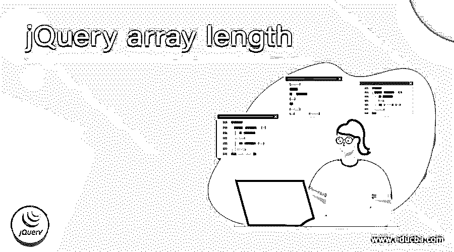
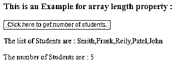
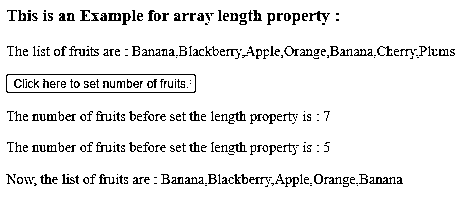

# jQuery 数组长度

> 原文：<https://www.educba.com/jquery-array-length/>




## jQuery 数组长度简介

jQuery 数组长度属性用于设置或返回给定数组中元素的数量。数组长度属性是 jQuery 中 array 对象的内置属性。jQuery size()函数也返回给定数组中元素的数量，但是数组长度属性比 size()函数更可取，因为它避免了调用该函数的开销。

**语法—**

<small>网页开发、编程语言、软件测试&其他</small>

返回数组长度的数组长度属性的语法–

```
array.length;
```

设置数组长度的数组长度属性的语法–

```
array.length = value;
```

哪里-

值–这是可选的。它指定要设置的数组对象的长度，应该是数字类型。

返回值–

该属性的返回值是数组中元素的个数。

### 工作

JQuery 数组长度属性设置或返回数组的长度。假设我们有一个数字数组“no = [ 51，20，64，89，45，25 ]”，现在我们需要得到一个 no 数组的长度。所以我们可以使用数组长度属性作为“var len = no.length”，其中 len 是一个变量，存储 length 属性的返回结果，即 6。

### jQuery 数组长度属性的示例

获取给定数组中学生姓名数量的数组长度属性示例

#### 示例#1

**代码:**

```
<!doctype html>
<html lang = "en">
<head>
<meta charset = "utf-8">
<script src = "https://code.jquery.com/jquery-3.5.0.js"></script>
<title> This is an example for jQuery array length property </title>
<style>
#p1 {
color : blue;
}
#p2 {
color : red;
}
</style>
</head>
<body>
<h3> This is an Example for array length property : </h3>
<button onclick = "checkRes()" > Click here to get number of students. </button>
<p id = "p1"> </p>
<p id = "p2"> </p>
<script>
var Student = [ "Smith", "Frank", "Reily", "Patel", "John" ];
function checkRes()
{
$( "#p1" ).text( "The list of Students are : " + Student );
var res = Student.length;
$( "#p2" ).text("The number of Students are : " + res);
}
</script>
</body>
</html>
```

上述代码的输出是–


一旦我们点击按钮，输出是




在上面的代码中，创建了包含学生姓名的数组。接下来，使用数组长度属性来获取学生数组中的姓名数量，如“Student.length”长度属性返回数字 5，这是学生数组的长度，正如我们在上面的输出中看到的。

为给定数组设置水果名称数量的数组长度属性示例

#### 实施例 2

**代码:**

```
<!doctype html>
<html lang = "en">
<head>
<meta charset = "utf-8">
<script src = "https://code.jquery.com/jquery-3.5.0.js"></script>
<title> This is an example for jQuery array length property </title>
<style>
#p1 {
color : blue;
}
#p2 {
color : red;
}
#p3 {
color : green;
}
</style>
</head>
<body>
<h3> This is an Example for array length property : </h3>
<p id = "p1"> </p>
<button onclick = "checkRes()" > Click here to set number of fruits. </button>
<p id = "p2"> </p>
<p id = "p3"> </p>
<p id = "p4"> </p>
<script>
var fruits = [ "Banana", "Blackberry", "Apple", "Orange", "Banana", "Cherry", "Plums" ];
$( "#p1" ).text( "The list of fruits are : " + fruits);
function checkRes()
{
$( "#p2" ).text( "The number of fruits before set the length property is : " + fruits.length );
fruits.length = 5;
$( "#p3" ).text( "The number of fruits before set the length property is : " + fruits.length);
$( "#p4" ).text( "Now, the list of fruits are : " + fruits);
}
</script>
</body>
</html>
```

上述代码的输出是


一旦我们点击按钮，输出是




在上面的代码中，创建了包含水果名称的数组。接下来，使用数组长度属性将水果数组中出现的名称数量设置为“fruits . length = 5；”，length 属性设置长度为 5 并删除剩余的元素，正如我们在上面的输出中看到的。

迭代给定数组的所有元素的数组长度属性示例

#### 实施例 3

**代码:**

```
<!doctype html>
<html lang = "en">
<head>
<meta charset = "utf-8">
<script src = "https://code.jquery.com/jquery-3.5.0.js"></script>
<title> This is an example for jQuery array length property </title>
<style>
#p1 {
color : blue;
}
</style>
</head>
<body>
<h3> The Example for array length property : </h3>
<p id = "p1" > </p>
<button onclick = "checkRes()" style = "background-color : green" > Click here to get all subjects. </button>
<script>
var arr = new Array( "JavaScript", "CSS", "Java", "jQuery");
$( "#p1" ).text( "The list of subjects are : " + arr);
function checkRes()
{
for ( i = 0; i < arr.length; i++ )
{
document.write( arr[i] + "<br>" );
}
}
</script>
</body>
</html>
```

上述代码的输出是


一旦我们点击按钮，输出是


在上面的代码中，创建了包含主题名称的数组。接下来，使用 array length 属性获取主题数组中存在的元素数量，以逐个迭代数组元素，直到数组的长度，正如我们在上面的输出中看到的。

### 结论

jQuery 数组长度属性是一个预定义的属性，用于设置或获取给定数组中元素的数量。

### 推荐文章

这是 jQuery 数组长度的指南。在这里，我们将讨论 JQuery 数组长度属性的工作方式，以及示例和输出。您也可以看看以下文章，了解更多信息–

1.  [jQuery 移动元素](https://www.educba.com/jquery-move-element/)
2.  [jQuery 内容](https://www.educba.com/jquery-contents/)
3.  [jQuery map()](https://www.educba.com/jquery-map/)
4.  [jQuery 窗口](https://www.educba.com/jquery-window/)


