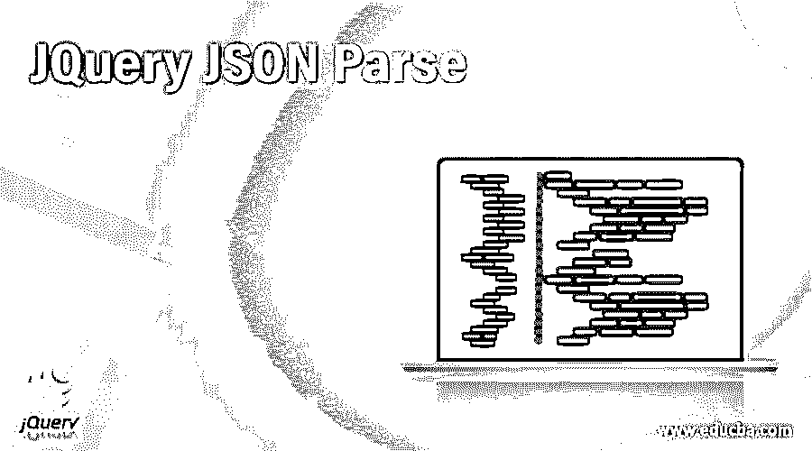
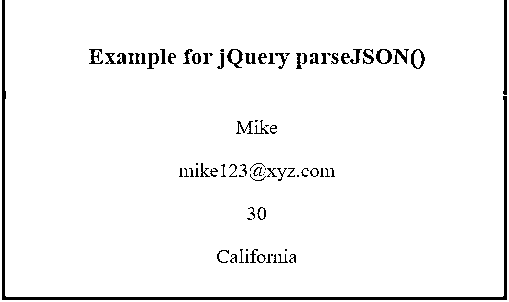
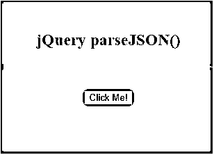
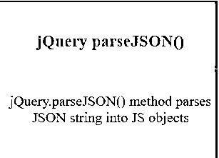
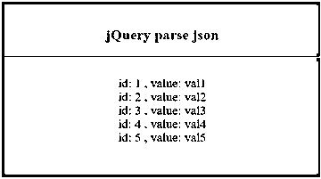
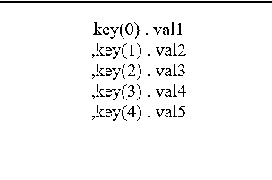

# JQuery JSON 解析

> 原文：<https://www.educba.com/jquery-json-parse/>




## JQuery JSON 解析简介

jQuery.parseJSON()方法用于实现 jQuery 中 JSON 字符串的解析。该方法获取一个结构良好的 JSON 字符串，并对其进行转换以返回一个结果 JavaScript 对象。由于 JSON 通常用于在客户机和服务器之间交换数据，并且从服务器接收的数据总是字符串，因此需要将字符串转换成 JSON 数据。这可以通过 jQuery.parseJSON()方法实现。这个 jQuery 方法在内部使用 JavaScript JSON.parse()方法。这种方法的简写是$。parseJSON()。

**语法**

<small>网页开发、编程语言、软件测试&其他</small>

```
jQuery.parseJSON(json)
```

其中 json 是指要解析的 JSON 字符串。

上面的签名在解析一个结构良好的 JSON 字符串后返回一个 JavaScript 对象。

### JQuery JSON 解析是如何工作的？

*   使用 parseJSON()方法的基本目的是将 JSON 字符串转换成相应的 JavaScript 对象。
*   JSON 是一种用于在服务器和客户机(浏览器)之间存储和交换数据的格式。
*   服务器和客户端之间的通信只能通过文本或字符串进行。
*   JSON 是一个字符串，可以通过在发送到服务器之前将 JavaScript 对象转换成 JSON 来形成。
*   类似地，从服务器接收的任何 JSON 也可以使用 parseJSON()方法转换成相应的 JavaScript 对象。
*   如果 JSON 字符串在传递给 parseJSON()方法之前格式不正确，浏览器会抛出异常。

例如，**，** {val: 1}周围没有双引号

{'val': 1}用单引号括起来，而不是双引号

由于这些字符串不是正确的 JSON 格式，jQuery.parseJSON()方法在解析它们时会抛出一个异常。

*   如果将 null、undefined 或空字符串传递给 parseJSON()方法，它将返回 null 值。

### JQuery JSON 解析示例

让我们通过几个例子来理解 jQuery.parseJSON()方法的实现

#### 示例#1

这个例子演示了 jQuery.parseJSON()方法的简单用法。

**代码:**

```
<html>
<head>
<script src="https://code.jquery.com/jquery-1.12.4.js"></script>
<script>
$(document).ready(function () {
var jsonStr =
'{"firstName":"Mike","emailId":"mike123@xyz.com", "age":30, "city":"California"}';
var obj = $.parseJSON(jsonStr);
document.getElementById("name").innerHTML = obj.firstName;
document.getElementById("email").innerHTML = obj.emailId;
document.getElementById("age").innerHTML = obj.age;
document.getElementById("city").innerHTML = obj.city;
});
</script>
<style>
#divstyle {
width: 500px;
height: 280px;
padding-top: 20px;
padding-left: 5px;
font-size: 20px;
text-align: center;
color: maroon;
background-color: cadetblue;
}
</style>
</head>
<body>
<div id="divstyle">
<h3 style="color: black;">Example for jQuery parseJSON()</h3>
<hr />
<p id="name">First name of the person</p>
<p id="email">Email Id of the person</p>
<p id="age">Age of the person</p>
<p id="city">City of residence</p>
</div>
</body>
</html>
```

**输出:**

*   一旦上面的代码被执行，下面的屏幕显示。




*   在这个例子中，一旦页面被加载，JSON 字符串 jsonStr 就使用$。parseJSON(jsonStr)方法转换为基本上是一个对象的变量 obj。
*   我们在页面上看到显示了用 JSON 数据创建的对象的属性。

#### 实施例 2

这个例子是如何使用 jQuery.parseJSON()方法从 JSON 数据创建一个解析的 JS 对象的另一个演示。

**代码:**

```
<html>
<head>
<script src="https://code.jquery.com/jquery-1.12.4.js"></script>
<script>
$(function(){
$('#btn').one('click', function(){
var obj = jQuery.parseJSON('{"text1":"jQuery.parseJSON() method ","text2":"parses JSON string into JS objects"}');
$('#divstyle').append(obj.text1 + obj.text2);
$("#btn").hide();
});
});
</script>
<style>
#divstyle {
width: 300px;
height: 200px;
padding-top: 20px;
padding-left: 5px;
font-size: 20px;
text-align: center;
color: maroon;
background-color: cadetblue;
}
</style>
<body>
<div id="divstyle">
<h3 style="color: black;"> jQuery parseJSON()</h3><hr>
<center>
<br>
<button id ="btn">Click Me!</button>
</center>
</div>
</body>
</html>
```

**输出:**

*   一旦上面的代码被执行，下面的屏幕显示。




*   格式良好的 JSON 数据被解析成一个变量 obj，它基本上是一个单击按钮时的对象。
*   页面上显示的文本基本上是由解析后的 JSON 数据创建的对象的属性组成的。




#### 实施例 3

以下示例说明了 jQuery.parseJSON()方法如何处理来自 jQuery ajax 调用的 JSON 响应。

**代码:**

```
<html>
<head>
<script src="https://code.jquery.com/jquery-1.12.4.js"></script>
<script>
$(document).ready(function () {
$.ajax({
url: "json_demo.txt",
dataType: "text",
success: function (data) {
var json = $.parseJSON(data);
for (var i = 0; i < json.length; ++i) {
$("#divstyle").append(
'<div class="name">' +
"id: " +
json[i].id +
" , " +
"value: " +
json[i].name +
"</>"
);
}
},
});
});
</script>
<style>
#divstyle {
width: 500px;
height: 280px;
padding-top: 20px;
padding-left: 5px;
font-size: 20px;
text-align: center;
color: maroon;
background-color: cadetblue;
}
</style>
</head>
<body>
<div id="divstyle">
<h3 style="color: black;">jQuery parse json</h3>
<hr />
<br />
</div>
</body>
</html>
```

**输出:**

*   一旦上面的代码被执行，下面的屏幕显示。
*   在这个例子中，我们试图使用 jQuery.ajax 调用来获取 JSON 数据。
*   我们使用了一个文本文件 txt，从该文件中获取 JSON 数据并解析成一个包含 JSON 格式数据的对象。
*   我们显示解析后的 JSON 数据中的项目，如下图所示。




#### 实施例 4

下面的例子说明了如何从解析的 JSON 数据中获取并显示键值对。

**代码:**

```
<html>
<head>
<script src="https://code.jquery.com/jquery-1.12.4.js"></script>
<script>
$(document).ready(function () {
var j =
'[{"id":"1","name":"val1"},{"id":"2","name":"val2"},{"id":"3","name":"val3"},{"id":"4","name":"val4"},{"id":"5","name":"val5"}]';
var json = $.parseJSON(j);
var obj = document.getElementById("divstyle");
var json_arr = [];
$.each(json, function (key, value) {
json_arr.push("key" + "(" + key + ")" + " . " + value.name + "<br>");
});
obj.innerHTML = json_arr;
});
</script>
<style>
#divstyle {
width: 300px;
height: 180px;
padding-top: 20px;
padding-left: 5px;
font-size: 20px;
text-align: center;
color: maroon;
background-color: cadetblue;
}
</style>
</head>
<body>
<div id="divstyle">
<h3 style="color: black;">Example for jQuery parseJSON()</h3>
<hr />
</div>
</body>
</html>
```

**输出:**

*   一旦上面的代码被执行，下面的屏幕显示。
*   本例中的**、** $。因为 jSON 对象总是以键/值对的形式出现，所以每一个都用于遍历解析后的 JSON 数据并获得键-值对。
*   如下所示，每个键/值对由逗号分隔。




### 结论

在本文中，我们讨论了使用 parseJSON()方法解析 JSON 数据。parseJSON()方法将给定的结构良好的 JSON 字符串转换成 JSON 格式的 JavaScript 对象。如果传递的 JSON 字符串格式不正确，该方法将引发异常。

### 推荐文章

这是一个 JQuery JSON 解析的指南。这里我们讨论 JQuery JSON 如何解析作品和例子，以及代码和输出。您也可以看看以下文章，了解更多信息–

1.  [jQuery 可见](https://www.educba.com/jquery-is-visible/)
2.  [JSON 解析数组](https://www.educba.com/json-parse-array/)
3.  [jQuery 可见](https://www.educba.com/jquery-is-visible/)
4.  [JSON 蛮](https://www.educba.com/json-pretty/)


