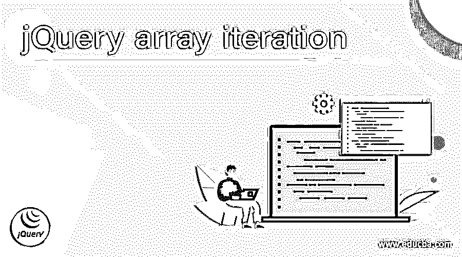
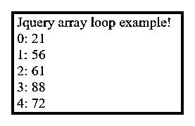

# jQuery 数组迭代

> 原文：<https://www.educba.com/jquery-array-iteration/>




## jQuery 数组迭代简介

jquery 数组迭代是用于连续操作相似类型数据的过程，用户得到输出。数组迭代是用于重复操作或过程以获得所需结果的函数。数组迭代是操作同一类型数据序列的循环过程。数组迭代是对数组列表或数据集进行重复和类似的编码过程。jquery 数组迭代是将相同代码迭代所需次数的方法。数组迭代用于减少编程算法长度和处理数组列表。

**语法**

<small>网页开发、编程语言、软件测试&其他</small>

使用“for”循环语法如下。

```
var array_var = [ elements of the array…  ];
for( condition of the array element … ) {
coding for jquery array iteration…
}
```

*   “for 循环”是用于 jquery 数组的基本迭代的函数。

使用“for–in”循环语法的数组迭代如下。

```
var array_var = [ elements of the array…  ];
for(var data in array_var) {
coding and for jquery array iteration using array_var[data]…
}
```

*   “for–in”循环是用于 jquery 数组的简单迭代的函数。
*   “for–in”循环不需要条件来迭代和操作数组元素。

使用“each”方法语法的数组迭代如下。

```
$.each(jquery array object, jquery callback function);
```

*   “$”符号代表定义 jquery 和访问 Jquery。
*   “each()”方法表示以循环格式操作 jquery 数组迭代。
*   “jquery array”用于显示每个()方法中的数组值或数组对象。
*   “jquery 回调函数”用于 each()方法中的数组索引和数组值。

下面是使用“map”方法语法的数组迭代。

```
$.map(jquery array or object, jquery callback function);
```

*   “map()”方法用于操作数组迭代。
*   “jquery 数组”用于显示 map()方法中的数组值或数组对象。
*   “jquery 回调函数”用于 map()方法中的数组索引和数组值。

### jquery 中如何进行数组迭代？

要向左滚动 jquery，用户可以下载 jquery 库或使用 jquery CDN 版本链接。

*   从 jquery.com 下载 jquery 的开发版本或产品版本。
*   jquery 最新版本放在 html 页面中。jquery 链接在下面。

```
<script src = "https://ajax.googleapis.com/ajax/libs/jquery/3.5.1/jquery.min.js">
</script>
```

HTML 页面是用文件名和。html 扩展。

*   例如:jqueryarrayloop.html

源代码中使用的数组迭代语法。

*   为数组迭代操作创建一个变量。

```
var jq_Addition = 0;
```

*   通过初始化数组值来创建 jquery 数组变量。

```
var array_var = [ 9, 5, 3, 7, 8 ];
```

*   “for–in”循环对于数组迭代非常有用。

```
for(var data in array_var){write required source code for iteration…}
```

*   为迭代编写添加的源代码。

```
Jq_Addition += array_var[ data ];
```

*   返回所需的输出。

```
document.write("jquery array iteration for Addition: " +jq_Addition);
```

结合数组迭代的程序。

```
<!DOCTYPE html>
<html>
<head>
<script src="https://ajax.googleapis.com/ajax/libs/jquery/3.5.1/jquery.min.js"></script>
<script>
$(document).ready(function(){
var jq_Addition = 0;
var array_itr = [2, 5, 6, 3, 8, 9];
for(var data in array_itr){
jq_Addition += array_itr[ data ];
}
document.write("jquery array iteration for Addition: " +jq_Addition);
});
</script>
</head>
<body>
</body>
</html>
```

### 例子

下面是下面提到的例子

#### 示例#1

下面是使用“for”循环的例子和输出。

**代码:**

```
<!DOCTYPE html>
<html>
<head>
<script src="https://ajax.googleapis.com/ajax/libs/jquery/3.5.1/jquery.min.js"></script>
<script>
$(document).ready(function(){
var jq_Addition = 0;
var array_itr = [2, 5, 6, 3, 8, 9];
for ( var i = 0, l = array_itr.length; i < l; i++ ) {
jq_Addition += array_itr[ i ];
}
document.write("jquery array iteration for Addition: " +jq_Addition);
});
</script>
</head>
<body>
</body>
</html>
```

**输出:**


#### 实施例 2

下面是使用“for–in”循环示例和输出的数组迭代。

**代码:**

```
<!DOCTYPE html>
<html>
<head>
<script src="https://ajax.googleapis.com/ajax/libs/jquery/3.5.1/jquery.min.js"></script>
<script>
$(document).ready(function(){
var jq_Addition = 0;
var array_itr = [2, 5, 6, 3, 8, 9];
for ( var data in array_itr ) {
jq_Addition += array_itr[ data ];
}
document.write("jquery array iteration for Addition: " +jq_Addition);
});
</script>
</head>
<body>
</body>
</html>
```

**输出:**


#### 实施例 3

下面是使用“each”方法的数组迭代示例和输出。

**代码:**

```
<!DOCTYPE html>
<html>
<head>
<script src="https://ajax.googleapis.com/ajax/libs/jquery/3.5.1/jquery.min.js"></script>
<script>
document.write( "Jquery array loop example! <br/>" );
$.each ( [21, 56, 61, 88, 72], function( ind, valu ) {
document.write( ind + ": " + valu+ "<br/>" );
});
</script>
</head>
<body>
</body>
</html>
```

**输出:**




#### 实施例 4

下面是使用“map”方法的数组迭代示例和输出。

**代码:**

```
<!DOCTYPE html>
<html lang="en">
<head>
<script src="https://ajax.googleapis.com/ajax/libs/jquery/3.5.1/jquery.min.js"></script>
</head>
<body>

<script>
var itr_var = document.getElementById('write');
var jq_itr_arr = [2, 5, 6, 3, 8, 9];
var jqry_Arr = $.map(jq_itr_arr, function(vals, inde) {
return {
Addition: (vals-1) + vals
};
})
itr_var.innerHTML = JSON.stringify(jqry_Arr);
</script>
</body>
</html>
```

**输出:**


#### 实施例 5

下面是使用“for–in”循环示例和输出的 jquery 字符串数组迭代。

**代码:**

```
<!DOCTYPE html>
<html>
<head>
<script src="https://ajax.googleapis.com/ajax/libs/jquery/3.5.1/jquery.min.js"></script>
<script>
$(document).ready(function(){
var jq_Addition = "";
var array_itr = ["i", "am", "good", "with", "learning", "."];
for ( var data in array_itr ) {
document.write(array_itr[ data ]);
}
});
</script>
</head>
<body>
</body>
</html>
```

**输出:**


### 结论

*   jquery 数组迭代有助于减少源代码大小并节省内存。
*   数组迭代有助于为用户和开发人员处理大量数据。
*   相似类型的数据收集很容易通过数组迭代来处理和操作。

### 推荐文章

这是一个 jQuery 数组迭代的指南。这里我们讨论如何在 jquery 中执行数组迭代，并给出例子和输出。您也可以看看以下文章，了解更多信息–

1.  [jQuery eq()](https://www.educba.com/jquery-eq/)
2.  [jQuery 延期](https://www.educba.com/jquery-deferred/)
3.  [jQuery 替换](https://www.educba.com/jquery-replace/)
4.  [jQuery 偏移底部](https://www.educba.com/jquery-offset-bottom/)


