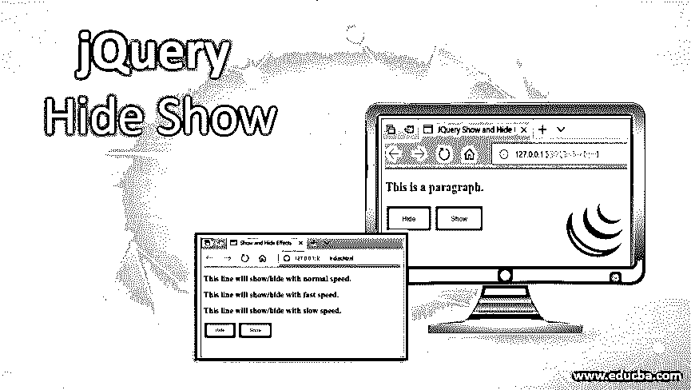
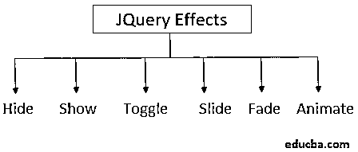
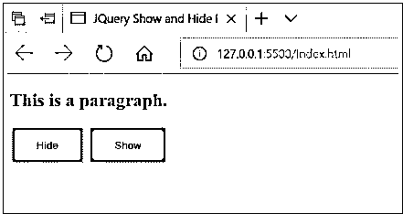
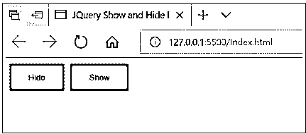
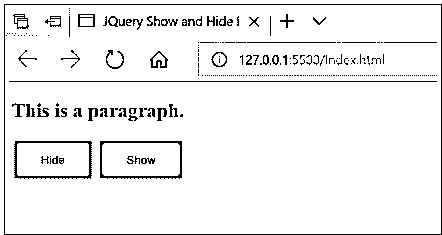
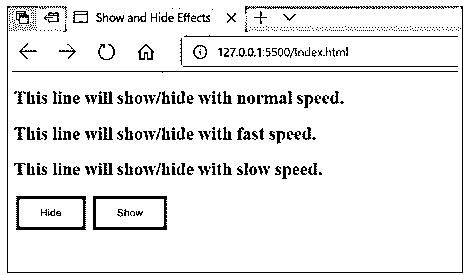
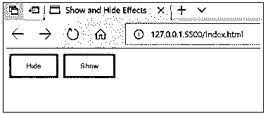
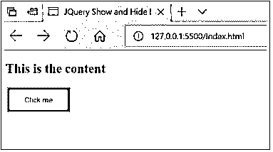
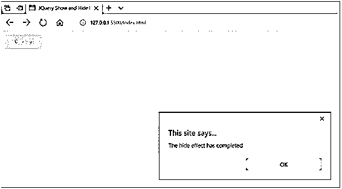

# jQuery 隐藏显示

> 原文：<https://www.educba.com/jquery-hide-show/>




## jQuery 隐藏显示简介

jQuery 是一个紧凑、轻量级和[跨平台的 Javascript 库](https://www.educba.com/what-is-javascript/)，它能够让你的 web 应用程序更有吸引力和交互性。创建 jQuery 的基本目标是“写得更少，做得更多”。jQuery 有很多值得探索的地方。jQuery 之所以如此特别，是因为它非常容易使用，而且它的各种效果给了你丰富的 web 体验。




<small>网页开发、编程语言、软件测试&其他</small>

在这里，我们将讨论两个有趣的 jQuery 效果，隐藏和显示效果。

### 什么是 jQuery 隐藏显示？

使用 jquery，您可以使用 hide()和 show()方法显示和隐藏 HTML 元素。

*   方法通过简单地设置内联样式 display: none 来隐藏选中的 HTML 元素。
*   **show()** 方法通过将显示属性恢复到内联样式显示之前的初始样式来显示所选元素:没有应用到它们。

**语法:**

```
$(selector).show();
$(selector).show(speed,callback);
$(selector).hide();
$(selector).hide(speed,callback);
```

*   **速度** **:** 可选参数，使用值:“慢”、“快”或“毫秒”指定显示和隐藏的速度。
*   **callback:** 还是可选参数，指定 hide()或 show()方法完成后要执行的函数。

### 实现 jQuery hide()和 show()的示例

让我们看一个例子来更好地理解 hide()和 show()方法。

**代码:**

```
<!DOCTYPE html>
<html lang="en">
<head>
<meta charset="UTF-8" />
<meta name="viewport" content="width=device-width, initial-scale=1.0" />
<meta http-equiv="X-UA-Compatible" content="ie=edge" />
<meta charset="utf-8" />
<title>JQuery Show and Hide Effects</title>
<script src="https://code.jquery.com/jquery-1.12.4.min.js"></script>
<style>  .button {   background-color: #F08080;   border: none;   padding: 15px 32px;   text-align: center;   text-decoration: none;   display: inline-block;   font-size: 14px;   margin: 2px 3px;   cursor: pointer;
}
</style>
</style>
<script>
$(document).ready(function() {
// Showing hidden paragraphs
$("#show").click(function() {
$("h2").show();
});
// Hiding displayed paragraphs
$("#hide").click(function() {
$("h2").hide();
});
});
</script>
</head>
<body>
<h2>This is a paragraph.</h2>
<button class ="button" id="hide">Hide</button>
<button class="button"  id="show">Show</button>
</body>
</html>
```

**输出:**

运行上述代码后，浏览器显示以下屏幕。

*   点击隐藏按钮“这是一个段落”的内容被隐藏。
*   当单击“显示”按钮时，隐藏的再次显示。
*   jQuery hide()和 show()方法隐藏了[选中的 html 元素](https://www.educba.com/html-form-elements/)。在上面的示例中，选定的 h2 元素是隐藏的。
*   id，“隐藏”和“显示”被分配给两个按钮隐藏和显示，然后在这些 id 上调用 click 函数。

下面的屏幕显示了最初加载页面时没有触发点击事件。




单击隐藏按钮时，会出现以下屏幕。




单击“显示”按钮时，隐藏的内容会出现在屏幕上。




为了让你的网页更吸引人，你可以指定速度参数，该参数可以根据指定的延迟时间来隐藏和显示动画。

#### 示例 1–使用速度参数

因为 speed 参数是可选的，如果你想在你的 web 应用程序中获得更多丰富的动画体验，你完全可以使用这个参数。

速度参数可以采用以下值:

*   慢的
*   快速的
*   毫秒

**注**:

*   对于毫秒，较高的值表示较慢的动画效果。
*   对于“快”速度，持续时间是指 200 毫秒。
*   对于“慢”速度，持续时间是指 600 毫秒。

我们通过一个简单的例子来理解这一点。

**代码:**

```
<!DOCTYPE html>
<html lang="en">
<head>
<meta charset="UTF-8" />
<meta name="viewport" content="width=device-width, initial-scale=1.0" />
<meta http-equiv="X-UA-Compatible" content="ie=edge" />
<meta charset="utf-8" />
<title>Show and Hide Effects</title>
<script src="https://code.jquery.com/jquery-1.12.4.min.js"></script>
<style>      .button {       background-color: #F08080;       border: none;       padding: 15px 32px;       text-align: center;       text-decoration: none;       display: inline-block;       font-size: 14px;       margin: 2px 3px;       cursor: pointer;
}
</style>
</style>
<script>
// Hiding the displayed paragraphs with different speeds
$(document).ready(function() {
$("#hide").click(function() {
$("h2.normal").hide();
$("h2.fast").hide("fast");
$("h2.slow").hide("slow");
});
// Showing the hidden paragraphs with different speeds
$("#show").click(function() {
$("h2.normal").show();
$("h2.fast").show("fast");
$("h2.slow").show("slow");       });
});
</script>
</head>
<body>
<h2 class="normal">This line will show/hide with normal speed.</h2>
<h2 class="fast">This line will show/hide with fast speed.</h2>
<h2 class="slow">This line will show/hide with slow speed.</h2>
<button class="button" id="hide">Hide </button>
<button class="button" id="show">Show </button>
</body>
</html>
```

**输出:**

运行上述代码时，浏览器上显示的输出如下:







*   点击**隐藏**按钮，线条将按照指定的速度值开始消失。
*   当您点击“**显示**按钮时，线条将开始按照指定值显示。

#### 示例 2–使用回调函数

*   回调函数仅在 hide()和 show()完全执行后执行。
*   由于 JavaScript 行是逐行执行的，但是由于 jQuery 影响的时间，下一行代码甚至可能在代码完成之前就被执行了。这可能会导致错误。
*   回调函数有助于防止这种错误。
*   它作为参数传递给 effect 方法。
*   它是传递给 effect 方法的最后一个参数。

让我们考虑下面的例子:

**代码:**

```
<!DOCTYPE html>
<html lang="en">
<head>
<meta charset="UTF-8" />
<meta name="viewport" content="width=device-width, initial-scale=1.0" />
<meta http-equiv="X-UA-Compatible" content="ie=edge" />
<meta charset="utf-8" />
<title>JQuery Show and Hide Effects</title>
<script src="https://code.jquery.com/jquery-1.12.4.min.js"></script>
<style> .button { background-color: #f08080; border: none; padding: 15px 32px; text-align: center; text-decoration: none; display: inline-block;
font-size: 14px; margin: 2px 3px; cursor: pointer;
}
</style>
<script>
$(document).ready(function() {
//Displaying alert message after the hide effect is completed.
$("button").click(function() { $("h2").hide("slow", function() {
alert("The hide effect has completed");
});
});
});
</script>
</head>
<body>
<h2>This is the content</h2>
<button class="button">Click me</button>
</body>
</html>
```

**输出:**







在上面的例子中，回调参数是一个只有在 hide()方法完成后才会执行的函数。

*   一旦点击了“点击我”按钮，内容就会被隐藏。
*   只有在“隐藏”效果完成后，回调函数(基本上是一个警告函数)才会被执行。

### 结论

*   在本文中，我们讨论了如何使用 jQuery hide()和 show()方法在 web 页面触发 click 事件后隐藏和显示页面元素。
*   JQuery effects 可以用非常简单容易的方式提供各种令人惊叹的动画。
*   它有能力通过其丰富的功能来丰富人们的网络体验。
*   jQuery 提供了更多这样的效果，使您的 web 应用程序更加吸引人。

### 推荐文章

这是一个 jQuery 隐藏显示的指南。这里我们讨论如何使用 jQuery hide()和 s how()方法，以及不同的示例和代码实现。您也可以阅读以下文章，了解更多信息——

1.  [jQuery append()](https://www.educba.com/jquery-append/)
2.  [jQuery toggleClass()](https://www.educba.com/jquery-toggleclass/)
3.  [jQuery hide()](https://www.educba.com/jquery-hide/)
4.  [jQuery UI 对话框](https://www.educba.com/jquery-ui-dialog/)


