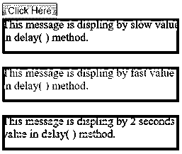

# jQuery 延迟()

> 原文：<https://www.educba.com/jquery-delay/>


## jQuery 延迟概述()

JQuery delay()是 javascript 中一个预定义的方法，用于定义和设置一个定时器值，以便在设定的时间段后执行即将到来的代码。此函数的语法是'($selector)。delay (speed.name)，其中 speed.name 表示延迟值，name 是一个可选参数，用于在执行队列中命名此函数。这个函数在许多基于 web 的应用程序开发编程语言中都可用，来自 javascript 的 jQuery 扩展为用户提供了类似 delay()函数的选项。

**语法:**

<small>网页开发、编程语言、软件测试&其他</small>

```
($selector).delay(speed, Name)
```

其中使用了两个参数，解释如下:

*   **速度参数:**速度是可选参数，用于指定延迟速度。速度值可以作为一个以毫秒为单位的整数或者其他两个慢和快的值来传递。
*   **Name 参数:** Name 也是可选参数，用于指定队列名称。标准队列效果“fx”是 name 参数的默认值。

### jQuery 延迟()的示例

有不同类型的延迟()下面列出了不同条件下的示例:

#### 示例#1

在这里，我们使用带有整数值的 delay()方法。接下来，我们通过下面的例子编写 [HTML 代码](https://www.educba.com/what-is-html/)来更清楚地理解 jQuery delay()的效果。

**代码:**

```
<!DOCTYPE html>
<html>
<head>
<script src="https://ajax.googleapis.com/ajax/libs/jquery/1.11.3/jquery.min.js"></script>
<script>
$(document).ready(function(){
$("#btn").click(function(){
$("#dv1").delay(4000).fadeIn();
});
});
</script>
</head>
<body>
<button id="btn" > Click Here </button> <br>
<div id="dv1" style="width:250px; height:50px; display:none; background-color:red;">
This message is display in 4 seconds </div> <br>
</body>
</html>
```

**输出:**

上述代码的输出是-


单击“单击此处”按钮后，输出如下


在上面的代码中，delay()方法传递 4000，也就是 4 秒钟，所以带有文本的红框在 4 秒钟后显示，因为对 div 标签应用了 delay()方法。

在上面的代码中，fadeIn()方法也使用了。fadeIn()方法的用途是将所选元素的不透明度逐渐从隐藏变为可见，作为渐变效果。fadeIn()方法可选地接受三个参数，但是在上面的代码中，我们没有传递任何参数。

#### 实施例 2

这里我们使用 delay()方法和“慢”值。下一个示例代码中，slow 值被传递给 jQuery delay()方法，如下所示。

**代码:**

```
<!DOCTYPE html>
<html>
<head>
<script src="https://ajax.googleapis.com/ajax/libs/jquery/1.11.3/jquery.min.js"></script>
<script>
$(document).ready(function(){
$("#btn").click(function(){
$("#dv1").delay("slow").fadeIn();
});
});
</script>
</head>
<body>
<button id="btn" > Click Here </button> <br>
<div id="dv1" style="width:250px; height:50px; display:none; background-color:red;">
This message is displing by slow value in delay() method.</div> <br>
</body>
</html>
```

**输出:**

上述代码的输出是-


单击“单击此处”按钮后，输出如下


#### 实施例 3

这里我们使用带有“快速”值的 jQuery delay()方法。下一个示例代码中，slow 值被传递给 jQuery delay()方法，如下所示。

**代码:**

```
<!DOCTYPE html>
<html>
<head>
<script src="https://ajax.googleapis.com/ajax/libs/jquery/1.11.3/jquery.min.js"></script>
<script>
$(document).ready(function(){
$("#btn").click(function(){
$("#dv1").delay("fast").fadeIn();
});
});
</script>
</head>
<body>
<button id="btn" > Click Here </button> <br>
<div id="dv1" style="width:250px; height:50px; display:none; background-color:red;">
This message is displing by fast value in delay() method.</div> <br>
</body>
</html>
```

**输出:**

上述代码的输出是-


单击“单击此处”按钮后，输出如下


#### 实施例 4

具有不同值的 jQuery delay()方法示例。接下来，我们编写 jQuery delay()效果示例的 HTML 代码，其中我们使用了所有三个值 slow、fast 和毫秒。

**代码:**

```
<!DOCTYPE html>
<html>
<head>
<script src="https://ajax.googleapis.com/ajax/libs/jquery/1.11.3/jquery.min.js"></script>
<script>
$(document).ready(function(){
$("#btn").click(function(){
$("#dv1").delay("slow").fadeIn();
$("#dv2").delay("fast").fadeIn();
$("#dv3").delay(2000).fadeIn();
});
});
</script>
</head>
<body>
<button id="btn" > Click Here </button> <br>
<div id="dv1" style="width:250px; height:50px; display:none; background-color:red;">
This message is displing by slow value in delay() method. </div> <br>
<div id="dv2" style="width:250px; height:50px; display:none; background-color:green;">
This message is displing by fast value in delay() method. </div> <br>
<div id="dv3" style="width:250px; height:50px; display:none; background-color:blue;">
This message is displing by 2 seconds value in delay() method. </div> <br>
</body>
</html>
```

**输出:**

上述代码的输出是-


单击“单击此处”按钮后，输出如下




我们重写了上面的代码，在这里我们将速度值传递给 fadeIn()方法，这样我们在这里通过淡入淡出效果显示的每个框都将以某种淡入淡出效果的速度显示。

**代码:**

```
<!DOCTYPE html>
<html>
<head>
<script src="https://ajax.googleapis.com/ajax/libs/jquery/1.11.3/jquery.min.js"></script>
<script>
$(document).ready(function(){
$("#btn").click(function(){
$("#dv1").delay("slow").fadeIn( 3000 );
$("#dv2").delay("fast").fadeIn( 3000 );
$("#dv3").delay(2000).fadeIn( 3000 );
});
});
</script>
</head>
<body>
<button id="btn" > Click Here </button><br>
<div id="dv1" style="width:250px; height:50px; display:none; background-color:red;">
This message is displing by slow value in delay() method. </div> <br>
<div id="dv2" style="width:250px; height:50px; display:none; background-color:green;">
This message is displing by fast value in delay() method. </div> <br>
<div id="dv3" style="width:250px; height:50px; display:none; background-color:blue;">
This message is displing by 2 seconds value in delay() method. </div> <br>
</body>
</html>
```

**输出:**

上述代码的输出是-


单击“单击此处”按钮后，输出如下


### 推荐文章

这是 jQuery delay()的指南。这里我们讨论一个简单的概述，jQuery delay()的参数和实现以及各种例子。您也可以阅读以下文章，了解更多信息——

1.  [jQuery 插件](https://www.educba.com/jquery-plugins/)
2.  [滑入式 jQuery](https://www.educba.com/slide-in-jquery/)
3.  [jQuery querySelector](https://www.educba.com/jquery-queryselector/)
4.  [jQuery val()](https://www.educba.com/jquery-val/)


