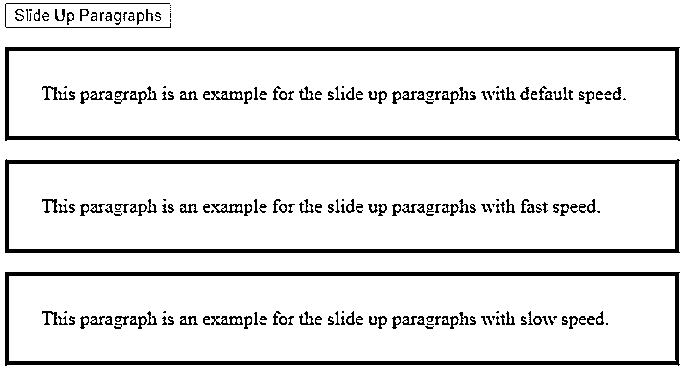
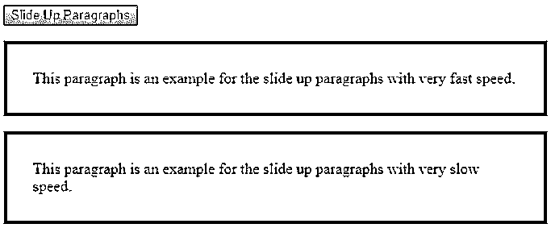

# jQuery 中的幻灯片

> 原文：<https://www.educba.com/slide-in-jquery/>


## jQuery 中的幻灯片简介

jQuery 中的 slide 函数用于创建动画特征的幻象，以便在使用 javascript jQuery 函数设计/实现的网页中显示和隐藏元素。jQuery 中的 slide 特性通常使用三种方法，它们是 slideUp()、slideDown()和 slideToggle()。所有这 3 种方法都可以在一些参数的帮助下运行，如持续时间、缓动和函数，这些参数可以具有类似于任何其他脚本/编程语言的动态或静态值。

### jQuery 中的滑动方法

Jquery 中的 3 个方法是 slideUp()、SlideDown()和 slideToggle():

<small>网页开发、编程语言、软件测试&其他</small>

#### 1\. slideUp()

[SlideUp()方法](https://www.educba.com/jquery-slideup/)将隐藏使用动画选择的元素。它不返回任何东西，只是隐藏元素。当它改变图像或元素的高度时，我们也可以制作图像动画。

**语法:**

```
$(selector) .slideUp( [duration][,easing] [,function()])
```

**参数:**

*   **时长:**时长可以是字符串，也可以是数字。它可以是以毫秒为单位的时间，也可以是预设的时间。持续时间的默认值是 400 毫秒。它可以将 slow、fast 或 normal 作为字符串参数。这有助于我们根据需求控制幻灯片动画。
*   **缓动:**缓动应为字符串类型。它用于过渡。默认值为 swing。
*   **函数:**动画完成时会执行一个可选的回调函数。

##### 示例#1

这是 slideUp()方法的一个例子。在这种情况下，我们将参数传递为空，即该段落的 normal (first ),因此它采用默认值 400 毫秒。接下来，我们传递了字符串“快”和“慢”。

**代码:**

```
<!DOCTYPE html>
<html lang="en">
<head>
<meta charset="utf-8">
<title>Example of jQuery Slide-Up </title>
<script src="https://code.jquery.com/jquery-1.12.4.min.js"></script>
<style>
p{
padding: 30px;
background: Red;
}
</style>
<script>
$(document).ready(function(){
$(".up-btn").click(function(){
$("p.normal").slideUp();
$("p.fast").slideUp("fast");
$("p.slow").slideUp("slow");
});
});
</script>
</head>
<body>
<button type="button" class="up-btn">Slide Up Paragraphs</button>
<p class="normal">This paragraph is an example for the slide up paragraphs with default speed.</p>
<p class="fast">This paragraph is an example for the slide up paragraphs with fast speed.</p>
<p class="slow">This paragraph is an example for the slide up paragraphs with slow speed.</p>
</body>
</html>
```

**输出:**

输出，它显示段落。




点击上滑段落按钮，三个段落将被隐藏。


##### 示例#2

在这个例子中，我们已经为持续时间参数传递了“秒”。

**代码:**

```
<!DOCTYPE html>
<html lang="en">
<head>
<meta charset="utf-8">
<title>Example of jQuery Slide-Up </title>
<script src="https://code.jquery.com/jquery-1.12.4.min.js"></script>
<style>
p{
padding: 30px;
background: Red;
}
</style>
<script>
$(document).ready(function(){
$(".up-btn").click(function(){
$("p.very-fast").slideUp(50);
$("p.very-slow").slideUp(20000);
});
});
</script>
</head>
<body>
<button type="button" class="up-btn">Slide Up Paragraphs</button>
<p class="very-fast">This paragraph is an example for the slide up paragraphs with very fast speed.</p>
<p class="very-slow">This paragraph is an example for the slide up paragraphs with very slow speed.</p>
</body>
</html>
```

**输出:**

在输出中，我们可以看到它显示了两个段落。




点击“向上滑动段落”按钮，我们可以观察到第一个段落立即被隐藏，因为它花费了 50 毫秒的时间。

而第二段慢慢地被隐藏，因为它花费了 20000 毫秒的时间。我们可以看到尺寸在慢慢变小，变得隐蔽。


#### 2.向下滑动()

SlideDown()方法将显示使用动画选择的元素。

**语法:**

```
$(selector) .slideDown( [duration][,easing] [,function()])
```

**参数:**

*   **时长:**时长可以是字符串，也可以是数字。它可以是以毫秒为单位的时间，也可以是预设的时间。持续时间的默认值是 400 毫秒。也可以是慢的，快的，正常的。这有助于我们控制幻灯片动画。
*   **缓动:**缓动应为字符串类型。它用于过渡。默认值为 swing。
*   **函数:**动画完成后会执行一个可选的[回调函数。](https://www.educba.com/callback-function-in-jquery/)

##### 例子

这是 slideDown()方法的一个例子。

**代码:**

```
<!DOCTYPE html>
<html lang="en">
<head>
<meta charset="utf-8">
<title>Example of jQuery Slide-Up and Slide-Down Effects</title>
<script src="https://code.jquery.com/jquery-1.12.4.min.js"></script>
<style>
p{
padding: 30px;
background: Red;
}
</style>
<script>
$(document).ready(function(){
$(".up-btn").click(function(){
$("p.normal").slideUp();
});
$(".down-btn").click(function(){
$("p.normal").slideDown();
});
});
</script>
</head>
<body>
<button type="button" class="up-btn">Slide Up Paragraph</button>
<button type="button" class="down-btn">Slide Down Paragraph</button>
<p class="normal">This paragraph will fade with default speed.</p>
</body>
</html>
```

**输出:**

执行完程序后。


点击向上滑动的段落，该段落被隐藏。


点击向下滑动的段落，就会显示该段落。我们可以在下图中看到。


#### 3.slideToggle()

SlideToggle()方法创建一个切换效果。在显示和隐藏之间切换。每当单击它时，它会切换所选元素的滑动动画。

**语法:**

```
$(selector) .slideToggle( [duration][,easing] [,function()])
```

**参数:**

*   **函数:**动画完成时会执行一个可选的回调函数。

##### 例子

这是 slideToggle()方法的一个例子。

**代码:**

```
<!DOCTYPE html>
<html lang="en">
<head>
<meta charset="utf-8">
<title>Example of jQuery Toggle Effect</title>
<script src="https://code.jquery.com/jquery-1.12.4.min.js"></script>
<style>
p{
padding: 30px;
background: Red;
}
</style>
<script>
$(document).ready(function(){
$(".toggle-btn").click(function(){
$("p.normal").slideToggle();
});
});
</script>
</head>
<body>
<button type="button" class="toggle-btn">Slide toggle Paragraph</button>
<p class="normal">This paragraph will fade with default speed and toggle on clicking on the button.</p>
</body>
</html>
```

**输出:**

执行程序。


点击按钮时(滑动切换段落)被隐藏。


点击相同的按钮(滑动切换段落),就会显示。


这些是 jQuery 中的滑动方法。

### 推荐文章

这是 jQuery 中的一个幻灯片指南。这里我们详细讨论 Jquery 中的 3 个方法 slideUp()、SlideDown()和 slideToggle()，并给出正确的代码和输出。您也可以浏览我们的其他相关文章，了解更多信息——

1.  [jQuery querySelector](https://www.educba.com/jquery-queryselector/)
2.  [jQuery 效果](https://www.educba.com/jquery-effects/)
3.  [jQuery slideDown()](https://www.educba.com/jquery-slidedown/)
4.  [jQuery Slidetoggle()](https://www.educba.com/jquery-slidetoggle/)


